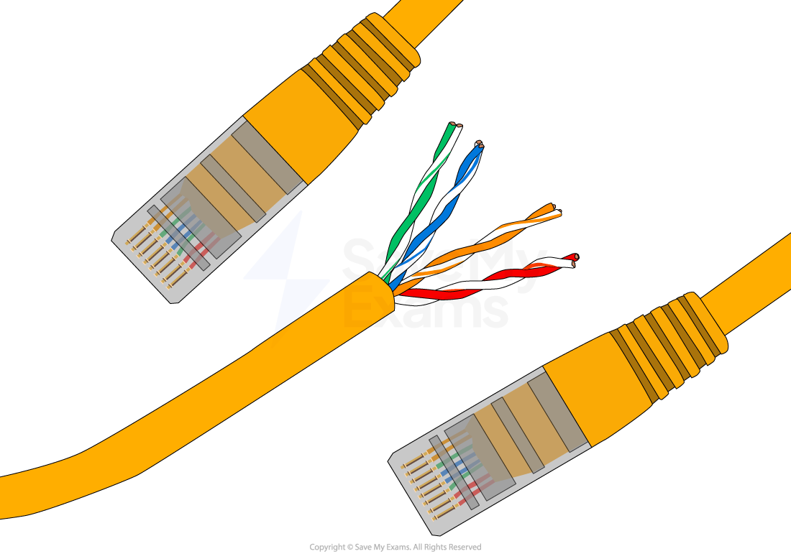
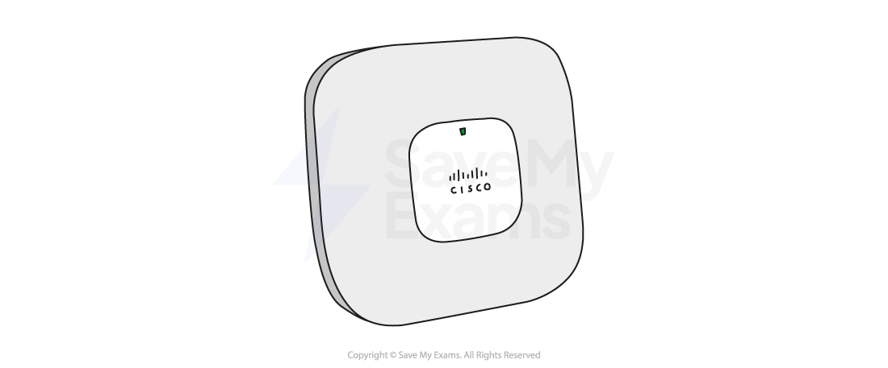
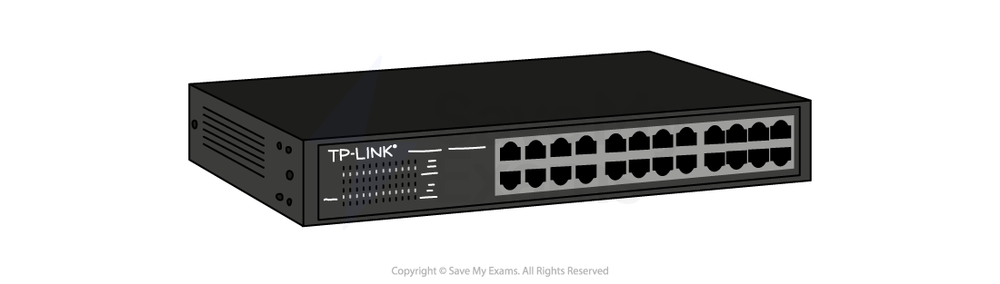

# Components of a Network

## Cables

> **Spec point** — `spcpt_G8zMr9DymcMggcjp`

## Cables

### What cables are used in a wired network?

- A wired network is a network where **physical cables** are used to join devices together and **transmit data**
- The most common types of cables in a wired network are:

  - **Ethernet**
  - **Fibre optic**

#### What is Ethernet?

- Ethernet is a wired networking ***standard*** to carry electrical signals between devices on a local area network (**LAN**)
- Ethernet is common in most offices and homes to connect devices such a **desktop computers** & **servers**
- Ethernet uses **twisted pair cables (CAT5)** to allow ***duplex*** communication

#### What is fibre optic?

- Fibre optic is a type of cable that uses **light to transmit data** on a wide area network (**WAN**)
- Fibre **transmits data** at a much** higher speed** and has a much **higher bandwidth** compared to copper cables
- Fibre optic cable **does not suffer from interference** which makes them the **most secure option** to send **sensitive data**
- Fibre optic cables can **cover a long distance** without any ***degradation***, they can span cities and countries

## Wireless Access Points

> **Spec point** — `spcpt_dBxgjGvxZQB9p2pZ`

## Wireless Access Points

### What is a wireless access point (WAP)?

- The Wireless Access Point (**WAP**) allows wireless devices to connect to a local area network (**LAN**)
- The WAP connects to a **Switch **or **Hub **via an **Ethernet **cable
- The WAP **range **is limited so the use of multiple Wireless Access Points can be used for complete coverage or a home/business

## Router & gateway

> **Spec point** — `spcpt_93KWR3PS4fYHbwMT`

## Router & gateway

### What is a router?

- The router is responsible for routing** data** **packets** between different networks
- An example of data the router can direct is, sending internet **traffic to the right devices in your home**
- The router **manages and prioritise data traffic**, which can help to keep connections stable
- The router will **assign IP addresses** to the devices on the network
- The router **acts as a gateway**

### What is a gateway?

- A gateway is a device that** bridges the connection** between two different types** **of network
- Gateways **translate **between different network protocols
- For example, a local area network (**LAN**) to a wide area network (**WAN**)

## Switch & boosters

> **Spec point** — `spcpt_BDZhZ9Dg8CcyDh2M`

## Switch & boosters

### What is a switch?

- A Switch **allows multiple wired devices** to connect to a local area network (**LAN**)
- The Switch is an **active device**, which means it can inspect network data and route it to the correct device, thus reducing traffic on the network
- A Switch can contain** extra Software** to allow administration/configuration

### What is a booster?

- A booster is a device used to **amplify a network signal** in order to **extend the normal range**
- Boosters can be used with** both wired and wireless networks**
- **Wireless access points** can be be configured to act as a booster (**repeater mode**)

## Server

> **Spec point** — `spcpt_DBZxKFm8mrbJDTs2`

## Server

### What is a server?

- A server is a **dedicated computer that shares its resources **with devices that connect to it
- Devices that connect to a server are known as **clients**
- Common examples of servers include:

  - **File**
  - **Web**
  - **Print**
  - **Authentication**
  - **Application**

| Server | Function |
|---|---|
| **File** | - Allows access to shared and private resources |
| **Web** | - Stores the content of websites and processes requests made via HTTP to access them |
| **Print** | - Manages print jobs and organises the queue so that individual printers are not overloaded |
| **Authentication** | - Stores usernames and passwords that can be checked when a user logs in - Authenticated users receive a certificate  that allows access to resources |
| **Application** | - Allows clients access to applications that run directly from the server |

- A single computer can perform **multiple server functions** depending on its resources (**memory & processor**)

> **Worked Example**
> One piece of network hardware is a router.
> 
> State 3 tasks carried out by a router.
> 
> **[3]**
> 
> **Answer**
> 
> > *1 mark each to max 3 e.g.*
> 
> - Receive packets **[1]**
> - Forward/send packets **[1]**
> - Maintain a routing table **[1]**
> - Identify the most efficient path to the destination / correct IP / correct location **[1]**
> - Assign IP addresses to nodes / devices **[1]**
