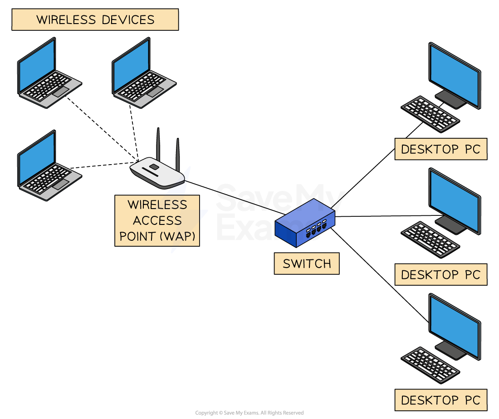
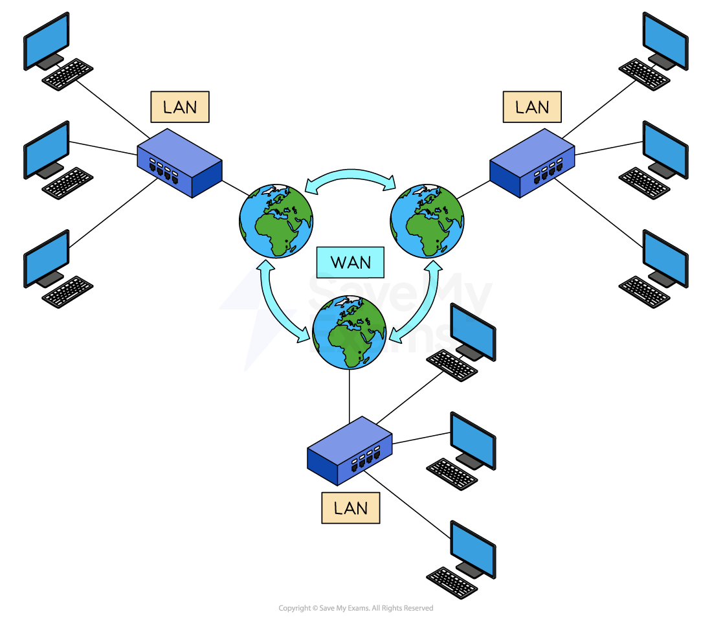

# Networks

## Local area networks (LANs)

> **Spec point** — `spcpt_NSVdWYsb722tS6v9`

## Local area networks (LANs)

### What is a local area network?

- A local area network (LAN) is a network which has a **small geographical area** (under 1 mile)
- All of the hardware is **owned by the company/organisation/household using it**
- LANs will use unshielded twisted pair (UTP) cable, fibre optic cable or wireless connections (Wi-Fi)

#### Advantages and disadvantages of LANs

| Advantages | Disadvantages |
|---|---|
| Allows **centralised **management of updates, backups and software installations | If **hardware fails**, the network may not function properly or even at all |
| Can **secure **its devices with the use of firewalls, antivirus software and other security features to prevent unauthorised access | Networks are more **prone to attacks** than standalone computers |
| Allows users on the network to **share resources **such as printers and other peripherals | Access to data and peripherals can be slow depending on **network traffic** |
| Allows the users of the network to **collaborate **and** share files and folders** | **Require maintenance** to ensure that software is up to date, upgrades and backups which can be costly |

## Wide area networks (WANs)

> **Spec point** — `spcpt_WSgQ8DgVWBqqSpJJ`

## Wide area networks (WANs)

### What is a wide area network?

- A wide area network (WAN) is a network which has a **large geographical area** (over 1 mile)
- They are a** collection of LANs joined together**
- The computers on a WAN are **connected via routers**
- The hardware used to connect the networks together is **not all owned by the company/organisation/household using it**.
- For example, telephone lines **owned by telecommunication companies**
- WANs will use fibre optic cable, telephone lines and satellite to connect the LANs together

## Personal area networks (PANs)

> **Spec point** — `spcpt_TpxQNgRzr76Q48kw`

## Personal area networks (PANs)

### What is a PAN?

- A personal area network (**PAN**) is a network that is used for **transmission of data** between **devices in close proximity**
- A PAN has a** very short range** (10 metres)
- **Bluetooth **is the most widely used PAN
- Typical examples of devices which make use of a PAN are:

  - **Wireless headphones**
  - **Mobile phones**
  - **Tablet**
  - **Laptop etc.**

## Tethering

> **Spec point** — `spcpt_g9sndxmd47VbNyYh`

## Tethering

### What is tethering?

- Tethering is when a **host device shares its internet connection** with other connected devices
- Commonly used by **mobile devices **to share its mobile data connection to devices such as **laptops **and **tablets**
- Tethering can be **enabled or disabled** as part of the mobile contract
- Some network providers **charge extra** to use this feature

> **Worked Example**
> Draw a diagram to show how a smartphone can be used to provide a tablet computer with an Internet connection.
> 
> Label each component and the connectivity you use in your diagram
> 
> **[4]**
> 
> **Answer**
> 
> > *A drawing that shows:*
> 
> - A smartphone connected to the Internet / mobile phone mast **[1]**
> - Correct connectivity identified for this (3G, 4G etc.) **[1]**
> - Tablet directly connected to smartphone **[1]**
> - Correct connectivity identified for this (Bluetooth / Wi-Fi / USB etc.) **[1]**
> 
> *"Image coming soon"*
