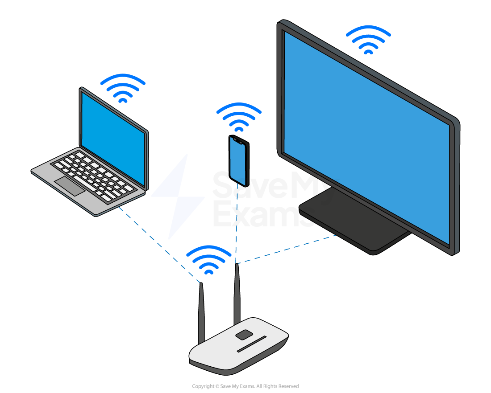

# Wireless Communications

## Wi-Fi

> **Spec point** — `spcpt_r7ZTtP3sxnXc2Ssw`

## Wi-Fi

#### What is Wi-Fi?

- Wireless fidelity (**Wi-Fi**) is a common ***standard*** for wireless networks
- Wi-Fi is common in most homes and offices to connect devices such as **laptops**, **tablets **& **smart phones**
- Using Wi-Fi, devices communicate with a ***hotspot***** or **a wireless access point (**WAP**), which can be a standalone device or built into a **router **or **switch **
- Wi-Fi may be preferred over Bluetooth when:

  - **High speed data transfer is required**
  - **Long range communication is required**
  - **Many devices are needed to be connected at the same time**

| **Advantages** | **Disadvantages** |
|---|---|
| - **Portability **- Easy to move around, location is only limited by range - **Cost **- Less expensive to setup and add new devices - **Compatibility **- Most devices are manufactured with a built in Wi-Fi adapter | - **Speed **- Slower data transfer than Ethernet - **Security **- Less secure than Ethernet - **Range **- Relies on signal strength to the WAP, signals can be obstructed (up to 100m) |

## Bluetooth

> **Spec point** — `spcpt_wKn2zT8hp94pBynt`

## Bluetooth

#### What is Bluetooth?

- Bluetooth is another common ***standard*** for wireless networks
- Bluetooth is common in most homes and offices to connect devices such as **headphones**, **controllers**, **keyboards **& **mice**
- Bluetooth is used typically for a **direct connection** between **two devices **
- When two devices **pair, **they both exchange a ***cryptographic key***
- The keys are used to generate a **secret shared key **which is used to **encrypt** the data between the two devices and create a **Wireless Personal Area Network (WPAN)**
- Connected devices continuously **change their transmitting frequency** between 79 different channels to avoid **interference** and improve the reliability of the connection
- This is known as the **frequency hopping spread spectrum (FHSS)**

| **Advantages** | **Disadvantages** |
|---|---|
| - **Compatibility **- Ideal for personal devices and ***ad-hoc*** connections - **Power **- Very low power consumption | - **Speed **- Very slow transfer speeds - **Security **- Data can be intercepted by anyone in range - **Range **- Short range (30m) |

#### Differences between Bluetooth and Wi-Fi

|   | **Bluetooth** | **Wi-Fi** |
|---|---|---|
| **Maximum number of connections** | 7 | 30 |
| **Transmission frequency** | 2.4Ghz | 2.4Ghz, 5Ghz |
| **Maximum range **(meters) | 30 meters | 100 meters (depending on obstructions) |
| **Maximum transfer speed**  (Depending on the standard being used) | 3 Mbytes / Sec | 75 Mbytes / Sec |

## GPS

> **Spec point** — `spcpt_r6tvmzmvJjQVf2bF`

## GPS

### What is GPS?

- Global Positioning System (**GPS**) is a satellite system **used to track the exact location** of an object
- GPS uses **orbiting satellites **to receive, amplify and transmit signals
- **Radio frequencies are used **to communicate between satellites and ground stations
- GPS** requires a direct line of sight**

> **Case Study**
> **Sat nav in a car**
> 
> - The position/location of the car is calculated using GPS software
> - Data is transmitted every few seconds
> - An algorithm calculates the speed/location of the car
> - The map is updated every few seconds

| **Advantages** | **Disadvantages** |
|---|---|
| - **Wide coverage** area - **Real-time **data transmission - Improved communication in **remote locations** - **Accurate **location tracking | - **Expensive **setup and maintenance - Signal **interference **due to weather or obstacles - **Limited bandwidth **and capacity - **Privacy concerns** and potential for Surveillance |

## 3G & 4G

> **Spec point** — `spcpt_Jp7sqqdhr2mJXCPQ`

## 3G & 4G

### What is 3G & 4G?

- 3G and 4G are references to the 3rd and 4th generation of **mobile data networks**
- They provide **mobile devices** with** wireless access to the internet**
- Each generation has a **faster transfer rate** and an **improved capacity for more users**

  - **3G** - 256 Kbps (kilobits per second)
  - **4G** - 100+ Mbps (megabits per second)
- The current generation (**5G**) has even **faster speeds** and lower *latency*

## Infra-red (IR)

> **Spec point** — `spcpt_5xHXDKs7S5nWGQsC`

## Infra-red (IR)

### What is infra-red?

- Infra-red is a wireless communication method used to transfe**r very small amounts of data** to a device** in direct line of sight**
- Commonly used in remotes to **control **devices such as:

  - **Televisions**
  - **Audio receivers**
  - **Home entertainment equipment etc.**
- Uses **light waves** which can cause:

  - Walls or obstacles **to block the signal**
  - **Sunlight **to affect the signal
- It is a **reliable **and **cost effective** solution for many **short-range** wireless communication needs

## NFC

> **Spec point** — `spcpt_SvhGbR5ccsNwPj5d`

## NFC

### What is NFC?

- Near field communication (**NFC**) is a subset of RFID which **allows communication between two devices** in very close proximity
- NFC can be either:

  - **Passive **- uses energy from the reader
  - **Active **- has it's own power source
- Smartphones use **active NFC to allow contactless payments **by tapping a smartphone on a reader
- Smartphones can also** exchange data **using NFC** **by tapping together (usually back to back)

| **Advantages** | **Disadvantages** |
|---|---|
| - **Convenient** - **Secure** - Very **fast** - **Low power** consumption | - **Limited range** - **Slow data transfer **rate (not suitable for transferring large files) - **Compatibility** |

> **Worked Example**
> George uses a smartwatch when he exercises outside.
> 
> The smartwatch connects to a wireless health monitor to track his heart rate.
> 
> The health monitor uses Wi-Fi to transfer data to the smartwatch.
> 
> A. Speed is not a concern. Explain why Wi-Fi is a better choice than infrared for this transfer
> 
> **[2]**
> 
> B. Explain why distance might affect the speed of the transfer
> 
> **[2]**
> 
> **Answers**
> 
> > *A.** **An explanation such as: *
> 
> - Wi-Fi does not require line of sight / Infrared requires line of sight** ****[1]** which is not always possible when moving/exercising **[1]**
> 
> > *OR *
> 
> - Infrared is / Wi-Fi  is not affected by sunlight **[1]** (which will affect the data transfer because) the health monitor will be used outside **[1]**
> 
> > *B. An explanation to include two from: *
> 
> - More packets of data have to be requested again **[1]**
> - ...because a signal degrades / gets weaker as it travels **[1]**
> - ...due to (more opportunities for) interference / spreading out of the radio waves **[1]**
