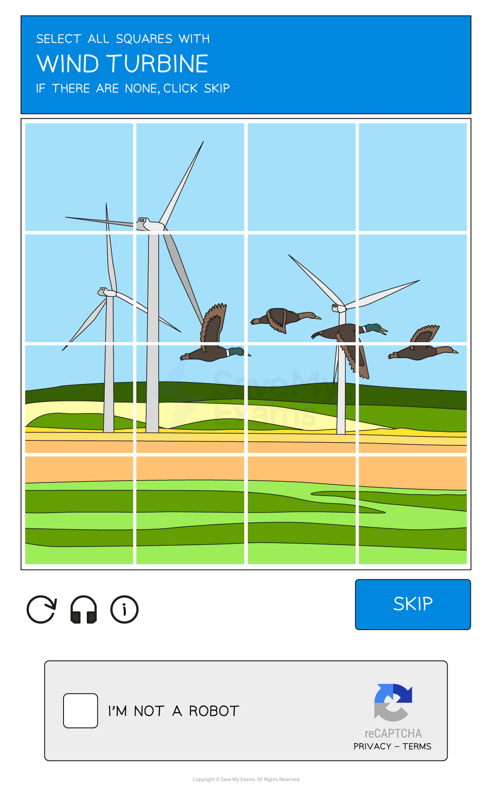
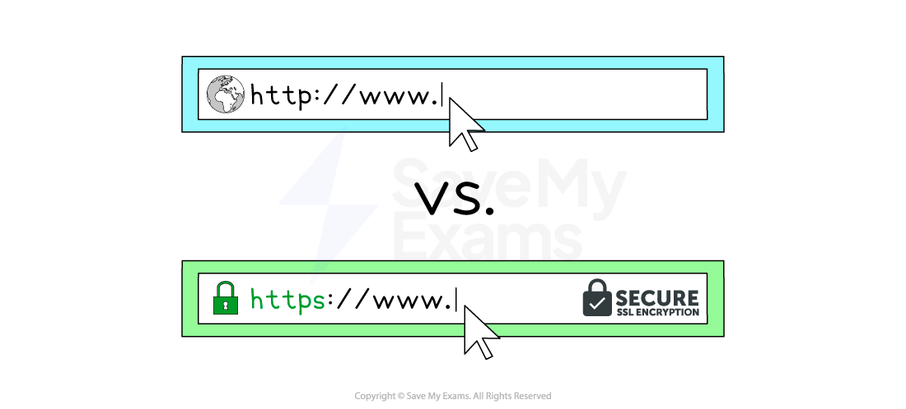

# Methods of Securing Data

## Passwords, PINs & biometrics

> **Spec point** — `spcpt_WyFG4QQfbdGY4YdW`

## Passwords, PINs & biometrics

### What is a strong password?

- **Strong passwords** should contain:

  - **More than eight characters**
  - **A mixture of letters, numbers and symbols**
  - **A mixture of uppercase and lowercase letters**
  - **Uncommon words/phrases**
- Passwords should be **changed regularly**

### What are biometrics?

- Biometrics are a way of authenticating a user by using their **unique human characteristics**
- Some of the ways biometrics can be used are:

  - **Fingerprint scans**
  - **Retina scans**
  - **Facial recognition**

| Advantages | Disadvantages |
|---|---|
| - Unique to the person and can not be copied, meaning that the data is always with the person - Passwords can be easily copied, forgotten, guessed or cracked - It is difficult to copy or forge biometric data - Eliminates the possibility of attacks such as shoulder surfing and  key-logging software - A high degree of accuracy as there is no known way to copy a person's retina pattern for example | - can be intrusive, for example, scanning eyes - Scans may not be recognised, an example of this could be fingerprint scans with dirty hands - Very expensive to install - Low light can provide an issue for facial recognition as well as hats and glasses - People may be uncomfortable having their most unique characteristics being stored in a database |

### What is a CAPTCHA?

- A CAPTCHA is a method of** testing if a website request **originates from a **human **or a **machine **(bot)
- **C**ompletely **A**utomated **P**ublic **T**uring test to tell **C**omputers & **H**umans **A**part (CAPTCHA) examples include:

  - **Text **- Asking users to enter characters from a distorted text box, users would need to decipher the characters and enter them in a designated box
  - **Image **- A grid of images, a user would be asked to select all those that contain a specific object
  - **Checkbox **- A simple checkbox appears asking the user to confirm they are not a robot
- A CAPTCHA can be used to **prevent spam** and **protect logins**

## Anti-malware

> **Spec point** — `spcpt_GZbJ6nR4yqQc8BnW`

## Anti-malware

### What is anti-malware software?

- Anti-malware software is a term used to describe a combination of different software to prevent computers from being susceptible to **viruses** and other **malicious software**
- The different types of software anti-malware include:

  - **Anti-virus**
  - **Anti-spam**
  - **Anti-spyware **

#### How does anti-malware work?

- Anti-malware **scans** through **email** attachments, **websites** and downloaded **files** to search for issues
- Anti-malware software has a list of known malware **signatures to block** immediately if they try to access your device in any way
- Anti-malware will also perform **checks for updates** to ensure the database of known issues is up to date

## Access rights

> **Spec point** — `spcpt_7kVtWP79DNwFnBVz`

## Access rights

### What are access rights?

- Access rights ensure users of a network **can access what they need to access** and do not have access to information/resources they shouldn't
- Users can have **designated** **roles** on a network
- Access rights can be set based on a user's **role, responsibility, or clearance level**

  - **Full access - **this allows the user to open, create, edit & delete files
  - **Read-only access - **this only allows the user to open files without editing or deleting
  - **No access - **this hides the file from the user
- Some examples of different rights of access to a school network could include:

  - **Administrators: ***Unrestricted* - Can access all areas of the network
  - **Teaching Staff:** *Partially restricted - *Can access all student data but cannot access other staff members' data
  - **Students:** *Restricted* - Can only access their own data and files
- Users and groups of users can be given **specific file permissions**

## Secure websites

> **Spec point** — `spcpt_9h2bDHnF6wFcv9sH`

## Secure websites

### What is HTTP & HTTPS?

- Hypertext Transfer Protocol (**HTTP**) allows communication between clients and servers for **website viewing**
- HTTP allows clients to **receive data** from the sever (fetching a webpage) and **send data** to the server (submitting a form, uploading a file)
- **HTTPS **works in the same way as HTTP but with an **added layer of security**
- All data sent and received using HTTPS is **encrypted**
- HTTPS is used to **protect sensitive information **such as passwords, financial information and personal data

## Email safety

> **Spec point** — `spcpt_ySdqbbsVkfqG8PMT`

## Email safety

### What is email safety?

- Users should be **aware of the dangers** when using email, especially **email attachments **and **web links**
- To ensure users use email safely they should take** extra caution** when:

  - Email is from an** unknown sender**
  - Text is **general or impersonal**
  - Contains **spelling, punctuation or grammar **mistakes
  - Attached files are** executable files** (.exe)
  - **Urgency** is the tone of the message
  - **Don't recognise** the URL

## Backup procedures

> **Spec point** — `spcpt_Jk97923yr4y6TQGz`

## Backup procedures

### What is backup software?

- Backup software is used to** create copies of personal data** in order to keep it safe in the event of:

  - **Accidental loss**
  - **Data theft**
- Backups can be **automated **and **scheduled **to happen at less busy periods of the day, to not take up valuable system resources (e.g. overnight etc.)
- Backups can be made in two ways:

  - **Full **- all files are backed up (safest, slow)
  - **Incremental **- only files that have been added/modified since the last backup are backed up (faster, less secure)
- Backups can be stored **locally **(secondary storage) or **remotely** (cloud)
- Backup software can be **purchased **or come as a standalone application **bundled **with an **operating system**
