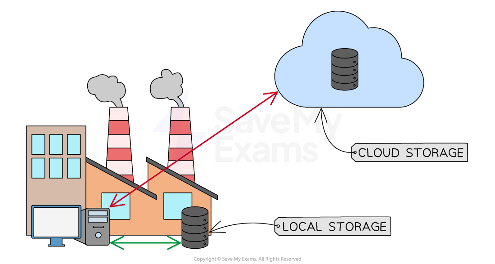

# Cloud Services

## What is the cloud?

- The cloud is a word used to describe the** use of the internet** to:

  - **Store data**
  - **Access software**
- Data & software accessed locally are **confined to the resources of the specific device** you are using
- Data & software accessed using the cloud** rely on an internet connection**

## Hosted & local software

> **Spec point** — `spcpt_j3yvC6JKFns7mWX3`

## Hosted & local software

### What is hosted software?

- Hosted software is** software accessed using the internet**
- Unlike local software where installation files are stored on local secondary storage, the software is **stored on a remote server**
- Hosted software can also be called **web applications** (web apps)
- Software is hosted on a server and **accessed through a web browser**
- Common examples of hosted software include:

  - Microsoft Office 365
  - Google Docs/Sheets/Slides
- Hosted software operates on  a *subscription model*

#### Advantages and disadvantages of hosted software

| Advantages | Disadvantages |
|---|---|
| Access from different types of device | Can only be accessed using an internet connection |
| Combined with online storage, can save files online | User experience is affected by:  - High latency (delay) - Low bandwidth (slow internet) |
| Features that enable collaboration | Not as many features as locally installed software |
| Updates & security managed by someone else | Privacy concerns, who has access to your data |
| Cost effective (pay monthly plans) | Hidden fees can add up |

### What is local software?

- Local software is software that is** installed directly onto a device's secondary storage** (such as an HDD or SSD) and runs from that device without needing an internet connection.
- Installation files can come from a **download**, **a CD/DVD**, or **a USB drive**
- Once installed, the software runs **using the device's own processor**, **RAM** and **storage**
- Local software is **usually purchased **with a one-off licence fee, although some products now offer subscription options
- Common examples of local software include:

  - Microsoft Office (desktop version)
  - Adobe Photoshop
  - iTunes

#### Advantages and disadvantages of local software

| Advantages | Disadvantages |
|---|---|
| Works without an internet connection | Can only be used on the device it is installed on |
| Generally runs faster as it uses the device's own resources | Higher upfront cost (one-off licence fee) |
| Often includes more advanced features than web-based equivalents | The user is responsible for installing updates |
| The user has full control over their software and files | The user is responsible for security (e.g. anti-malware) |
| No ongoing subscription required for many products | Takes up space on the device's secondary storage |

## Online & local storage

> **Spec point** — `spcpt_TWVNQhkNkz5Mn6nJ`

## Online & local storage

### What is online storage?

- Online storage (cloud storage) is a term to describe **long-term (secondary) storage of data** that resides in a **remote location**, accessible only** via a wide area network** (Internet)
- Data is stored on **remote servers**, typically using magnetic storage (**HDD**), but increasingly using solid state (**SSD**)
- The three types of online storage are:

  - **Public cloud** - The customer and the cloud storage provider are different companies
  - **Private cloud** - The customer and the cloud storage provider are a single organisation
  - **Hybrid cloud** - Combines both public and private cloud options and allows for sensitive data to remain private whilst providing public cloud services for less sensitive information

#### Advantages and disadvantages of online storage

| Advantages | Disadvantages |
|---|---|
| Data can be accessed from anywhere | A stable internet connection is required to use cloud storage |
| Data can be accessed by anyone with the relevant permissions, making it quick to share files and collaborate with others | Storing data in the cloud may be vulnerable to *security breaches* |
| Data can be accessed on any device with an internet connection | The user is dependent on the storage provider for the availability and reliability of its services |
| Allows customers to increase or decrease their storage capacity as needed | Should the company dissolve or cease to exist, all cloud data may be lost |
| Providers often use multiple servers to store and backup data, reducing the risk of data loss due to hardware failure | As the amount of storage or *bandwidth* required increases, the service may become expensive over time |
| Providers offer advanced security features, such as data *encryption* and *multi-factor authentication* multi-factor authentication, to protect user data from unauthorised access |   |
| There is no need to hire specialist staff as IT services being provided by the cloud storage provider |   |

### What is local storage?

- Local storage is the** long-term (secondary) storage** of data on **a device's own internal or directly connected storage media**
- Data is saved directly to the device and accessed **without needing an internet connection**
- Local storage can be **internal **(HDD, SSD) or **external/portable** (USB flash drive, external HDD, SD card)
- The user has **direct physical control over** where their data is kept
- Common examples of local storage include:

  - Internal hard disk drive (HDD) or solid state drive (SSD)
  - USB flash drive
  - External hard drive
  - SD memory card

#### Advantages and disadvantages of local storage

| Advantages | Disadvantages |
|---|---|
| No internet connection needed to access files | Limited capacity compared to cloud options |
| Faster read and write speeds, especially with SSDs | Vulnerable to device loss, theft or physical damage |
| The user has full control over their data and privacy | If the device fails, data can be lost without a backup |
| One-off cost, no ongoing subscription fees | Harder to share files and collaborate with others |
| Works on devices that are offline or have poor connectivity | The user is responsible for their own backups and security |

> **Worked Example**
> Explain one drawback of using cloud storage to back up a digital music library
> 
> **[2]**
> 
> **Answer**
> 
> - Uploads will take a long time **[1]** because bandwidth is limited / file sizes are large **[1]**
> - Increased cost **[1]** as data often charged per Mb used **[1]**
