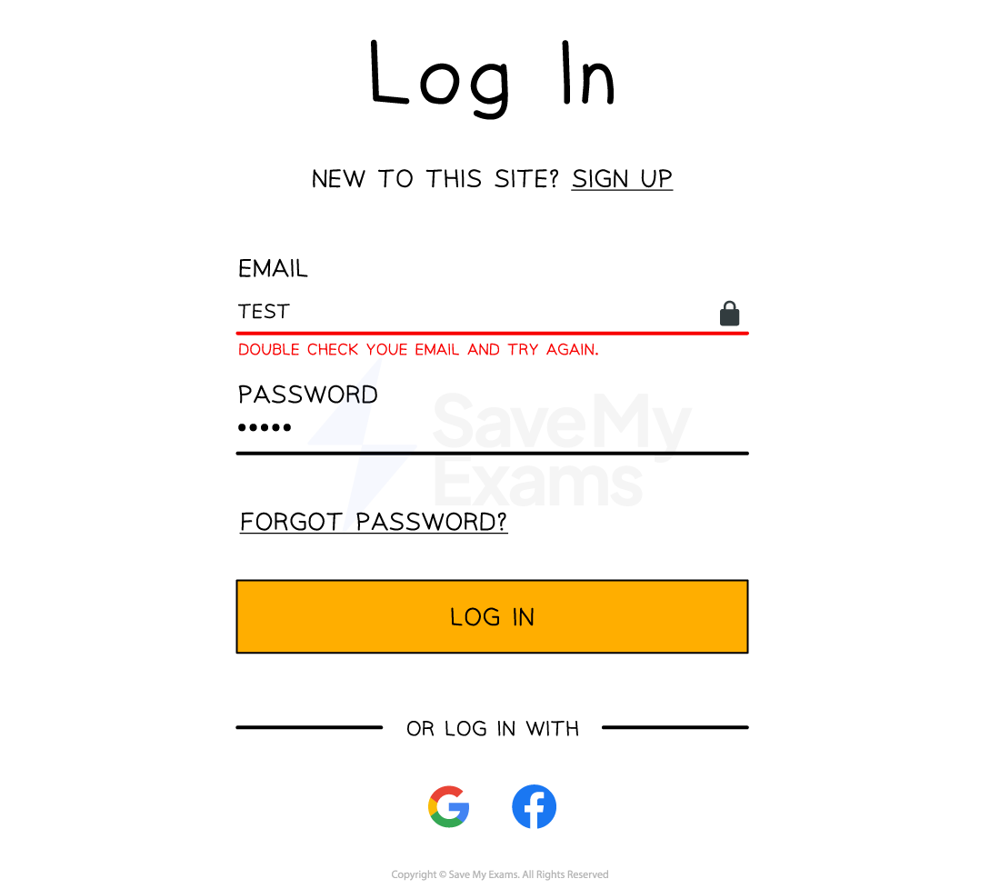

# Data Types & Validation

## Data types

> **Spec point** — `spcpt_fdBhGYmZnmY6QFy9`

## Data types

### What is a data type?

- A data type is the **type of data** that can be held **in a field** and is defined when designing a table in a database
- Examples of common datatypes are:

  - **Numerical/number** - whole/decimal numbers
  - **Alphanumerical **- contains letters & numbers
  - **Date/Time **
  - **Boolean **- true or false values
  - **Currency**
- In the car table below, the following datatypes would be used:

  - **car_id**: numerical
  - **make**: alphanumerical
  - **model**: alphanumerical
  - **colour**: alphanumerical
  - **price**: currency

***cars***

| **car_id** | **make** | **model** | **colour** | **price** |
|---|---|---|---|---|
| 1 | Peugeot | 2008 | Red | 24950 |
| 2 | Mazda | MX5 | Blue | 17995 |
| 3 | Citroen | DS4 | Black | 21450 |
| 4 | Ford | Puma | White | 19500 |

## Validation

> **Spec point** — `spcpt_kKZM3Wwk6F3mVf2t`

## Validation

### What is validation?

- Validation is used to **check** that an **input** from a user is **acceptable** and that it matches the requirements of the database
- There are **5 main categories of validation** which can be carried out on **fields** and **data types, **these are:

  - **Length check**
  - **Type check**
  - **Range check**
  - **Presence check**
- There can be occasions where** more than one type of validation** will be used on a field
- An example of this could be a password field which could have a length, presence and type check on it

#### Length check

- Checks the **length of an input**
- An example is ensuring that a password is **8 or more characters** in length

#### Type check

- Check the **data type** of a field
- An example is checking a user's **age** has been entered as an **integer**

#### Range check

- Ensures the data entered as a number **falls within a particular range**
- An example is checking a user's age has been entered and falls between the digits of **0-100**

#### Presence check

- Looks to see if **any data has been entered** in a field
- An example is checking that a user has entered a name when registering for a website
