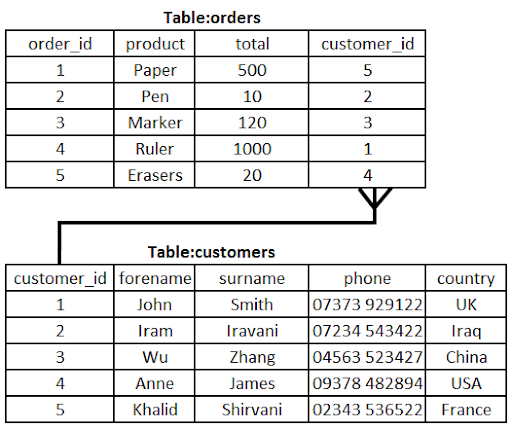

# Database Structure

## Database structure

> **Spec point** — `spcpt_kmBx9hjHVr8zqYyf`

## Database structure

### What is the structure of a database?

- A** **database is an **organised collection of data**
- A database is made up of either **one or multiple tables** which are made up of **fields **and **records **to organise how it stores data
- It allows **easy storage, retrieval, and management** of information
- A database is useful when working with **large amounts of data**
- A database can be stored on remote servers so **multiple users** can **access it at the same time**, useful for online systems

#### Fields, records and tables

- A field is a **single piece** of data in a table (**column**)

| **car_id** | **make** | **model** | **colour** | **price** |
|---|---|---|---|---|
| 1 | Peugeot | 2008 | Red | 24950 |
| 2 | Mazda | MX5 | Blue | 17995 |
| 3 | Citroen | DS4 | Black | 21450 |
| 4 | Ford | Puma | White | 19500 |

- An example of a field in the cars table is '**make**'
- A record is **complete set of fields** on a single entity in a table (**row**)

| **car_id** | **make** | **model** | **colour** | **price** |
|---|---|---|---|---|
| 1 | Peugeot | 2008 | Red | 24950 |
| 2 | Mazda | MX5 | Blue | 17995 |
| 3 | Citroen | DS4 | Black | 21450 |
| 4 | Ford | Puma | White | 19500 |

- An example of a record in the cars table is '**2, Mazda, MX5, Blue, 17995**'
- A table is **a complete set of records** about the same subject/topic in a database

| **car_id** | **make** | **model** | **colour** | **price** |
|---|---|---|---|---|
| 1 | Peugeot | 2008 | Red | 24950 |
| 2 | Mazda | MX5 | Blue | 17995 |
| 3 | Citroen | DS4 | Black | 21450 |
| 4 | Ford | Puma | White | 19500 |

#### Relational databases

- A relational database is one that **organises data into multiple tables **
- It uses **keys **to connect related data which:

  - **reduces data redundancy**
  - makes **efficient **use of storage
  - is **easier **to maintain

#### Primary & foreign keys

- A primary key is a **unique field** that can be used to **identify a record** in a **table**
- order_id is the **primary key** for the orders **table**

- customer_id is the **primary key** for the customers **table**
- A foreign key is a **field in a table** that refers to the **primary key in another table**.
- A foreign key is used to **link tables** and **create relationships**
- In the **orders **table customer_id is a **foreign key** - it links an order back to the customer that made the order in the **customer **table
