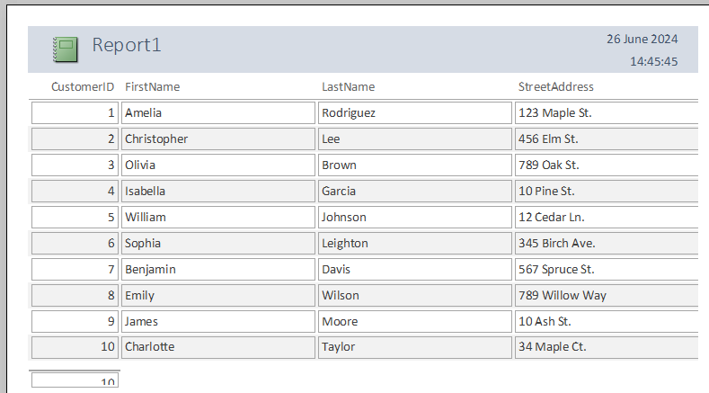
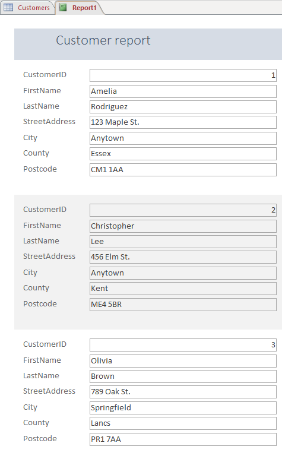

# Outputs

## Database outputs

> **Spec point** — `spcpt_HbqvFwGnkfCjCSXs`

## Database outputs

### What is a database output?

- A database output is often done through **reports**
- Reports can be **formatted **and **customised **to display data in a **user-friendly** manner
- Reports should** display all the required data and labels** in full
- For example, if you're creating a sales report, it should include all relevant fields, like product name, quantity sold, and total sales

#### Using appropriate headers and footers

- **Report header**

  - This appears at the **beginning **of the report
  - This is typically where you would put the report title and other introductory information
- **Report footer**

  - This appears at the **end **of the report
  - This is where you might put summary or conclusion information
- **Page header**

  - Appears at the **top **of each page
  - This might contain the page number and the date
- **Page footer**

  - Appears at the **bottom **of each page
  - This might also contain the page number and the date

#### Producing different output layouts

- You can control the **display **of data and labels in your report
- For example, you might choose a tabular format, where data is arranged in rows and columns, or a columnar format, where each data field is listed vertically

*Simple report layout with data in rows*

*Simple report layout with data shown in columns*

#### Aligning data and labels

- Data and labels should be aligned appropriately
- For example, numeric data is often right-aligned, and decimal points should be aligned for easy comparison

#### Controlling the display format of numeric data

- You can control the number of decimal places displayed, the use of a currency symbol, and the display of percentages
- For example, a total sales field might be displayed with two decimal places and a currency symbol
