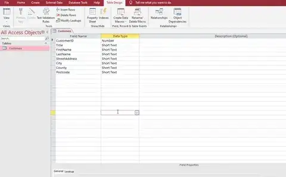
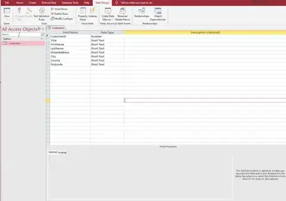

# Sorting & Searching

## Sorting

> **Spec point** — `spcpt_kQrhGWGhV69CtyqT`

## Sorting

### What is sorting?

- Sorting is a crucial function in databases that helps **organise and present data** in a **meaningful way**

#### Using a single criterion to sort data

- You can sort data based on a **single criterion** - such as by name, date, or numerical value
- For example, you might sort a list of customers in **ascending order** by their last names
- To sort the customer's table by `LastName` in either ascending or descending order:

  - **Open the table in 'Datasheet View'**
  - **Click on the column header for the field to be sorted**
  - **For example, a table of customers to be sorted by **`LastName`**, click on the **`LastName`** column header**
  - **Click on the "Sort Ascending" or "Sort Descending" button in the toolbar at the top of the screen**

*Sorting a table of information using only one criterion*

#### Using multiple criteria to sort data

- You can also sort data based on** multiple criteria**
- For instance, you might want to sort a list of customers **first by**` LastName`** **(ascending), and within each `LastName`, **by **`City`** **(descending)
- To sort the customer's table first by `City`, and then by `LastName` within each city:

  - **Open the table in 'Datasheet View'**
  - **Click on the 'Advanced' button in the Sort & Filter section above**
  - **Select 'Advanced Filter/Sort'**
  - **Add the first column to sort data by, by dragging in to the QBE grid and from the sort row choose ascending or descending**
  - **Repeat for second criteria**
  - **Selecting 'Advanced' again and choose 'Apply Filter/Sort'**

*Sorting a table of information using more than one criterion*

#### Ascending and descending order

- **Ascending Order** - Data is sorted from smallest to largest (e.g., from A to Z, or from 1 to 100)
- **Descending Order** - Data is sorted from largest to smallest (e.g., from Z to A, or from 100 to 1)

## Searching

> **Spec point** — `spcpt_7Zq7vTrG3ZXzfGtR`

## Searching

### What is searching?

- Searching is the process of **using keywords, phrases or criteria** to **find specific information **within a database
- Searching in databases is typically done using **queries**
- Queries can be based on a **single** criterion or **multiple **criteria

#### Using a single criterion to select subsets of data

- You can use a** single criterion** to select specific data
- For example, you might want to select **all customers from a specific county**
- E.g. to return all customers from Devon:

  - **Open the 'Query Design View'**
  - **Add the table you want to query**
  - **Drag the field you want to query to the QBE grid**
  - **For instance, if you're looking for customers from a specific county, drag the **`County `**field**
  - **In the **`Criteria`** row under this field, type the value you're looking for (e.g., 'Devon')**

*Creating a search within a database using one criterion *

#### Using multiple criteria to select subsets of data

- You can also use **multiple criteria** to select data
- For instance, you might want to select **all customers from a specific city** who have also** purchased in the last month**
- E.g. to return all customers from London who purchased in the last 30 days:

  - **Follow the steps above to start a new query and add the **`City`** field with 'London' as the criteria**
  - **Drag another field you want to query to the QBE grid**
  - **For example, if you're looking for customers who purchased in the last month, drag the **`LastPurchaseDate`** field**
  - **In the **`Criteria`** row under this field, type **`Date()-30`
  - **Hit run**

#### Using operators to perform searches

- **AND** - Returns true if both conditions are met
- **OR** - Returns true if at least one condition is met
- **NOT** - Returns true if the condition is not met
- **LIKE** - Returns true if the value matches a pattern (used with wildcards)
- **>, <, =, >=, <=, <>** - These are comparison operators, they return true if the comparison between the values is correct

#### Using wildcards to perform searches

- Wildcards are used with the **LIKE** operator to** search for patterns**
- The most common wildcard characters are:

  - `%`** - Represents zero, one, or multiple characters**
  - `_`** - Represents a single character**
  - `*`** - Represents all**
- E.g. to return all customers whose names start with 'L':

  - **Start a new query and drag the field you want to query to the QBE grid**
  - **For example, if you're looking for customers whose names start with 'L', drag the **`LastName`** field**
  - **In the **`Criteria`** row under this field, type **`L*`
  - **Hit run**

*Searching a database using a wildcard function*
