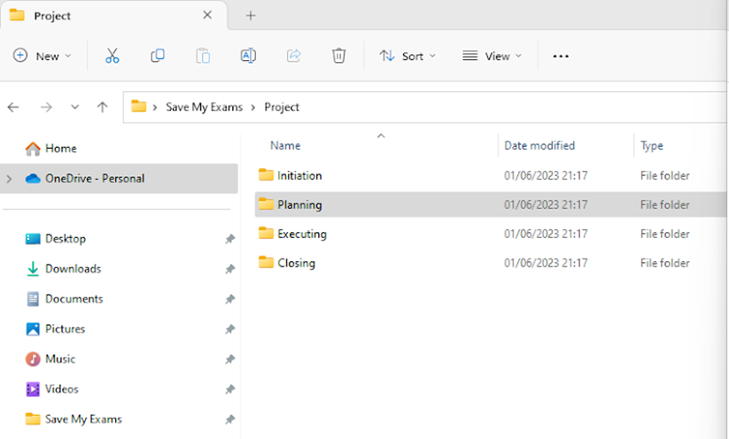
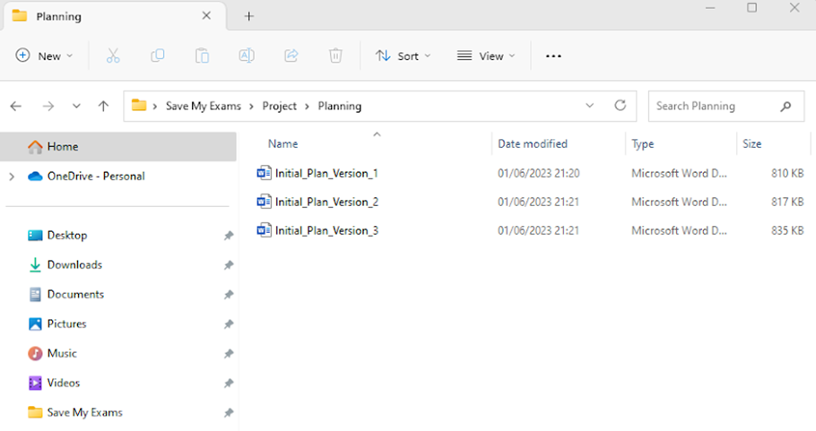
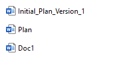
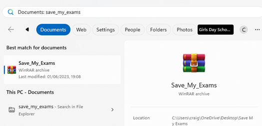

# File Management

## File formats

> **Spec point** — `spcpt_PVf7DFXvqGqpdzwq`

## File formats

### What is a file format?

- A file format is a way of **saving data created in an application **so that it can be opened again later in the same application
- Different applications** use different file formats**, so it is good practice to save work using a **compatible **file format
- There are occasions when you may wish to change** to a different file format**, for example you may have to save work in an older format for older software versions to be able to open it
- Software is often **backward compatible**, which means newer versions will open older file formats
- Older software** cannot open newer file formats**
- After editing your work in one application you may want to **export in to a different **format, for example:

  - **Creating a poster in a desktop publishing application and then once complete, exporting  as a generic file format such as PDF**
  - **PDFs can be opened on most devices, even without the application it was created in**

#### Example application file formats

| Application type | Application | File format |
|---|---|---|
| Word processor | Microsoft Word | .docx |
| Spreadsheet | Microsoft Excel | .xlsx |
| Database | Microsoft Access | .accdb |
| Presentation | Microsoft PowerPoint | .pptx |
| Image editing | GIMP | .xcf |
| Web authoring | Serif WebPlus | .wpp |

## File & folder structures

> **Spec point** — `spcpt_7ypDCK3fHfvxqJYB`

## File & folder structures

### What is a file & folder structure?

- A file & folder structure is a way of** organising digital information **on a computer
- Files are** individual** documents, images, video, or other data that is stored on a computer
- Folders are **digital containers for files**
- Folders can be **nested **inside other folders to create a **hierarchical structure**
- The purpose of a file & folder structure is **find information quickly**

#### Saving work

- It is important to save work **regularly**, in case of a loss of power or the application crashes
- The below screenshot shows a** project structure** broken into 4 different sections, Initiation, Planning, Executing and Closing
- Within each folder, files are saved according to the which part of the project they are relevant to

- Files are saved inside folders with **version numbers** allowing the user to go back and review previous versions
- This is known as **version control**

#### Naming files

- **Meaningful** file names should give a clue as to what the document contains

- '**Doc1**’ does not give any idea about the contents of the file and is not a meaningful file name
- ‘**Plan**’ is a partially meaningful name but could be any plan or any version of the plan
- ‘**Initial_Plan_Version_1**' is a meaningful name as it determines that it is an initial plan and is the first version

#### Locating stored files

- **Secondary storage** contains files and folders
- Within a folder, there may be files or other folders which are known as subfolders
- There are multiple ways to locate files

  - **Using Windows search**
  
    - Click on the Windows Icon at the bottom of the screen and type the file that is required and click on the ‘documents’ button

