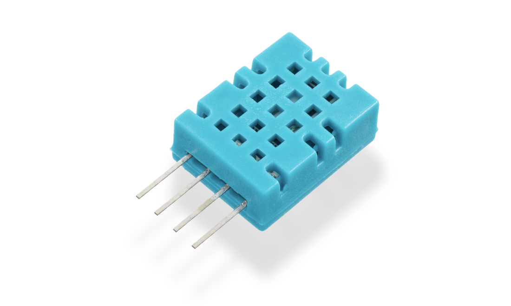
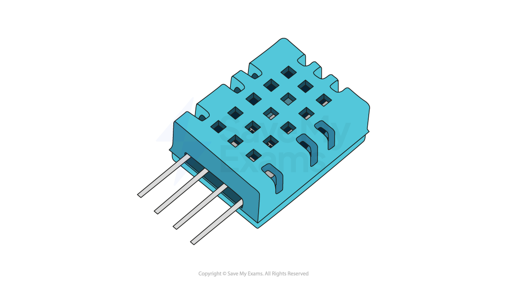
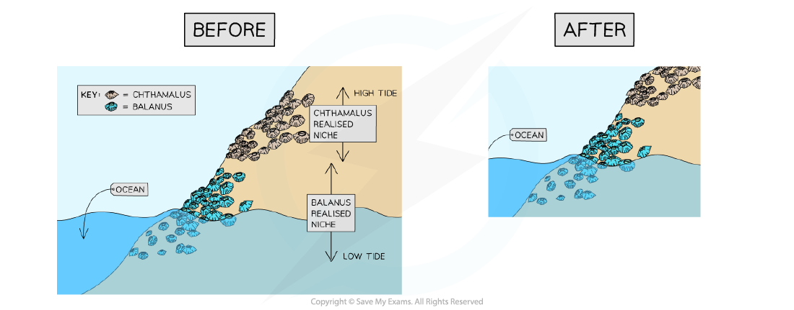
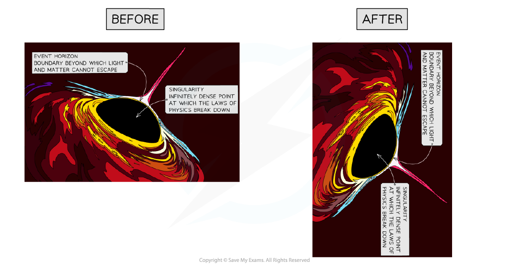
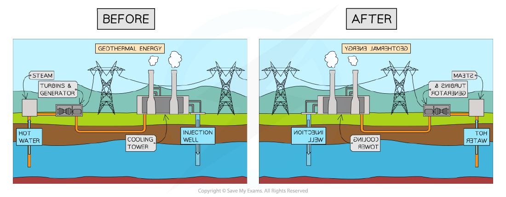
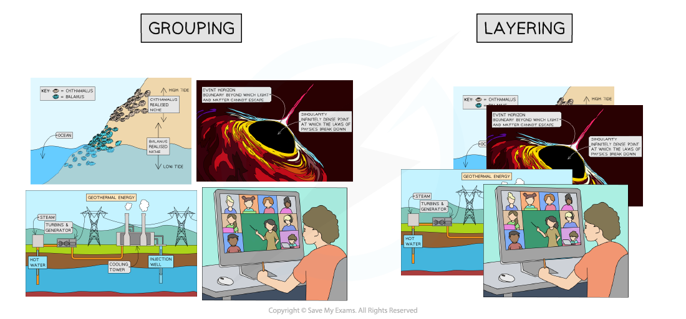

# Image Types

## Bitmaps & vectors

> **Spec point** — `spcpt_fgrXKYgFpDMM4tyK`

## Bitmaps & vectors

- Computers represent all data in binary, including images that are seen on a screen, TV or other output device
- Images can be stored in binary as **Bitmap** or **Vector**

### What is a bitmap?

- A bitmap image is made up of squares called **pixels**
- A pixel is the **smallest element** of a bitmap image
- Each pixel is** stored as a binary code**
- Binary codes are **unique **to the **colour **in each pixel
- A typical example of a bitmap image is a photograph

- The more colours and more detail in the image, the higher the quality of the image and the more binary that needs to be stored

### What is a vector?

- A vector image is created from **mathematical equations** and **points**
- Only the mathematics used to create the image are stored
- For example, to create a circle the data stored would be:

  - **Centre point (x, y coordinates)**
  - **Radius**
- Typical examples of vector images are logos and clipart

- Vector images are infinitely ***scalable***
- Ideal for situations where the same image** will be made bigger and smaller** and a **loss of quality is unacceptable**. For example, the same logo used on both a pencil and a billboard

## Editing images

> **Spec point** — `spcpt_ffxZ38qHZjgqTrSk`

## Editing images

### What is image editing?

- Image editing is the process of **modifying and enhancing** digital photographs, illustrations or any other visual media

#### Placing an image with precision

- This refers to **positioning an image accurately** within a document or other media

  - You can usually do this by selecting the image and dragging it to the desired location
  - Some software allows for more precision through the use of coordinates or alignment tools

#### Resizing an image

- This means **changing the dimensions **of an image

  - You can often do this by selecting the image and dragging its corners or edges
  - **Maintaining the aspect ratio** means the image's width and height change at the same rate, preventing distortion
  - Adjusting the aspect ratio can change the shape and proportions of the image

#### Cropping an image

- This involves **cutting out and discarding **parts of an image

  - Cropping tools usually allow you to select a portion of the image to keep and discard the rest

#### Rotating an image

- This means** turning the image** around a central point

  - Most software allows rotation to any angle, and common rotations such as 90 degrees or 180 degrees are often provided as options

#### Reflecting (flipping) an image

- This means **creating a mirror image** of the original

  - An image can be flipped horizontally (left to right) or vertically (top to bottom)

#### Grouping and layering images

- These techniques help to **organise **multiple images

  - **Grouping** combines images so they can be moved or transformed as a single unit
  - **Layering** involves placing images on top of each other
  - You can change the order of layered images, moving them to the front or back

