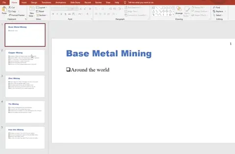
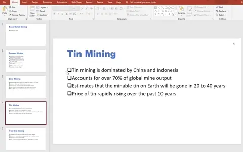
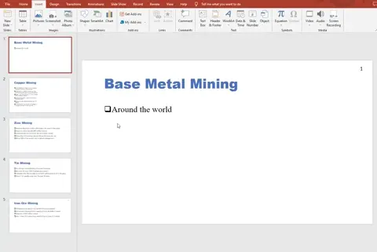
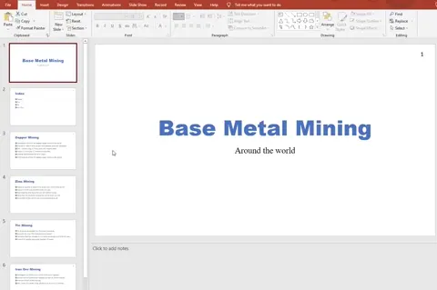
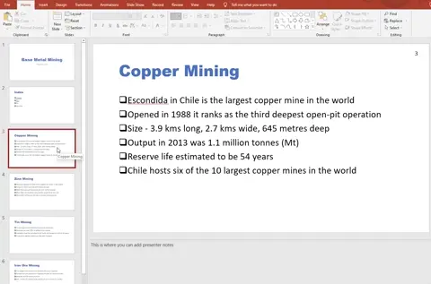
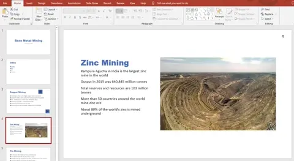
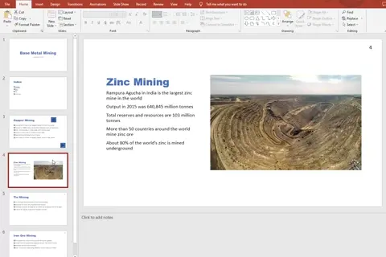
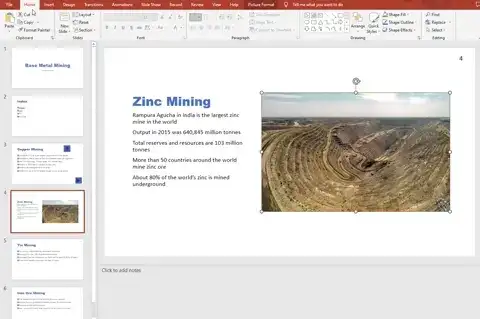
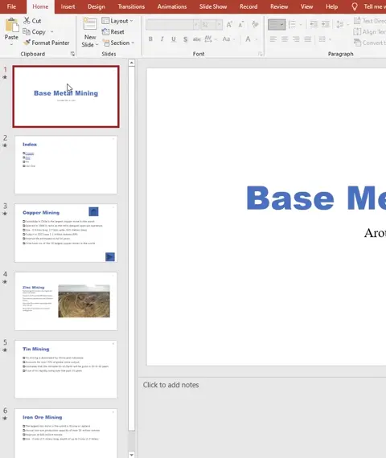

# Edit a Presentation

## Edit a Presentation

> **Spec point** — `spcpt_XDdh42vPHmy9gF6D`

## Edit a Presentation

### How do you edit a presentation?

- Editing a presentation will depend on the **audience and purpose  **of the presentation
- Common editing techniques include:

#### Inserting, moving, deleting slides & applying slide layouts

- Using the **home tab**, in the '**slides**' section

*Adding, moving & deleting slides in a presentation*

#### Inserting objects

- Using the **insert tab** the user can choose to add:

  - **Images**
  - **Videos**
  - **Charts etc**.

*Inserting objects in to a presentation*

#### Adding presenter notes

- Presenter notes can be added to slides as** prompts for the presenter **for when **delivering** a presentation
- Presenter notes usually contain** key talking points**
- Using the **view tab**, in the '**Show**' section, select **Notes**

*Adding presenter notes to a presentation *

#### Inserting hyperlinks

- Hyperlinks can be **added to text or objects** (images/videos etc.)
- **Select **the text or object
- Using the** insert tab**, select **Link**

*Adding hyperlinks in a presentation*

#### Inserting action buttons

- An action button is **a clickable object that enhances the interactivity** of a presentation
- Common actions include:

  - **Navigation**
  - **Media playback**
  - **Run programs**
  - **Open links**

*Using action buttons in a presentation *

#### Adding screen tips

- Screen tips are **short explanatory text** that appear when you** hover over an element** on the slide
- Screen tips provide **additional details** on hover

*Using screen tips in a presentation*

#### Adding alternative text (alt text)

- Alternative text **describes an image**
- Alt text is used for:

  - **Accessibility **- screen readers
  - To **understand the content** of an image

*Adding alt text to images in a presentation*

#### Applying consistent transitions & animations

- Transitions can be used when **moving between slides** to create a more visual appealing flow
- Animations can be used to** add movement or emphasis** to elements **on a slide**

*Adding transitions & animations to a presentation*

#### Hiding slides

- To hide a slide from a presentation without deleting, **right click on a slide** and select '**Hide Slide**'

*Hiding slides in a presentation *
