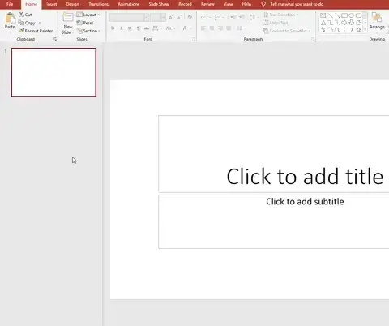
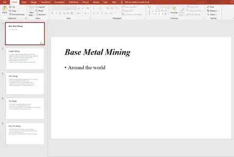
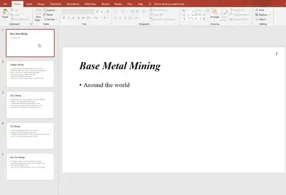
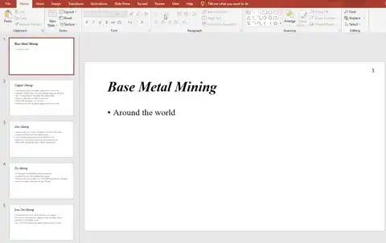

# Master Slides

## Create a Presentation

> **Spec point** — `spcpt_TwH5tzBr6bMxgkzX`

## Create a Presentation

### How do you create a presentation?

- In the exam, **content for the presentation** is provided in a **rich text format** (.rtf)
- The content **can be imported** using the '**new slide**' button on the **home tab **and selecting '**Slides from Outline**'

*Creating a presentation from a text file*

## Using a Master Slide

> **Spec point** — `spcpt_wt8Ghz9d75Dk8kjT`

## Using a Master Slide

### What is a master slide?

- A master slide allows you to** control the design and layout** of an entire presentation **from one place**
- A master slide controls:

  - **Colours**
  - **Fonts**
  - **Headers & footers**
  - **Positioning of objects**

> **Exam Hint**
> Remember to make sure you scroll to the top of the master slide window and select the first slide!

#### Auto slide numbering

- Select the master slide
- Insert a text box
- From the '**insert**' tab, select '**Slide Number**'
- Close the master slide

*Adding auto numbering to slides*

#### Adding objects

- Select the master slide
- From the 'insert' tab, choose an object
- Position on the slide
- Close the master slide

*Adding objects to slides*

#### Formatting a master slide

- Select the master slide
- Make desired changes (font & paragraph)
- Close master slide

> **Exam Hint**
> If your changes **are not visible** after closing the master slide, highlight the text and use the '**Clear All Formatting**' button (see below)

*Formatting the master slide*
