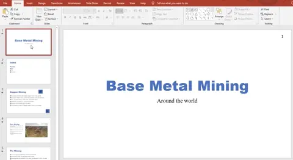
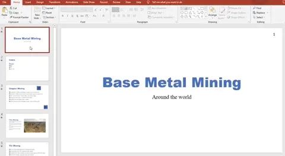

# Output Presentations

## Output Presentations

> **Spec point** — `spcpt_5msnjrCcs5VgCHbR`

## Output Presentations

### What are the different methods of outputting a presentation?

- The two most common methods of outputting a presentation are **on screen** and **printed**
- On screen presentations can be displayed in a variety of ways including:

  - **Looped on screen carousel**
  - **Presenter controlled**

*Setting display options in a presentation*

- Both options can be configured using the** Slide Show tab** and selecting '**Set Up Slide Show**'

- When printing a presentation, **a variety of layouts** can be selected, including:

  - **Full page slides**
  - **Presenter notes**
  - **Handouts**
- Printing options can be found in when using the **File tab** and selecting '**Print**'

*Setting print options in a presentation*
