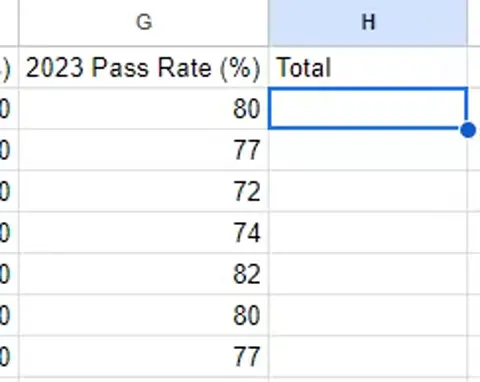
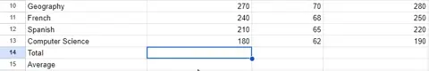
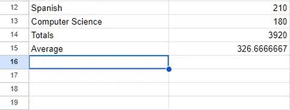

# Formulae & Functions

## Formulae

> **Spec point** — `spcpt_mXDvNxwqJhTR78p4`

## Formulae

### What is a formula?

- A formula is **a statement that performs simple calculations** in a spreadsheet
- Formulas **start with a = sign**
- A formula can perform calculations using:

  - **Numbers directly (e.g. =5*2)**
  - **Referenced data held in cells (e.g. =A1*B2)**
- **Changing data** in a cell that is being referenced in a formula will cause the formula to automatically recalculate based on the new value
- This is a **core concept **of spreadsheet modelling

*Adding simple formulas to a spreadsheet*

#### Arithmetic operators

- Formulas will make use of basis arithmetic operators

| Symbol | Operation |
|---|---|
| + | Addition |
| - | Subtraction |
| * | Multiplication |
| / | Division |
| ^ | Indices (power of) |

## Functions

> **Spec point** — `spcpt_qkmwy23c23Vpvqkb`

## Functions

### What is a function?

- A function is a** pre-defined formula** that can be used to** carry out more complex calculations**
- Functions are **built into spreadsheet software**
- Functions can **help to simplify **complex calculations
- Each function **has a specific name** that tells the software what calculation is being carried out

*Adding functions to a spreadsheet*

| Function | Operation |
|---|---|
| **SUM** | Adds all the numbers in a range of cells  **=SUM(A1:A10)** |
| **AVERAGE** | Calculates the average of a range of cells  **=AVERAGE(A1:A10)** |
| **MAX and MIN** | Finds the largest and smallest numbers in a range respectively  **=MAX(A1:A10)**  **=MIN(A1:A10)** |
| **INT** | Rounds a number down to the nearest integer  **=INT(A1)** |
| **ROUND** | Rounds a number to a specified number of digits  **=ROUND(A1,2) **- round to 2 decimal places |
| **COUNT** | Counts the number of cells in a range that contain numbers  **=COUNT(A1:A10)** |
| **COUNTA** | Counts the number of cells in a range that contain numbers and/or labels  **=COUNTA(A1:A10)** |
| **IF** | Returns one value if a condition is true and another if it's false  **=IF(condition, true, false)**  **=IF(A1 ="SME",100,B7*3)** |
| **HLOOKUP** | Performs a horizontal look up of data  **=HLOOKUP('Bananas', A2:D4, 3)** |
| **VLOOKUP** | Performs a vertical look up of data  **=VLOOKUP(100, A2:D4, 2, TRUE)** |
| **XLOOKUP** | Performs either a horizontal or vertical look up of data  **=XLOOKUP('Oranges', A1:A4, Sales Q3, "Not found")** |

*Average, Max, Min & Int in a spreadsheet*

#### Using external data sources within functions

- Spreadsheets allow you to use **external data sources** within functions
- This could be data from another **worksheet**, **workbook**, or even a **database**

#### Using nested functions

- Nesting is using **a function within another function**
- For example:

  - =IF(A1>B1, MAX(A1:B1), MIN(A1:B1))
  
    - This checks if A1 is greater than B1, and if true, it returns the max value, else it returns the min value

> **Worked Example**
> awara school has a shop that sells items needed by pupils in school. Part of a spreadsheet with details of the items is shown.
> 
> 
> 
> Tax is paid on certain items sold in the shop. The tax rate that has to be paid is 20% of the selling price. If tax is to be paid on an item, then ‘Y’ is placed underneath the Tax heading.
> 
> The formula in I4 is: IF(F4=''Y'',(\$I\$1*D4*G4),'''')
> 
> Explain, in detail, what the formula does.
> 
> **[5]**
> 
> **Answer**
> 
> Five of:
> 
> **Final answer:** **If Tax is payable then//If F4 is equal to "Y" then [1]**
> **If true the tax is paid [1]**
> **Multiply the rate of tax/I1 [1]**
> **By the selling price/D4 [1]**
> **By the amount sold/G4 [1]**
> **If Tax is not payable//If F4 <>"Y"//Else//Otherwise [1]**
> **Then display a blank [1]**
> **The tax is not paid [1]**
