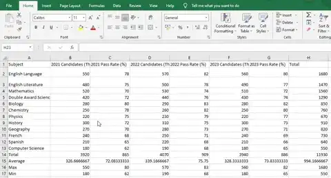
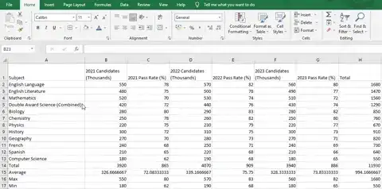
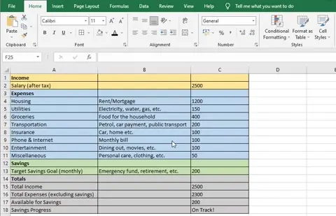
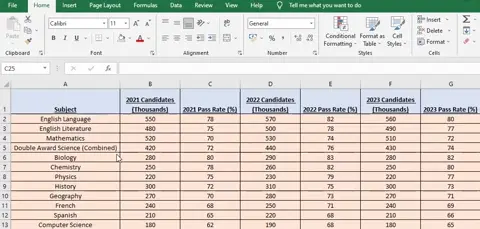
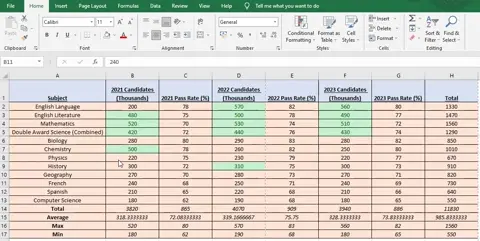
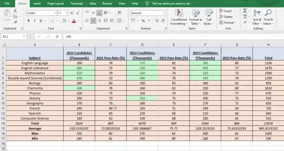

# Present Data

## Display Features

> **Spec point** — `spcpt_hjkH52zKdNr3m6s4`

## Display Features

### What are the display features of a spreadsheet?

- Display features of a spreadsheet include:

  - **Displaying either formulas or values**
  - **Adjusting height and width of rows/columns**
  - **Wrapping text**

*Adjusting basic display features in a spreadsheet*

## Formatting Spreadsheets

> **Spec point** — `spcpt_6dFsRMw3XbXTz3yh`

## Formatting Spreadsheets

### How can you format a spreadsheet?

- Formatting a spreadsheet can be split in to three parts:

  - **Enhancing the look**
  - **Formatting numeric data**
  - **Using conditional formatting**

#### Enhancing the look

- To enhance the look of a spreadsheet it involves changing:

  - **Text colour**
  - **Cell colour**
  - **Cell emphasis (Bold, italic, underline etc.)**

*Formatting a spreadsheet*

#### Formatting numeric data

- Formatting numeric data includes:

  - **Adjusting number of decimal places**
  - **Using different currency symbols as appropriate**
  - **Dealing with percentages**

*Formatting data in a spreadsheet*

#### Using conditional formatting

- Conditional formatting means **dynamically changing the format **of a cell **based on it's contents**

*Using conditional formatting in a spreadsheet*

## Page Layout

> **Spec point** — `spcpt_QKJ6YFpjtmtG7XFK`

## Page Layout

### How can you set the page layout of a spreadsheet?

- Changing the page layout of a spreadsheet includes:

  - **Changing orientation (portrait/landscape)**
  - **Controlling the print layout**

#### Changing orientation

*Changing the page orientation in a spreadsheet*

#### Controlling print layout

*Changing the page setup in a spreadsheet*
