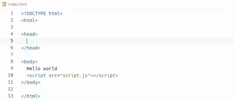
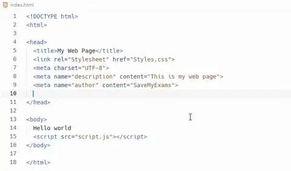
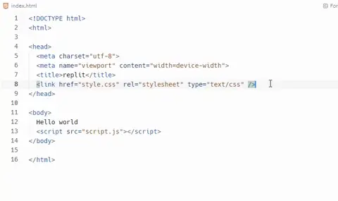
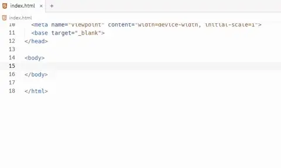
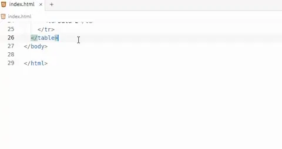
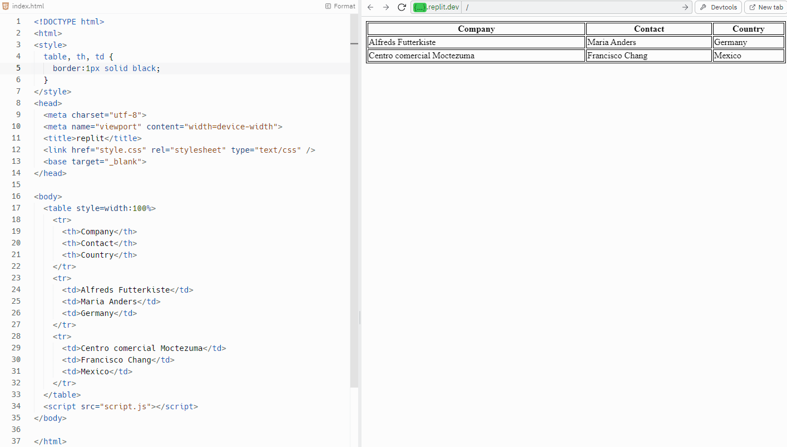

# HTML

## What is HTML?

- Hypertext Markup Language (**HTML**), is the foundational language **used to structure content on the web**
- HTML consists of a series of elements, often referred to as "**tags**," which can be used to **structure **and **format** a webpage
- The `<html>` tag is the root element of an HTML page
- The tag includes** all other HTML elements** used on the page
- Most tags are **opened and closed e.g. **`<html>` and `</html> `whereas **some tags are only opened e.g. **`` and `<link>`
- The content layer of a web page is made up of HTML elements such as headings (`<h1>, <h2>`, etc.), paragraphs (`
`), links (`<a>`), images (``), and more

## Head

> **Spec point** — `spcpt_Q2K5ZsmtsxBpQnth`

## Head

### What is the head section of a webpage?

- The head section contains **information about the web page** that's **not displayed on the page **itself

  - It's enclosed by `<head>` and `</head>` tags
  - The content inside the head tag is **displayed in the browser tab**

#### Page title

- The `<title>` element is used to set the **page title** that displays in the browser tab
- It is placed inside the `<head>` section of the HTML document

#### External stylesheets

- External stylesheets are **linked **in the `<head>` section using the `<link>` element
- The `rel` attribute is set to "stylesheet", and the `href` attribute contains the relative file path to the CSS file
- Stylesheets are loaded in the order they are listed, so **hierarchy** is important

*Adding a page title and link to an external stylesheet in HTML*

#### Metatags

- Metatags are snippets of text in HTML that** describe a page's content**
- They don't appear on the page itself but **in the page's code**
- Search engines, browsers and other web services use metatags **to glean information about a web page**
- Metatags provide **additional information** about the web page to the browser and search engines
- Examples of metatags include:

  - **Charset**
  
    - The `<meta charset="UTF-8">` tag specifies the character encoding for the HTML document
    - UTF-8 is the most common character encoding and includes almost all characters from all writing systems
  - **Keywords**
  
    - The `keywords` attribute in a `<meta>` tag is a comma-separated list of words that represent the content of the web page
    - It was originally intended to help search engines understand the content of a page, but it's less relevant today as search engines have become more sophisticated
  - **Author**
  
    - The `author` attribute in a `<meta>` the tag identifies the author of the web page
    - It can be helpful for copyright purposes and for readers who want to know the source of the content
  - **Description**
  
    - The `description` attribute in a `<meta>` tag provides a concise explanation of the content of the web page
    - This description often appears in search engine results and can influence click-through rates

*Adding basic metatags in HTML*

- **Viewport**

  - The `<meta name="viewport" content="width=device-width, initial-scale=1">` tag makes your web page display correctly on all devices (desktop, tablet, mobile)
  - It controls the** viewport siz**e and the **initial zoom level**

*Adding a viewpoint metatag in HTML*

#### Default target windows

- The `target` attribute of the `<base>` element can set a **default target window** for all links on a page
- For example, `<base target="_blank">` will open all links in a new window or tab

*Adding the base target metatag in HTML*

## Body

> **Spec point** — `spcpt_89Mw8r4ff7zBqcRy`

## Body

### What is the body section of a webpage?

- The body section contains the **main content of the web page**, such as **text**, **images**, **videos**, **hyperlinks**, **tables **etc.

  - It's enclosed by `<body>` and `</body>` tags
  - The content inside the body tag is** displayed in the browser window**
- **Text entry (headings & paragraphs)**

*Adding text to the body of a HTML page*

- **Inserting an image**

*Adding an image in HTML*

#### Tables in webpages

- In the early days of web development, tables were used to **create complex page layouts**
- They provide a way to** arrange data into rows and columns**
- By utilising **cell padding,** **cell spacing**, and **borders**, developers could **manipulate the appearance **of the page
- Today, tables are primarily used for** displaying tabular data** - information that is logically displayed in grid format
- For example, financial data, timetables, comparison charts and statistical data are often presented in tables
- Tables make it **easy for users to scan**, **analyse **and **comprehend** the data
- Tables also **enhance accessibility**
- **Screen readers** for visually impaired users can read tables effectively if they are correctly structured
- HTML elements like `<table>`, `<tr>`, `<th>`, and `<td>` help in conveying the structure and purpose of the data to these assistive technologies

*Creating a table using HTML*

## Hyperlinks 

> **Spec point** — `spcpt_SDpYVDBJz5FnwH7D`

## Hyperlinks

### What is a hyperlink?

- A hyperlink, often just called a 'link', is **a reference to data **that a reader can directly follow by clicking or tapping
- It is one of the **core elements of the World Wide Web**, as it enables navigation **from one web page or section to another**
- Hyperlinks are created using the `<a>` (anchor) tag in HTML
- They can link to different sections of the same page, other locally stored web pages, or external websites

  - **Text hyperlinks**: Usually, a portion of text that is highlighted in some way, like being underlined or a different colour
  - **Image hyperlinks**: An image that you can click on to take you to another page or another part of the same page
  - **Button hyperlinks**: A clickable button that redirects the user to another page or section
- Hyperlinks utilise the '`href`' attribute within the `<a>` tag in HTML
- The '`href`' attribute contains the** URL of the page **to which the link leads
- The text between the opening `<a>` and closing `</a>` tags are the part that will appear as a link on the page

#### Hyperlink types

- **Same-page bookmark**: Use the `#` followed by the `id` of the element you want to jump to

  - Example: `<a href="#section1">Go to Section 1</a>`
- **Locally stored web page**: Use the relative path to the file

  - Example: `<a href="contact.html">Contact Us</a>`
- **External website**: Use the full URL

  - Example: `<a href="https://www.google.com">Google</a>`
- **Email link**: Use `mailto:` followed by the email address

  - Example: `<a href="mailto:example@example.com">Email Us</a>`
- **Specified location**: Use the `target` attribute to specify where to open the link

  - `_blank` for a new tab or window
  - `_self` for the same tab or window, or a named window
  
    - Example: `<a href="https://www.google.com" target="_blank">Google</a>`

#### Example body section containing hyperlinks
