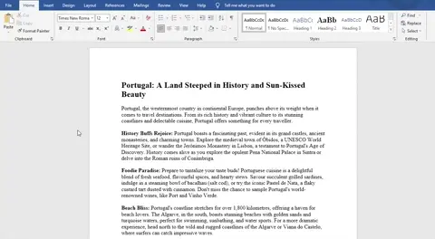
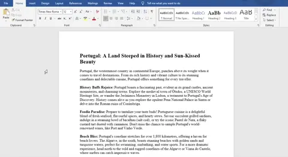
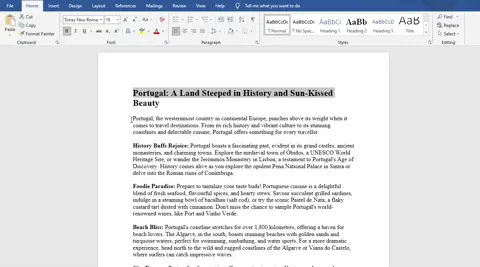
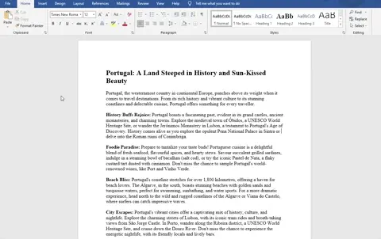
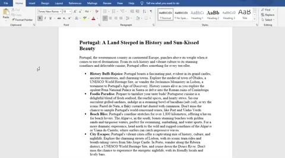
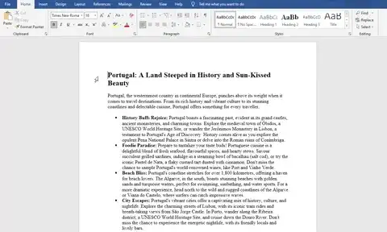

# Formatting

## Formatting

> **Spec point** — `spcpt_bHwRM2jQfM968rNc`

## Formatting

### How can you format a document?

- Applying different formatting techniques to a document can drastically change the** look and feel**
- Formatting should always **meet the needs** of the audience and purpose
- Formatting techniques include:

#### Setting line spacing

- Line spacing can be altered from the **Home tab**, by selecting the '**Line and Paragraph Spacing**' button or by opening the **paragraph settings**

*Changing line spacing in a document*

#### Setting tabulation

- Tabulation is setting text to be** indented at specific points**
- Tabulation can be configured via the** paragraph settings **on the **Home tab**

*Altering tabs in a document*

#### Formatting text

- Formatting text is **changing the visual appearance **of text in a document
- Common text formatting includes:

  - **Fonts**
  - **Colours**
  - **Case**
  - **Emphasis**
  - **Sub & super script**

*Formatting text in a document*

#### Creating lists

- Creating and editing lists,** bulleted and numbered** can be achieved from the **paragraph **section in the **Home tab**

*Creating lists in a document*

#### Finding and replacing text

- A useful technique for when** a word or phrase needs to be replaced**
- Using the find and replace tool, **all instances of a word or phrase** can be changed **automatically**
- Finding words in a document can be done by matching:

  - **Case**
  - **Whole words**

*Finding & replacing text in a document*

#### Adding hyperlinks & bookmarks

- Hyperlinks are used as **electronic shortcuts** to **sections in a document**, **other documents or websites**
- Hyperlinks can be **added to text or objects**
- Bookmarks **flag specific areas** within a document
- Bookmarks are** not clickable** but a **hyperlink can be used to navigate** to them

*Adding bookmarks & hyperlinks to a document*
