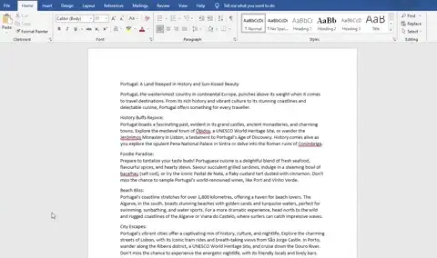
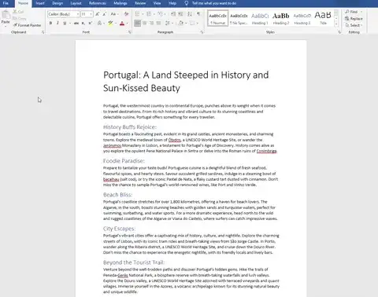
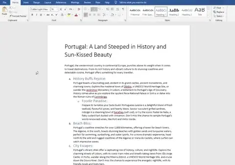
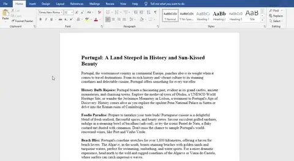
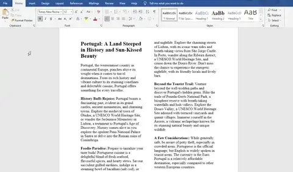
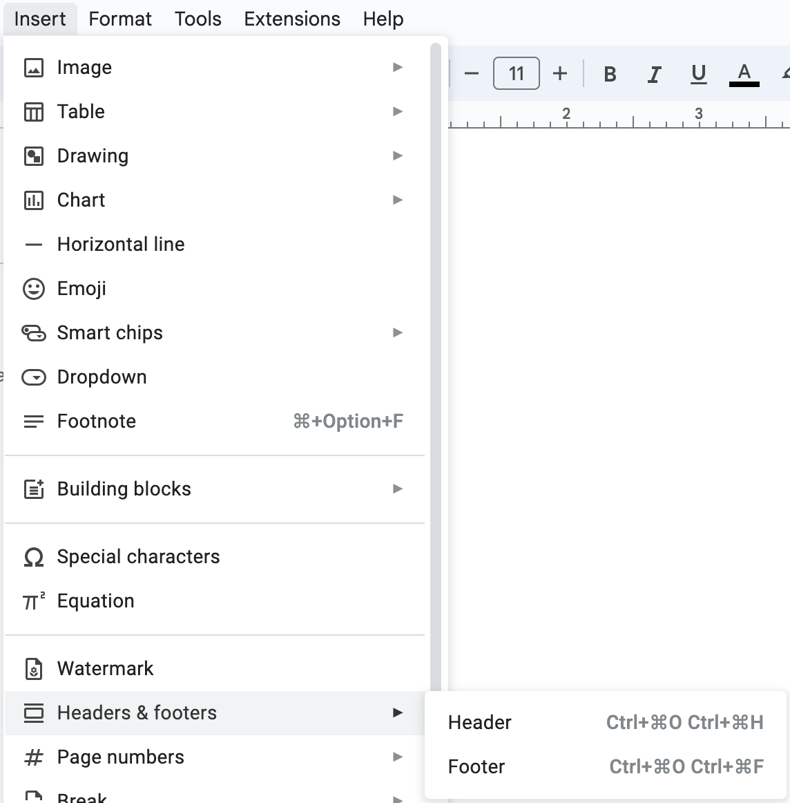

# Layout

## Layout

> **Spec point** — `spcpt_Kn797PJqGgjGzQ9N`

## Layout

### How can you edit the layout of a document?

- Editing the layout changes the overall **look and feel** of a document
- Layout relates to how **content is positioned** on a page
- There are many different way this can be achieved, such as using:

  - **Headings**
  - **Sub-headings**
  - **Lists**
  - **Templates**
  - **Orientation (portrait & landscape)**
  - **Breaks**

#### Headings & sub-headings

- Make documents consistent
- Predetermined styles can be applied (size, colour, font style etc.)
- Allows for the use of auto index creation

*Using headings and sub-headings*

#### Lists

- Present information in a clear, concise and easy to read way
- Allows users to find key points without being bogged down by paragraphs

*Adding lists in a document*

#### Templates

- Streamlines document production, saving time
- Pre-set formatting included with templates
- Help create a consistent look and feel

*Creating a new document using templates*

#### Orientation

- Weather the page is vertical (**portrait**) or horizontal (**landscape**)

*Changing the page orientation*

#### Breaks

- Breaks are a method of **dividing information into manageable chunks** to **control the layout** and organisation of a document
- Breaks can be used in:

  - **Printed materials**
  - **Websites and applications**

*Adding breaks to a document*

#### Page breaks

- A page break forces content to start on a new page **even when there is still space available**.
- Common uses include:

  - Starting a **new chapter or section**
  - **Separating graphics and tables** from surrounding text to improve readability
  - Ensuring all **page elements appear at the top** of a page

#### Column breaks

- A column break **divides a page into multiple columns** to suit specific content types
- Common uses include:

  - Creating a **newsletter or brochure**
  - **Formatting content for easier viewing on screen**

#### Section breaks

- A section break creates** independent sections that can be formatted differently**
- Common uses include:

  - Changing **page orientation** for a specific section
  - Applying different **column layouts** in the same document

## Headers & footers

> **Spec point** — `spcpt_KXvs9yBvS3hCHJRr`

## Headers & footers

### What is the purpose of headers & footers?

- Headers and footers are **areas at the top (header) and bottom (footer) of documents** that can be used to **help identify **them

- Headers and footers can contain:

  - **Document name**
  - **Author**
  - **Company logo**
- Headers and footers **only need to be added once** and are replicated on each page, **saving time** and **reducing the chance of data errors**

#### Automated objects

- Headers and footers can also contain automated objects to **enhance the professionalism **of a document
- Examples of automated objects include:

  - **Date/time**
  - **Page numbering**
  - **Total number of pages**

#### Aligning contents

- The contents of headers and footers **can be aligned consistently** within a document
- They can be aligned to the:

  - **Left margin**
  - **Right margin**
  - **Centred within margins**
