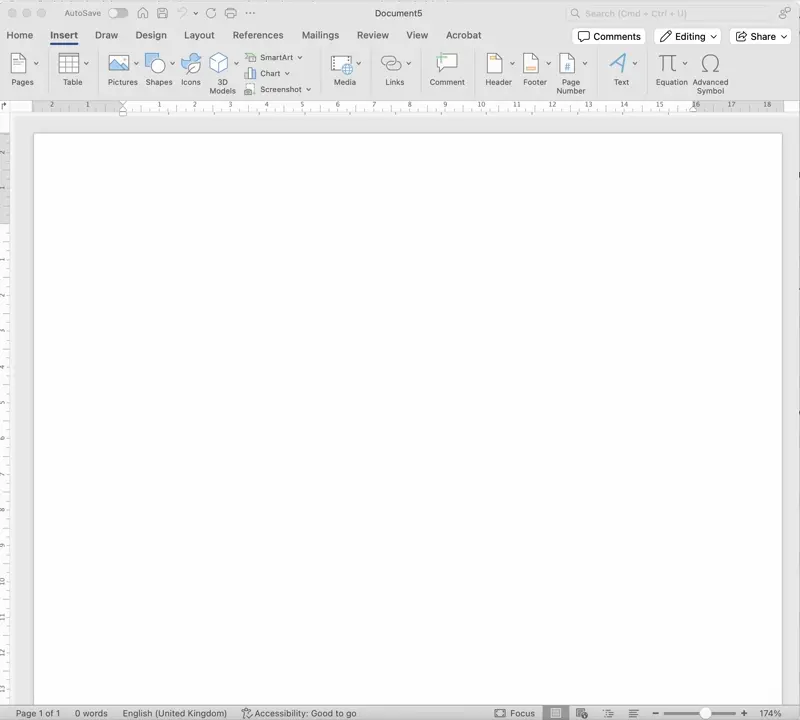
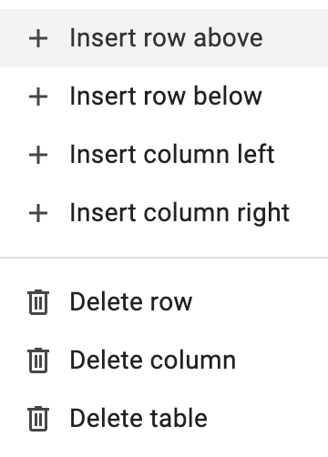
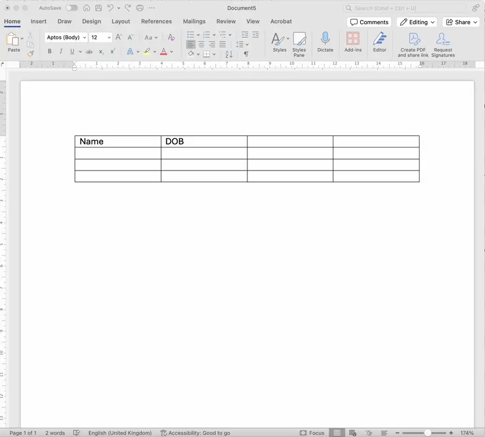
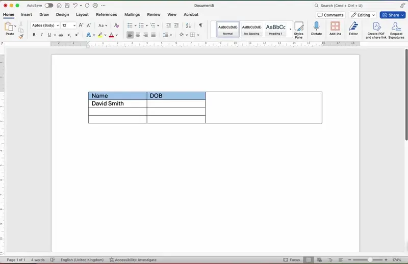

# Tables

## Tables

> **Spec point** — `spcpt_chnyZkhGYbChQx2R`

## Tables

### How do you create a table?

- Tables are created by **specifying the desired number of rows and columns**
- This can typically be done through** a menu option** or** manually typing them in**, or by **dragging the cursor** to the desired table size

### How can a table be edited and formatted?

- Tables can be edited in several ways:

  - **Insert rows and columns**  allows the user to add more rows or columns to your table
  - **Delete rows and columns** allows the removal unnecessary rows or columns

- **Merge cells** allows the user to join two or more cells into one
- Tables can be formatted to improve readability and visual appeal

- There are multiple options for formatting a table, some of these include:

  - **Set horizontal cell alignment**
  - **Set vertical cell alignment**
  - **Showing/hiding cell borders**
  - **colouring of the background of a cell**
  - **Adjusting the row/height width**

