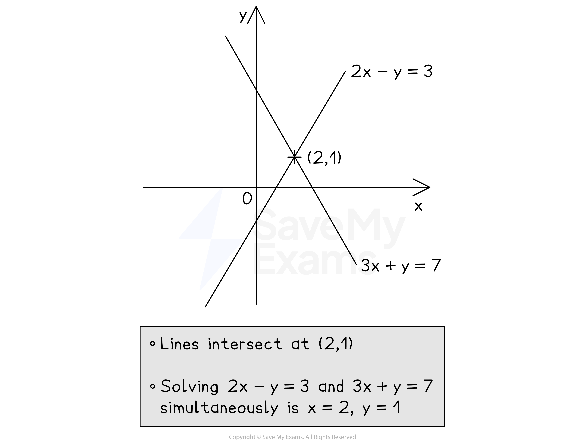

# Simultaneous Equations

## Linear Simultaneous Equations

> **Spec point** — `spcpt_4xsdMKbx5zYg9FpN`

## Linear simultaneous equations

### What are linear simultaneous equations?

- When there are **two unknowns** (***x***** and *****y***), we need **two equations** to find them both

  - For example, 3*x* + 2*y *= 11 and 2*x* - *y *= 5
  
    - The values that work for both equations at the same time are *x* = 3 and *y* = 1
- These are called **linear** **simultaneous equations**

  - **Linear **because there are no complicated terms like *x*2 or *y*2
  - **Simultaneous **because the solutions satisfy both equations at the **same time**

### How do I solve linear simultaneous equations by elimination?

- **Elimination** removes one of the variables, *x *or *y*
- To eliminate the *x*'s from 3*x *+ 2*y* = 11 and 2*x* - *y *= 5, make the number in front of the *x* (the **coefficient**) in both equations the same (the sign may be different)

  - Multiply** every term** in the **first** equation **by 2**
  
    - 6*x* + 4*y* = 22
  - Multiply **every term** in the **second **equation **by 3**
  
    - 6*x *- 3*y* = 15
  - **Subtracting** the second equation from the first **eliminates *****x***
  
    - When the** sign** in front of the term you want to eliminate is the** same**, **subtract **the equations

`negative bottom enclose table row cell 6 x plus 4 y equals 22 end cell row cell 6 x minus 3 y equals 15 end cell end table end enclose
space space space space space space space space space space space space space 7 y equals 7`

- The *y*  terms have become 4*y *- (-3*y*) = 7*y *(be careful with **negatives**)

  - **Solve** the resulting equation to find *y*
  - *y *= 1
- Then **substitute** *y * = 1 into one of the **original **equations to find* x*

  - 3*x* + 2 = 11, so 3*x *= 9, giving *x* = 3
- Write out **both** **solutions** together, *x *= 3 and *y *= 1
- **Alternatively**, you could have eliminated the *y*'s from 3*x *+ 2*y * = 11 and 
2*x *- *y *= 5 by making the **coefficient** of *y* in both equations the same

  - Multiply every term in the second equation by 2
  - **Adding** this to the first equation **eliminates *****y ***(and so on)
  
    - When the** sign** in front of the term you want to eliminate is **different**, **add **the equations

`plus bottom enclose table row cell 3 x plus 2 y equals 11 end cell row cell 4 x minus 2 y equals 10 end cell end table end enclose space
space space space space 7 x space space space space space space space space space equals 21`

### How do I solve linear simultaneous equations by substitution?

- **Substitution **means substituting one equation into the other

  - This is an **alternative** method to **elimination**
  
    - You can still use elimination if you prefer
- To solve 3*x *+ 2*y* = 11 and 2*x* - *y* = 5 by substitution

  - **Rearrange** one of the equations into ***y***** =** ... (or *x *= ...)
  
    - For example, the second equation becomes *y* = 2*x* - 5
  - **Substitute **this into the first equation
  
    - This means **replace **all *y*'s with 2*x *- 5 in brackets
    - 3*x* + 2(2*x* - 5) = 11
  - **Solve** this equation to find *x*
  
    - *x* = 3
  - Then **substitute** *x* = 3 into *y *= 2*x* - 5 to find *y*
  
    - *y *= 1

### How do I solve linear simultaneous equations graphically?

- **Plot** both equations on the same set of axes

  - To do this, you can use a **table of values**
  
    - or rearrange into *y* = *mx* + *c  *if that helps
- Find where the lines **intersect** (cross over)

  - The *x *and *y ***solutions** to the simultaneous equations are the *x *and *y ***coordinates** of the point of **intersection**
- For example, to solve 2*x *- *y* = 3 and 3*x* + *y* = 7 simultaneously

  - First **plot** them both on the **same axes** (see graph)
  - Find the **point of intersection**, (2, 1)
  - The solution is *x* = 2 and *y* = 1

> **Exam Hint**
> - Always check that your final solutions satisfy **both **original simultaneous equations!
> - Write out both solutions (*x* and *y*) together at the end to avoid examiners missing a solution in your working.

> **Worked Example**
> Solve the simultaneous equations
> 
> `table row cell 5 x plus 2 y end cell equals 11 row cell 4 x minus 3 y end cell equals 18 end table`
> 
> **Answer:**
> 
> > *It helps to number the equations*
> 
> `table row cell 5 x plus 2 y end cell equals cell 11 space space space space space space space space space space space space end cell row cell 4 x minus 3 y end cell equals 18 end table``table row blank blank cell circle enclose 1 end cell end table
> table row blank blank cell circle enclose 2 end cell end table`
> 
> > *We will choose to eliminate the **y **terms*
> *Make the **y** terms equal by multiplying all parts of equation 1 by 3 and all parts of equation 2 by 2*
> 
> `table row cell 15 x plus 6 y end cell equals cell 33 space space space space space space space space space end cell row cell 8 x minus 6 y end cell equals cell 36 space space space space space space space space end cell end table``table row blank blank cell circle enclose 3 end cell end table
> table row blank blank cell circle enclose 4 end cell end table`
> 
> > *The 6**y **terms have different signs, so they can be eliminated by adding equation 4 to equation 3 *
> 
> `space space space space space space space space space space 15 x plus 6 y equals 33 space space space space space space space space space space space space
> bottom enclose space plus space space space space space space space 8 x minus 6 y equals 36 space end enclose
> space space space space space space space space space space 23 x space space space space space space space space space equals 69 space`
> 
> > *Solve the equation to find** x **(divide both sides by 23)*
> 
> `table row x equals cell 69 over 23 equals 3 end cell end table`
> 
> > *Substitute **x** = 3 into either of the two original equations*
> 
> `circle enclose 1 space space space space space`* *`5 open parentheses 3 close parentheses plus 2 y equals 11`
> 
> > *Solve this equation to find** y*
> 
> `table row cell 15 plus 2 y end cell equals 11 row cell 2 y end cell equals cell 11 minus 15 end cell row cell 2 y end cell equals cell negative 4 space end cell row y equals cell fraction numerator negative 4 over denominator 2 end fraction equals negative 2 end cell end table`
> 
> > *Substitute **x** = 3  and **y **= - 2 into the other equation to check that they are correct*
> 
> `table row blank blank cell circle enclose 2 space space space space space end cell end table`* *`table row cell 4 x minus 3 y end cell equals 18 end table`
> *   *`table row cell 4 open parentheses 3 close parentheses minus 3 open parentheses negative 2 close parentheses end cell equals 18 row cell 12 minus open parentheses negative 6 close parentheses end cell equals 18 row 18 equals 18 end table`
> 
> > *Write out both solutions together*
> 
> $x=3,y=-2$
