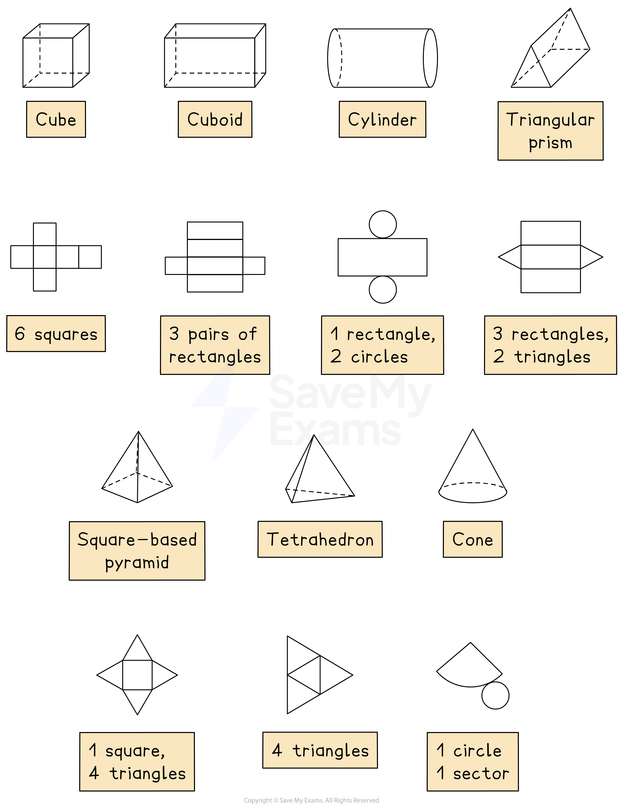
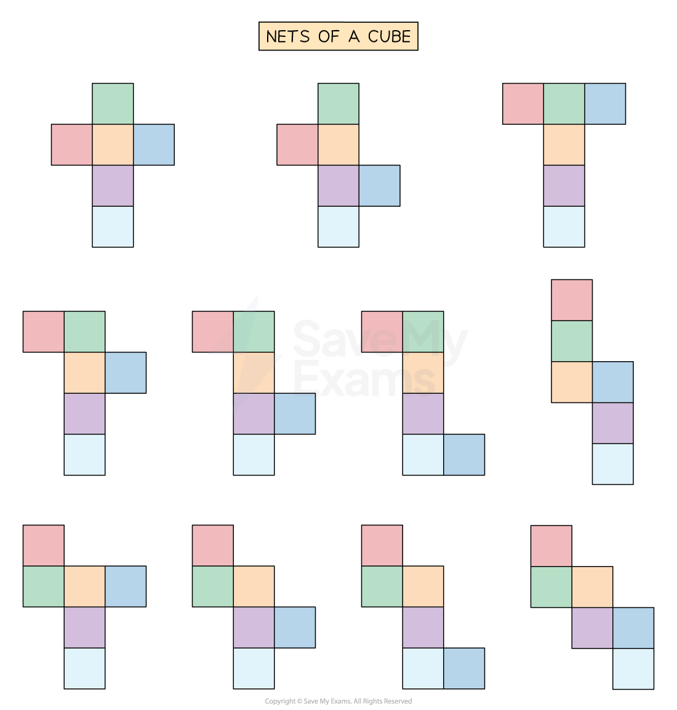
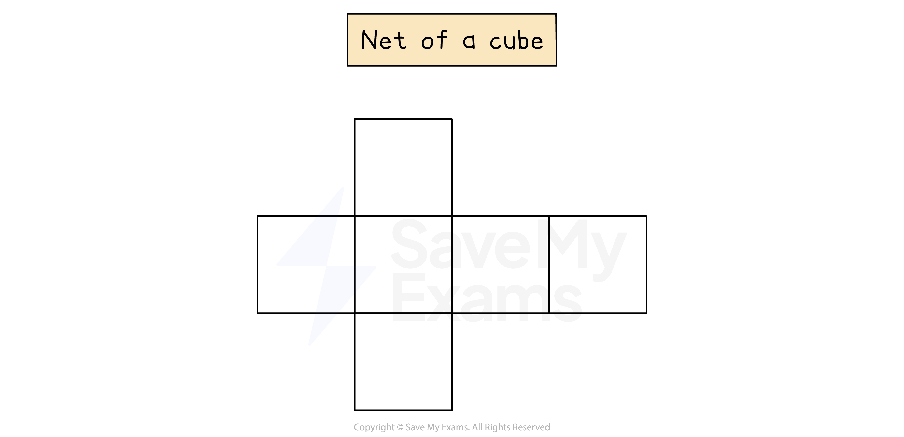
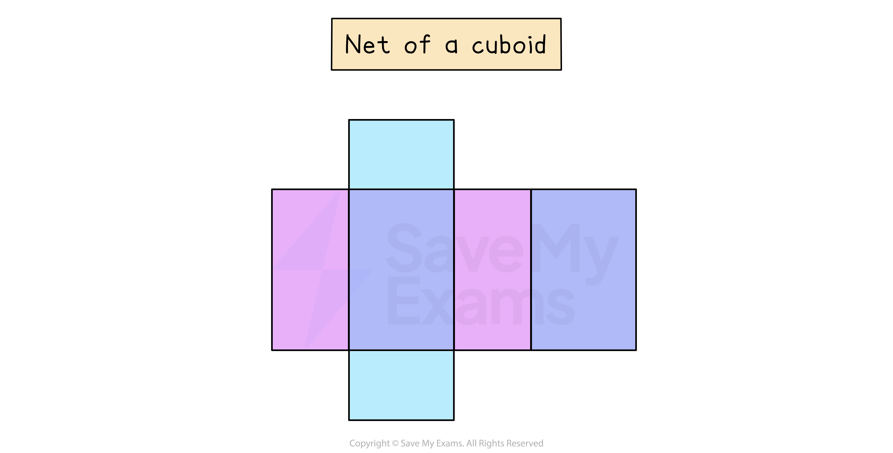
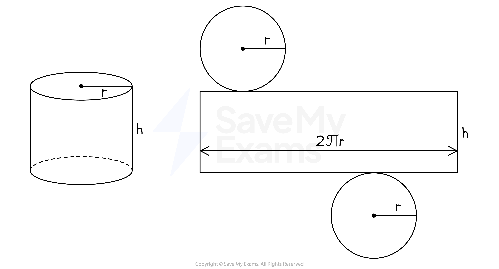
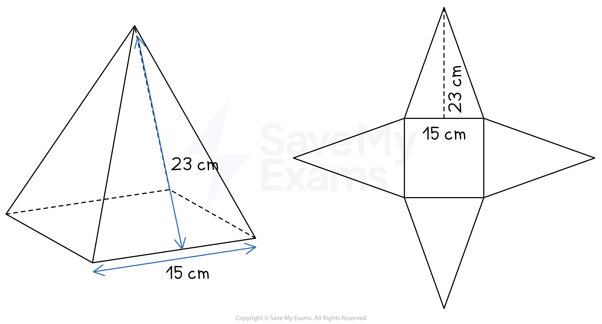

# Nets of Solids

## Nets of Solids

> **Spec point** — `spcpt_YbnQpJQYYZhVMwpX`

## Nets of solids

### What is a net of a solid?

- A **net **of a solid is a **2D drawing** that can be cut out and folded **to make a 3D shape**
- Each of the faces of the 3D shape are arranged in a certain pattern

  - Not every arrangement of the faces will create a net of that solid
  - Solids can have more than one arrangement that will work to make the 3D shape
- The **area **of the **net of a 3D shape** is the same as the **surface area **of the solid

*Nets of solids*

### What does the net of a cube or cuboid look like?

- The net of a **cube **has 6 squares connected at certain edges
- There are **11 different arrangements** of the square faces that will form a net of a cube

- The **most common** and **easiest to remember** is in the form of a cross

- A **cuboid **has 6 rectangular faces, so its net consists of 6 rectangles
- The rectangles will be in three pairs of two
- There are 54 different possible nets of a cuboid

  - Again, the most common and easiest to remember is in the form of a cross
  - Pay attention to which rectangles are the same
  
    - They are colour-coded in the diagram below

### What does the net of a cylinder look like?

- The net of a cylinder consists of two circles and a rectangle
- The **length **of the rectangle is equal to the **circumference **of the circles

  - $\mathrm{Circumference}=2\timesπ\times\mathrm{radius}$
- The **width **of the rectangle is equal to the **height **of the cylinder

*Net of a cylinder*

### What does the net of a pyramid look like?

- The net of a **square-based pyramid** consists of one square and four congruent (identical) triangles

  - The **perpendicular height **of each triangle is equal to the **slant height **of the pyramid

*Example of a net of a pyramid*

> **Exam Hint**
> You may be given the dimensions of the solid when asked to draw a net.
> 
> Make sure you put the correct lengths in the correct places by imagining cutting out and folding up the net.

> **Worked Example**
> A cuboid measures 6 cm by 3 cm by 2 cm.
> 
> On the 1 cm2 grid, draw an accurate net of this cuboid. One face has been drawn for you.
> 
> 
> 
> **Answer:**
> 
> > *The cuboid has three pairs of rectangles; measuring 6 cm by 3 cm, 6 cm by 2 cm, and 3 cm by 2 cm*
> 
> > *Make sure the net has two of each of these rectangles in the correct places*
> 
> 
