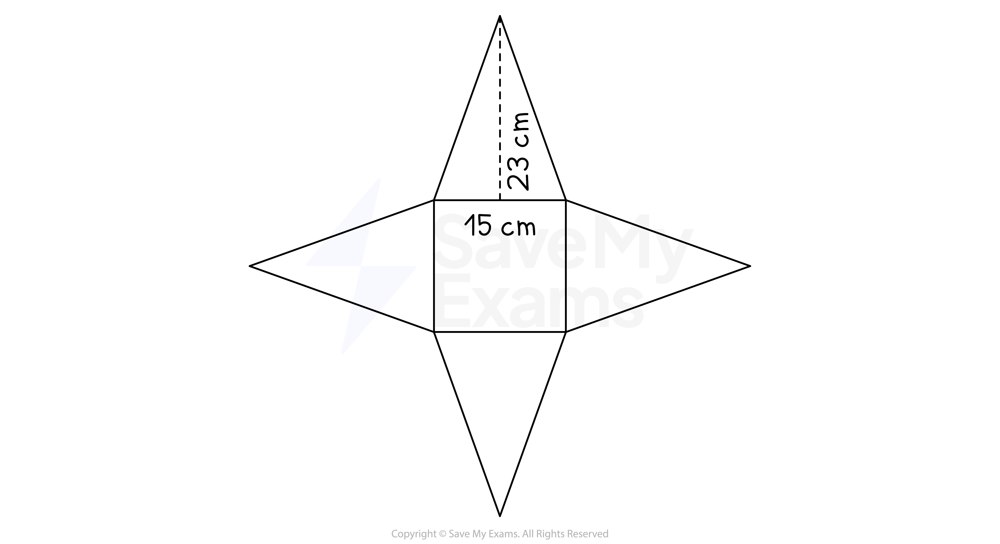

# Surface Area

## Surface Area

> **Spec point** — `spcpt_ncwVDtmPBNzrxjvH`

## Surface area

### What is surface area?

- The **surface area** of a 3D object is the **sum of the areas of all the faces **that make up the shape

  - Area is a 2D idea being applied into a 3D situation
  - A face is one of the flat or curved **surfaces** that make up a 3D object

### How do I find the surface area of cubes, cuboids, pyramids, and prisms?

- In cubes, cuboids, polygonal-based pyramids, and polygonal-based prisms (ie. pyramids and prisms whose bases have straight sides), **all the faces are flat**
- The **surface area** is found by

  - calculating the area of each individual flat face
  - adding these areas together
- When calculating surface area, it can be helpful to **draw a 2D net for the 3D shape** in question

  - For example, consider a square-based pyramid where the top of the pyramid is directly above the centre of the base
  
    - Its net will consist of a square base and four identical isosceles triangular faces
    - Calculate the area of a square and the area of each triangle then add them together

### How do I find the surface area of a cylinder?

- A cylinder has **two flat surfaces** (the top and the base) and** one curved surface**
- The **net** of a cylinder consists of** two circles** and a **rectangle** 
- The **curved surface area **(which is a rectangle) of a cylinder, *A*, with base radius, *r*, and height, *h*, is therefore given by

  - $A=2πrh$
  - This is the circumference of the circle, multiplied by the height
  - This formula is **not** given to you in the exam
- The **total surface area **of a cylinder, *A**Total*, can be found using the formula

  - $A_{Total}=2πrh+2πr^{2}$
  - This is the area of the curved surface (a rectangle), plus two circles of radius *r*
  - This formula is **not** given to you in the exam

### How do I find the surface area of a cone?

- A cone has **one flat surface** (the base) and **one curved surface**
- The net of a cone, with radius, *r*, perpendicular height, *h*, and sloping edge, (slant height), *l*, consists of

  - A **circular** **base**
  - A **sector** with radius, *l*, and an arc length equal to the circumference of the base

- The **curved surface area** of a cone, *A*, with radius, *r*, perpendicular height, *h*, and sloping edge, *l*, can be found using the formula

  - $A=πrl$
  - This formula is given to you in the exam if it is needed
- The **total surface area** of a cone, *A**Total*, can be found using the formula

  - $A_{Total}=πrl+πr^{2}$
  - This formula is **not** given to you in the exam
  
    - It is just the curved surface area formula above, plus the area of a circle

### How do I find the surface area of a sphere?

- A sphere has a **single curved surface**

- The surface area of a sphere, *A*, with radius, *r*, can be found using the formula

  - $A=4πr^{2}$
  - This formula is given to you in the exam if it is needed

> **Exam Hint**
> - Read the question carefully, you may need to add additional areas, e.g. a base
> - Make you are confident in calculating the areas of rectangles, circles and triangles

> **Worked Example**
> Find the surface area of the cuboid shown below.
> 
> 
> 
> **Answer:**
> 
> > *Find the area of the face at the front*
> 
> *2 cm × 10 cm = 20 cm**2** *
> 
> > *Find the area of the face at the side*
> 
> *2 cm × 15 cm = 30 cm**2** *
> 
> > *Find the area of the face at the top*
> 
> *10 cm × 15 cm = 150 cm**2** *
> 
> > *There are two of each face*
> *Add together the areas of all 6 faces*
> 
> *20 + 20 + 30 + 30 + 150 + 150 = 400*
> 
> **Final answer:** **400 cm****2**
