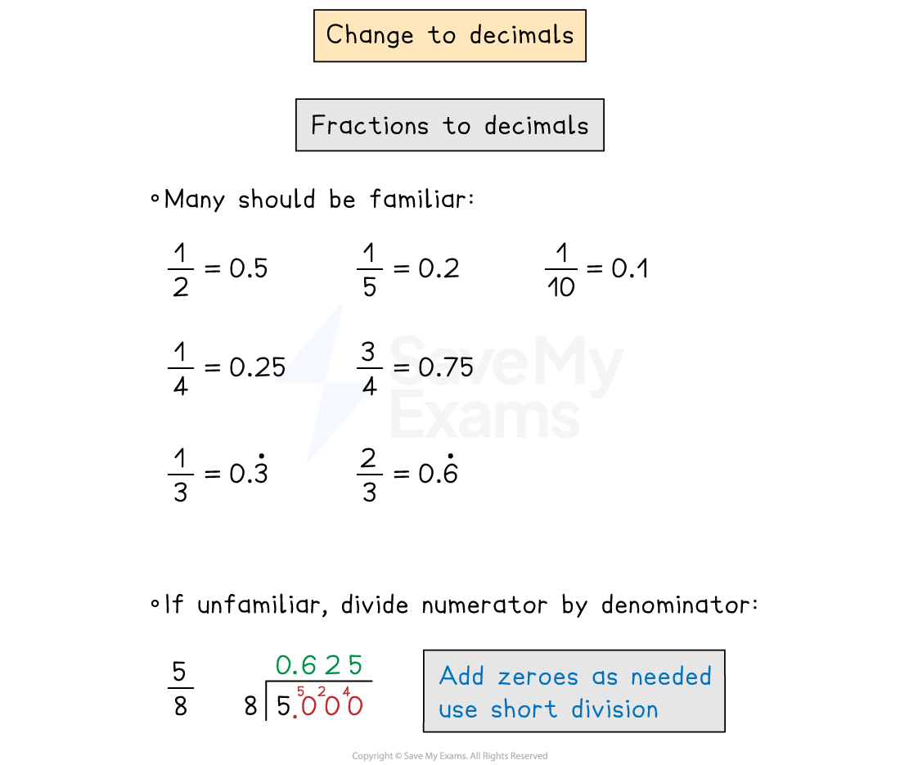

# Converting Fractions, Decimals & Percentages

## FDP Conversions

> **Spec point** — `spcpt_8MpvS5pnYkf9QswF`

## FDP conversions

### How do I convert from a percentage to a decimal?

- **Divide by 100** (move digits two places to the right)

  - 6% as a decimal is 6 ÷ 100 = 0.06
  - 40% as a decimal is 40 ÷ 100 = 0.4
  - 350% as a decimal is 350 ÷ 100 = 3.5
  - 0.2% as a decimal is 0.2 ÷ 100 = 0.002

### How do I convert from a decimal to a percentage?

- **Multiply by 100** (move digits two places to the left and add a % sign)

  - 0.35 as a percentage is  0.35 × 100 = 35%
  - 1.32 as a percentage is 1.32 × 100 = 132%
  - 0.004 as a percentage is 0.004 × 100 = 0.4%

### How do I convert from a decimal to a fraction?

- If it has o**ne decimal place**, write the digits over **10**

  - 0.3 is $\frac{3}{10}$
  - 1.1 is $\frac{11}{10}$
- If it has **two decimal places**, write the digits over **100**

  - 0.07 is $\frac{7}{100}$
  - 0.13 is  $\frac{13}{100}$
  - 30.01 is  $\frac{3001}{100}$
- If it has ***n***** decimal places**, write the digits over **10*****n***

  - 0.513 is $\frac{513}{1000}$
  - 0.0007 is  $\frac{7}{10000}$
- Learn **simple recurring decimals** as fractions

  - 0.33333… = `0.3 with dot on top`  is  $\frac{1}{3}$
  - 0.66666… =  `0.6 with dot on top` is  $\frac{2}{3}$
- **Whole numbers** can be written as fractions by writing them over **1**

  - 5 is $\frac{5}{1}$

### How do I convert from a percentage to a fraction?

- Write the **percentage over 100**

  - 37% is $\frac{37}{100}$

### How do I convert from a fraction to a decimal?

- Fractions written **over powers of 10** are quicker

  - $\frac{3}{5}=\frac{6}{10}$ which is 0.6
  - $\frac{7}{20}=\frac{35}{100}$ which is 0.35
  - $\frac{1}{500}=\frac{2}{1000}$ which is 0.002

### How do I convert from a fraction to a percentage?

- Change fractions into **decimals** then **multiply by 100**

  - $\frac{4}{5}=\frac{8}{10}$ which is 0.8 as a decimal, which is 0.8 × 100 = 80%

> **Exam Hint**
> A calculator can be used to check conversions between fractions and decimals (even if the question says to show working without a calculator).
