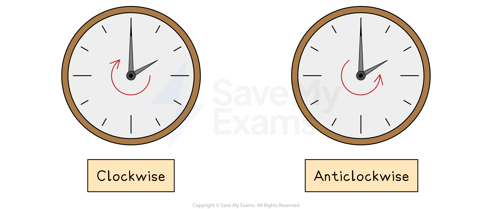

# Rotations

## Rotations

> **Spec point** — `spcpt_N5xf2wmr4yCNxHBj`

## Rotations

### What is a rotation?

- A **rotation** **turns** a shape** around a point**

  - This is called the** centre of rotation**
- The **rotated image** is the **same size** as the **original image**

  - It will have a **new position and orientation**
- If the centre is a point on the original shape then that point is **not changed** by the rotation

  - It is called an **invariant point**

*Orientation of a rotation*

### How do I rotate a shape?

- **STEP 1** Place the **tracing paper** over page and draw over the original object
- **STEP 2** Place the point of your pencil on the **centre of rotation**
- **STEP 3** **Rotate** the tracing paper by the **given angle** in the **given direction**

  - The angle will be **90°**, **180°** or **270°**
- **STEP 4**
**Carefully draw** the image onto the coordinate grid in the **position shown by the tracing paper**

> **Exam Hint**
> When you first go into the exam room, make sure there is some **tracing paper **on your desk ready for you. If there isn't ask for some before the exam begins.
> 
> Draw an **arrow facing up **on your tracing paper.
> 
> The arrow will be **facing left or right** when you have turned **90° or 270°.**
> 
> The arrow will be **facing down** when you have turned **180°.**
> 
> **Double-check** that you have copied the rotated image into the correct position.
> 
> Put the tracing paper over the original object and rotate it again to see that it lines up with your image.

> **Worked Example**
> (a) On the grid below rotate shape A by 90° anti-clockwise about the point (0, 2).
> 
> Label your answer A'.
> 
> 
> 
> **Answer:**
> 
> > *Using tracing paper, draw over the original object and mark one vertex.*
> *Mark on the centre of rotation.*
> *Draw an arrow pointing vertically upwards on the paper.*
> 
> 
> 
> > *With your pencil fixed on the point of rotation, rotate the tracing paper 90**o** anti-clockwise, the arrow that you drew should now be pointing left.*
> *Make a mental note of the new coordinates of the vertex that you marked on your tracing paper.*
> *Draw the new position of this vertex onto the grid.  *
> 
> 
> 
> > *Repeat this process for the other two vertices on the triangle.*
> *Connect the vertices together to draw the rotated image.*
> 
> 

### How do I describe a rotation?

- To describe a **rotation**, you must:

  - State that the transformation is a **rotation**
  - State the **centre of rotation**
  - State the **angle of rotation**
  
    - This will be 90°, 180° or 270°
  - State the **direction of rotation**
  
    - Clockwise or anti-clockwise
    - A direction is not required if the angle is 180°
    - 90° clockwise is the same as 270° anti-clockwise
- To find the **centre of rotation**:

  - If the rotation is **90° or 270°**
  
    - Use** tracing paper** and **start on the original shape**
    - **Try a point** as the centre and rotate the original shape
    - If the** rotated shape matches the image** then that point is the centre
    - Otherwise keep picking points until one works
  - If the rotation is **180°**
  
    - Draw **lines connecting** each vertex on the **original shape** with the corresponding vertices on the **image**
    - These lines will **intersect** at the centre of rotation

### How do I reverse a rotation?

- If a shape has been **rotated** to a new position, you can perform a single transformation to **return the shape** to its **original position**
- A rotation can be **reversed** by simply **reversing the direction** of rotation

  - The angle of rotation is the same
  - The centre of rotation is the same
- For a shape rotated by 45º in a clockwise direction about the point (0, 3)

  - The **reverse transformation** is
  
    - a rotation of 45º
    - in an anti-clockwise direction
    - about the point (0, 3)

> **Worked Example**
> Describe fully the single transformation that creates shape B from shape A.
> 
> 
> 
> **Answer:**
> 
> > *You should be able to see that the object has been rotated 90**o** clockwise (or 270**o** anti-clockwise).*
> *You are likely to be able to see roughly where the centre of rotation is but it may take a little time to find its position exactly.*
> 
> 
> 
> > *To find the exact coordinates of the centre of rotation you can play around with tracing paper.*
> 
> > *Draw over shape A on tracing paper, then try out different locations for the centre of enlargement by placing your pencil on a point, rotating the paper 90**o** clockwise and seeing if it lines up with shape B.*
> 
> 
> 
> > *Write down the all of the elements required to fully describe the transformation: the type of transformation, the centre of rotation, the angle and the direction.*
> 
> **Final answer:** **Rotation, 90° clockwise with centre (-4, 0)**
