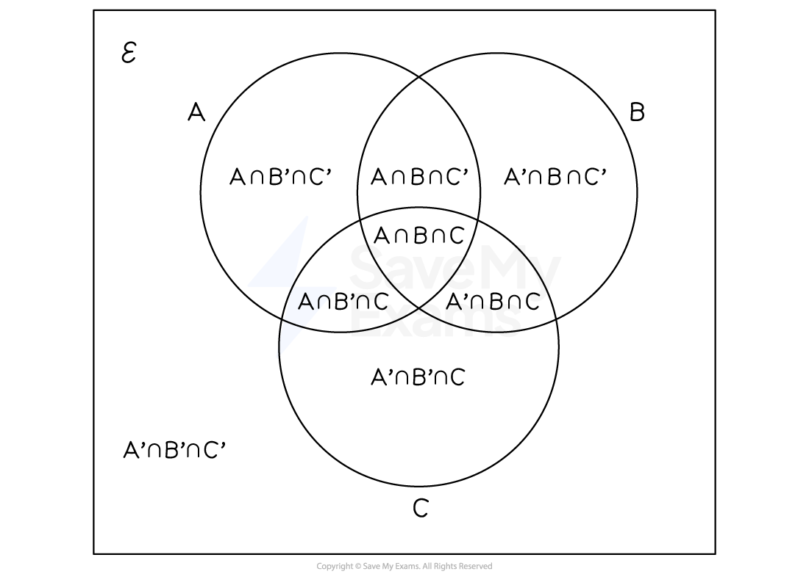
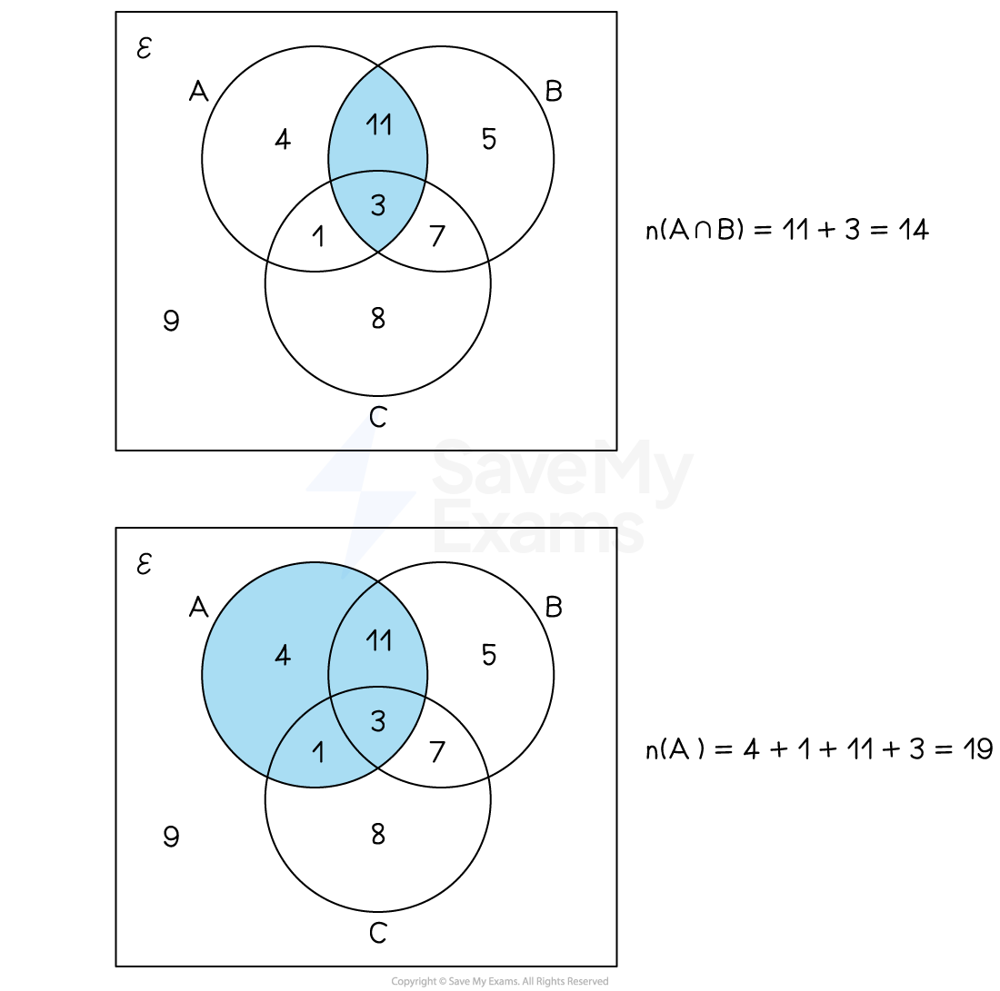
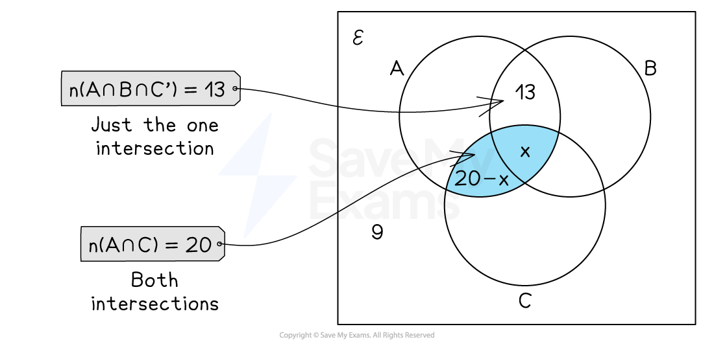
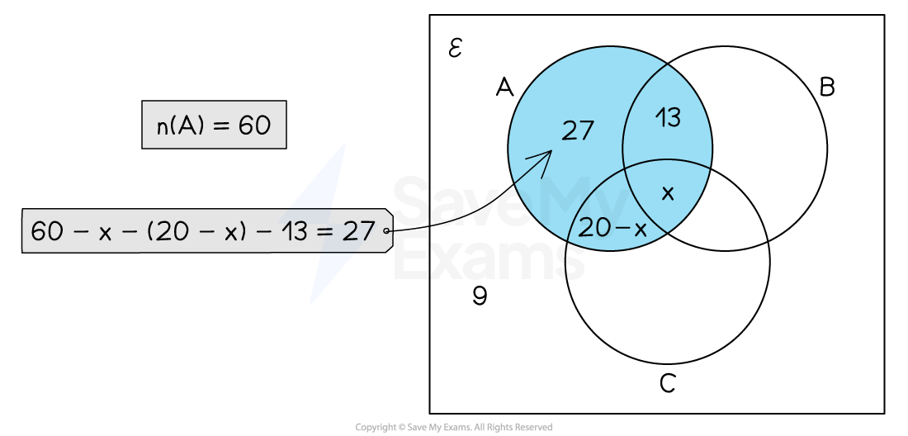

# Venn Diagrams with Three Sets

## Venn diagrams with three sets

> **Spec point** — `spcpt_vfPNw2mzksvxf2JP`

## Venn diagrams with three sets

### What does a Venn diagram with three sets look like?

- There is a **rectangle** representing the universal set
- There are **three circles**

  - One for each of the sets
  
    - E.g.  $A$, $B$ and $C$
- The three circles intersect and split the rectangle into **eight regions**

  - A region where all **three circles intersect**
  
    - $A\capB\capC$
  - Three regions where **exactly two circles intersect**
  
    - $A\capB\capC'$, $A\capB'\capC$ and $A'\capB\capC$
  - Three regions where each circle **does not intersect with any other circle**
  
    - $A\capB'\capC'$, $A'\capB\capC'$ and $A'\capB'\capC$
  - A region **outside the three circles**
  
    - $A'\capB'\capC'$
    - This can also be written as `open parentheses A union B union C close parentheses apostrophe`

*The intersections of three sets*

*Example of a Venn diagram with three sets*

- It is possible that **two **of the circles do not intersect

  - E.g. if $A\capC=\emptyset$

*Example of a Venn diagram where two sets do not have an intersection*

### How do I find the number of elements in a subset?

- Identify the **intersections **which make up the subset

  - E.g. the subset $A\capB$ is made up of $A\capB\capC$ and $A\capB\capC'$
- **Add together** the number of elements in the intersections

*Example of finding number of elements in subsets*

### How do I fill in a Venn diagram with three sets?

- Start with the **intersection **of **all three** circles $A\capB\capC$

  - Fill in the number or label it $x$ if it is unknown
- Fill in regions where **exactly two circles intersect**

  - You might be given the total number of elements in the intersection between those two sets
  
    - E.g. There are 20 elements that are in both set $A$ and set $C$
  - Subtract the number in the intersection of all three circles to find the number of elements that are just in those two sets
  
    - E.g. $20-x$ elements are in set $A$ and set $C$ but not set $B$

- Fill in the parts of the circles which **do not intersect other circles**

  - You might be given the total number of elements in a set
  
    - E.g. There are 60 elements in set $A$
  - Subtract the numbers in the intersections which involve set $A$
  
    - E.g. subtract the number of elements in $A\capB\capC$, $A\capB\capC'$ and $A\capB'\capC$ from the number of elements in $A$

- Fill in the number **outside all the circles**

  - This is the total number of elements minus the number of elements in all the intersections

> **Worked Example**
> Some students were asked whether they like studying statistics `open parentheses S close parentheses`, algebra `open parentheses A close parentheses` and geometry `open parentheses G close parentheses`.
> 
> - 5 said they like studying all three of statistics, algebra and geometry
> - 11 said they like studying statistics and algebra
> - 16 said they like studying algebra and geometry
> - 8 said they like studying statistics and geometry
> - 25 said they like studying geometry
> - 4 said they do not like studying any of the three topics
> - the number who said they like studying statistics only is the same as the number who said they like studying algebra only
> 
> Let $x$ be the number of students who said they like studying statistics.
> 
> (a) Show all this information on the Venn diagram, giving the number of students in each appropriate subset, in terms of $x$ where necessary. Simplify all expressions.
> 
> 
> 
> **Answer**:
> 
> > *Put 4 outside the circles*
> 
> > *Put 5 in the intersection of all three circles*
> 
> > *Find the number of students who like statistics and algebra only*
> 
> *11 - 5 = 6*
> 
> > *Find the number of students who like algebra and geometry only*
> 
> *16 - 5 = 11*
> 
> > *Find the number of students who like statistics and geometry only*
> 
> *8 - 5 = 3*
> 
> > *Find the number of students who like geometry only*
> 
> *25 - 5 - 11 - 3 = 6*
> 
> > *Find the number of students who like studying statistics only*
> 
> - *Give your answer in terms of *$x$
> 
> $x-5-6-3=x-14$
> 
> > *The number of students who like algebra only is the same as the number of students who like statistics only*
> 
> 
> 
> (b) Given that 30 students said they like studying algebra. Find the number of students who said they like studying statistics.
> 
> **Answer**:
> 
> > *Add together the numbers in the circle for algebra*
> 
> $x-14+6+5+11=x+8$
> 
> > *Set this equal to 30 and solve for *$x$
> 
> `table row cell x plus 8 end cell equals 30 row x equals 22 end table`
> 
> **Final answer:** **22 students said they like studying statistics**
