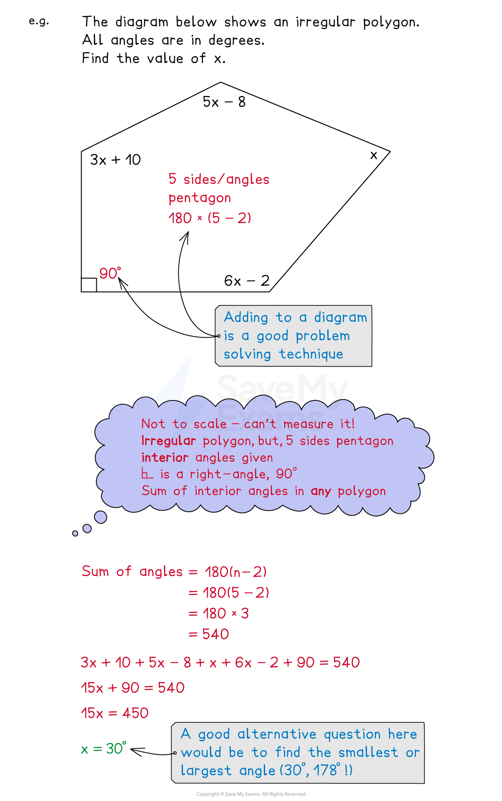

# Forming Equations from Shapes

## Forming Equations from Shapes

> **Spec point** — `spcpt_F2BG7bHjbM3fZkrR`

## Forming equations from shapes

### How do I form equations from shapes?

- You need to use all the information given on the diagram and any specific **properties **of that **shape**
- Common **2D shapes** that you should know properties for are

  - Triangles: **equilateral**, **isosceles**, **scalene**, **right-angled**
  - Quadrilaterals: **square**, **rectangle**, **kite**, **rhombus**, **parallelogram**, **trapezium**
- You may be asked about **perimeter**, **area **or **angles**
- You may be asked about **polygons**

  - **Regular** vs **irregular **polygons
  - **Interior** vs **exterior** angles
  
    - The **sum** of **interior** angles is **180(*****n*****-2) **for an *n*-sided polygon
- You may be asked about **angles** in **parallel lines**

  - **Alternative**, **corresponding** and **co-interior**
- You may be asked about **3D shapes** involving **surface area **and **volume**

  - **Prisms **have constant cross sections
  
    - Volume is cross-section area multiplied by length

### Is there anything else that can help?

- **Sketch **a diagram if none is given
- **Split **up uncommon shapes into the** sum** or **difference** of common shapes
- Look out for important extra information

  - For example, a trapezium "with a line of symmetry"
- With** irregular **shapes, **assume** all angles and lengths are different (unless told otherwise)
- Put** brackets **around **algebraic expressions** when substituting them into geometric properties

> **Exam Hint**
> Read the question carefully - does it want an angle? perimeter? total area? curved surface area? etc.
> 
> For surface area and volume questions, check the list of formulas given in the exam.

> **Worked Example**
> A rectangle has a length of $3x+1$ cm and a width of $2x-5$ cm.
> 
> Its perimeter is equal to 22 cm.
> 
> (a) Use the above information to find the value of *x*.
> 
> **Answer:**
> 
> > *The perimeter of a rectangle is 2 × length + 2 × width*
> 
> $2(3x+1)+2(2x--5)$
> 
> > *Expand the brackets*
> 
> $6x+2+4x-10$
> 
> > *Simplify by collecting like terms*
> 
> $10x-8$
> 
> > *This perimeter is 22, so set this expression equal to 22*
> 
> $10x--8=22$
> 
> > *Solve this equation by adding 8 then dividing by 10*
> 
> `table row cell 10 x end cell equals cell 22 plus 8 end cell row cell 10 x end cell equals 30 row x equals cell 30 over 10 end cell row x equals 3 end table`
> 
> $x=3$
> 
> (b) Find the area of the rectangle.
> 
> **Answer:**
> 
> > *The area of a rectangle is its length multiplied by is width*
> *Substitute the value of **x**  from part (a) into the length and width given in the question*
> 
> *length is 3 × 3 + 1 = 10*
> 
> *width is 2 × 3 - 5 = 1*
> 
> > *Find the area (multiply length by width)*
> 
> *10 × 1*
> 
> > *Include the correct units for area*
> 
> **Final answer:** **Area = 10 cm****2**
