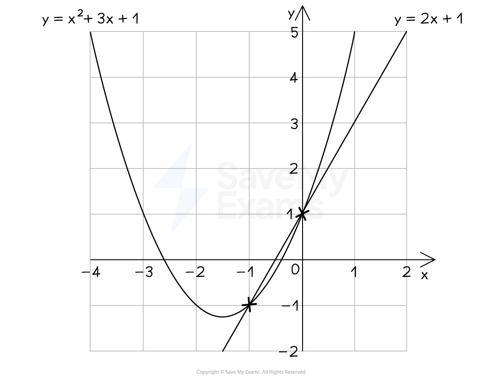

# Quadratic Simultaneous Equations

## Quadratic Simultaneous Equations

> **Spec point** — `spcpt_pGsqq7xcztBg59Yh`

## Quadratic simultaneous equations

### What are quadratic simultaneous equations?

- When there are two unknowns (e.g. *x* and *y*) in a problem, we need two equations to be able to find them both; these are called** simultaneous equations**
- If there is an *x*2 or *y*2 or *xy *in one of the equations then they are **quadratic** (or **non-linear**) simultaneous equations

### How do I use a graph to solve quadratic simultaneous equations?

- **Plot** both equations on the same set of axes

  - To do this, you can use a table of values
  - Or for straight lines it can help to rearrange into *y* = *mx* + *c*
- Find the point where the lines **intersect**

  - The *x* and *y ***solutions** to the simultaneous equations are the *x *and *y ***coordinates** of the point of **intersection**
- E.g. To solve *y* = *x*2 + 3*x* + 1 and *y* = 2*x* + 1 simultaneously

  - First **plot **them both (see graph below)
  - Then find the points of **intersection**, (-1, -1) and (0, 1)
  - So the **solutions **are *x* = -1 and *y* = -1 or *x* = 0 and *y* = 1

### How do I solve quadratic simultaneous equations using algebra?

- Use** substitution**

  - **Substitute** the** linear** equation, *y* = ... (or *x* = ...), into the quadratic equation
  
    - Do not try to substitute the quadratic equation into the linear equation
- E.g. To solve $x^{2}+y^{2}=25$ and $y-2x=5$

  - **Rearrange** the **linear** equation into $y=2x+5$
  - **Substitute** this into the quadratic equation, replacing all *y*'s with `open parentheses 2 x plus 5 close parentheses`
  
    - `x squared plus open parentheses 2 x plus 5 close parentheses squared equals 25`
- Expand and **solve** this **quadratic** equation

  - `x squared plus open parentheses 2 x plus 5 close parentheses open parentheses 2 x plus 5 close parentheses equals 25`
  - `table row cell x squared plus 4 x squared plus 20 x plus 25 end cell equals 25 end table`
  - `table row cell 5 x squared plus 20 x end cell equals 0 end table`
  - `table row cell 5 x open parentheses x plus 4 close parentheses end cell equals 0 end table`
  - $x=0$ and $x=-4$
- Substitute **each** value of *x* into the **linear** equation, $y=2x+5$, to find the corresponding *y* values

  - `y equals 2 open parentheses 0 close parentheses plus 5 equals 5`
  - `y equals 2 open parentheses negative 4 close parentheses plus 5 equals negative 3`
- Present your solutions in a way that makes it obvious which* x* belongs to which *y*

  - *x* = 0, *y* = 5 or *x* = -4, *y* = -3

- **Check** your final solutions satisfy both equations

### What if the quadratic has repeated roots or no roots?

- If the resulting quadratic after substituting has a **repeated root**,

  - then the line is a **tangent** to the curve
  
    - i.e. the curve and the line intersect in one place only
  - There is only **one solution** for *x* and *y*
- If the resulting quadratic to be solved has **no roots**,

  - then the line does not intersect with the curve
  - There are **no solutions** to the simultaneous equations
  - If this happens it *may* be an indicator that your working is wrong!

### What if I can't substitute one equation into the other straight away?

- If the linear equation is **not **in the form *y* = ...  or  *x* = ...

  - You will need to **rearrange **it first, so that it can be **substituted **into the quadratic equation
- Consider solving $xy=3$ and $x+y=4$
- Either:

  - Rearrange the second equation to $y=4-x$ and substitute into $xy=3$
  
    - `x open parentheses 4 minus x close parentheses equals 3`
    - Expanding produces a quadratic that can be solved for $x$
    - $4x-x^{2}=3$
  - Or rearrange the first equation to $y=\frac{3}{x}$  and substitute into $x+y=4$
  
    - $x+\frac{3}{x}=4$
    - Multiplying both sides by $x$ produces a quadratic that can be solved for $x$
    - $x^{2}+3=4x$

> **Exam Hint**
> When giving your final answer, make sure you indicate which *x* and *y* values go together.

> **Worked Example**
> Solve the equations
> 
> `table row cell x squared plus y squared end cell equals 36 row cell x minus 2 y end cell equals 6 end table`
> 
> **Answer:**
> 
> > *Number the equations*
> 
> `table row cell x squared plus y squared end cell equals cell 36 space space space space space space space space space space space space end cell row cell x minus 2 y end cell equals cell 6 space space space space space space space space space space space space space space space end cell end table``circle enclose 1
> circle enclose 2`* *
> 
> > *There is one quadratic equation and one linear equation so this must be done by substitution*
> 
> > *Equation 2 can be rearranged to make *$x$* the subject, which can then be substituted into equation 1*
> 
> > *You could rearrange to make *$y$* the subject instead, but this results in a fraction which can be more tricky to deal with*
> 
> > *Rearranging equation 2*
> 
> $x=2y+6$
> 
> > *Substituting into equation 1*
> 
> `open parentheses 2 y plus 6 close parentheses squared plus y squared equals 36`
> 
> > *Expand the brackets*
> *Remember that a bracket squared should be treated the same as double brackets*
> 
> `table row cell open parentheses 2 y plus 6 close parentheses open parentheses 2 y plus 6 close parentheses plus y squared end cell equals 36 row cell 4 y squared plus 6 open parentheses 2 y close parentheses plus 6 open parentheses 2 y close parentheses plus 6 squared plus y to the power of 2 space end exponent end cell equals 36 end table`
> 
> > *Simplify*
> 
> `table row cell 4 y squared plus 12 y plus 12 y plus 36 plus y squared end cell equals 36 row cell 5 y squared plus 24 y plus 36 end cell equals 36 end table`
> 
> > *Rearrange to form a quadratic equation that is equal to zero*
> *Do this by subtracting 36 from both sides*
> 
> `table row cell 5 y squared plus 24 y end cell equals 0 end table`
> 
> > *Take out the common factor of *`table attributes columnalign right center left columnspacing 0px end attributes row blank blank y end table`
> 
> `table row cell y open parentheses 5 y plus 24 close parentheses end cell equals 0 end table`
> 
> > *Solve to find the values of *$y$* by equating each factor to zero*
> 
> $y=0$*  or  *$5y+24=0$
> 
> > *Solve the linear equation above*
> 
> $y=-\frac{24}{5}$
> 
> > *So the two *$y$* values are*
> 
> `table row cell y subscript 1 end cell equals cell 0 space end cell row cell y subscript 2 end cell equals cell negative 24 over 5 end cell end table`
> 
> > *Substitute the values of *$y$* **into one of the equations (the linear equation is easiest) to find the values of *$x$
> 
> $x=2y+6$
> 
> `x subscript 1 equals 2 left parenthesis 0 right parenthesis plus 6 equals 6 space space space space space space space space space space space space x subscript 2 equals 2 open parentheses negative 24 over 5 close parentheses plus 6 equals negative 18 over 5`
> 
> > *Write the final solutions in clear pairs*
> 
> $x_{1}=6,y_{1}=0$
> $x_{2}=-\frac{18}{5},y_{2}=-\frac{24}{5}$
