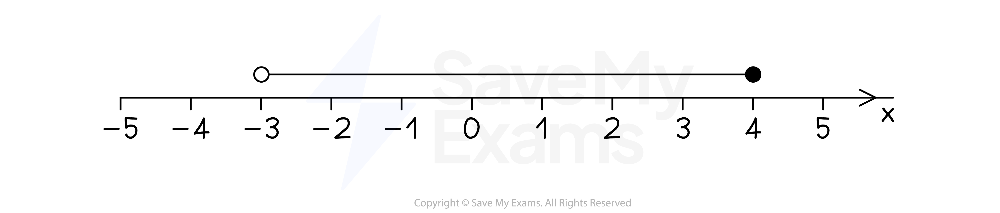

# Solving Linear Inequalities

## Solving Linear Inequalities

> **Spec point** — `spcpt_X8CSxK2dhn5rX34f`

## Solving linear inequalities

### What is an inequality?

- An **inequality** tells you that something is **greater than** (>) or **less than** (<) something else

  - *x* > 5 means *x* is greater than 5
  
    - *x* could be 6, 7, 8, 9, ...
- Inequalities may also include being **equal** (=)

  - ⩾ means **greater than or equal to**
  - ⩽ means **less than or equal to**
  
    - *x* ⩽ 10 means *x* is less than or equal to 10
    
      - *x *could be 10, 9, 8, 7, 6,....
- When they** cannot **be **equal**, they are called** strict **inequalities

  - > and < are **strict** inequalities
  
    - *x* > 5 **does not** include 5 (strict)
    - *x* ⩾ 5 **does** include 5 (not strict)

### How do I find integers that satisfy inequalities?

- You may be given** two** **end points** and have to list the **integer** values of *x* that **satisfy **the inequality

  - Look at whether each end point is **included **or not
  
    - 3 ⩽ *x *⩽ 6
    
      - *x* = 3, 4, 5, 6
    - 3 ⩽ *x *< 6
    
      - *x* = 3, 4, 5
    - 3 < *x* ⩽ 6
    
      - *x* = 4, 5, 6
    - 3 < *x *< 6
    
      - *x* = 4, 5
- If only **one end point** is given, there are an infinite number of integers

  - *x* > 2
  
    - *x* = 3, 4, 5, 6, ...
  - *x* ⩽ 2
  
    - *x* = 2, 1, 0, -1, -2, ...
    - Remember **zero** and **negative** whole numbers are **integers**
    - If the question had said **positive** integers only then just list *x* = 2, 1
- You may be asked to find integers that satisfy** two** inequalities

  - 0 < *x* < 5 and *x* ⩾ 3
  
    - List **separately**: *x* = 1, 2, 3, 4 and *x* = 3, 4, 5, 6,  ...
    - Find the values that appear in **both **lists: *x* = 3, 4
- If the question does not say *x* is an integer, do **not assume*** x* is an** **integer!

  - *x* > 3 actually means **any value** greater than 3
  
    - 3.1 is possible
    - $π$ = 3.14159... is possible
- You may be asked to find the** smallest **or **largest** integer

  - The smallest integer that satisfies *x* > 6.5 is 7

> **Worked Example**
> List all the integer values of $x$ that satisfy
> 
> $-4\leqx<2$
> 
> **Answer:**
> 
> > *Integer values are whole numbers *
> *-4 ≤ **x** shows that **x** includes -4, so this is the first integer*
> 
> **x*** = -4*
> 
> > *x** < 2 shows that **x** does not include 2*
> *Therefore the last integer is** x** = 1*
> 
> **x*** = 1*
> 
> > *For the answer, list all the integers from -4 to 1*
> *Remember integers can be zero and negative*
> 
> $x=-4,-3,-2,-1,0,1$

### How do I represent an inequality on a number line?

- The inequality -3 < *x* ≤ 4 is shown on a **number line** below

- Draw** circles** above the** end points **and connect them with a **horizontal line**

  - Leave an **open circle** for end points with **strict** inequalities, **< or >**
  
    - These end points **are not** included
  - Fill in a **solid circle** for end points with **≤ or ≥** inequalities
  
    - These end points** are **included 
- Use a **horizontal arrow** for inequalities with **one end point**

  - *x* > 5 is an open circle at 5 with a horizontal arrow pointing to the right

> **Worked Example**
> Represent the following inequalities on a number line.
> 
> (a) $-2\leqx<1$
> 
> **Answer:**
> 
> > *-2 is included so use a closed circle*
> 
> > *1 is not included so use an open circle*
> 
> 
> 
> (b) $t<3$
> 
> **Answer:**
> 
> > *3 is not included so use an open circle*
> 
> > *There is no second end point*
> *Any value less than three is accepted, so draw a horizontal arrow to the left*
> 
> 

### How do I solve linear inequalities?

- Solving linear inequalities is just like **Solving Linear Equations**

  - Follow the same rules, but keep the **inequality sign** throughout
  - If you change the inequality sign to an equals sign you are changing the meaning of the problem
- When you **multiply **or **divide** both sides by a **negative **number, you must **flip the sign** of the inequality

  - E.g. 
  `space 1 less than 2
  open parentheses cross times negative 1 close parentheses space space space space space space space space space space space space space space space space space space space open parentheses cross times negative 1 close parentheses
  space minus 1 greater than negative 2`
- **Never multiply **or **divide** by a **variable **(*x*) as this could be **positive or negative**
- The **safest way **to rearrange is simply to **add** and **subtrac**t to move all the terms onto **one side**

### How do I solve double inequalities?

- Inequalities such as $a<2x<b$ can be solved by applying the **same operation** to **all three sides** of the inequality

  - E.g. $\frac{a}{2}<x<\frac{b}{2}$
- Alternatively, you can **separate **the inequality into two inequalities

  - $a<2x$ and $2x<b$

> **Exam Hint**
> - Do **not **change the inequality sign to an equals when solving linear inequalities.
> 
>   - In an exam you will lose marks for doing this.
> - Remember to **reverse the direction** of the inequality sign when multiplying or dividing by a **negative** number!

> **Worked Example**
> Solve the inequality $2x-5\leq21$.
> 
> **Answer:**
> 
> > *Add 5 to both sides*
> 
> $2x\leq26$
> 
> > *Now divide both sides by 2*
> 
> **Final answer:** $x\leq13$** **

> **Worked Example**
> Solve the inequality $10-2x>4x-7$.
> 
> **Answer:**
> 
> > *Add *$2x$* to both sides*
> 
> $10>6x-7$
> 
> > *Add 7 to both sides*
> 
> $17>6x$
> 
> > *Divide both sides by 6*
> 
> $\frac{17}{6}>x\mathrm{or}x<\frac{17}{6}$
