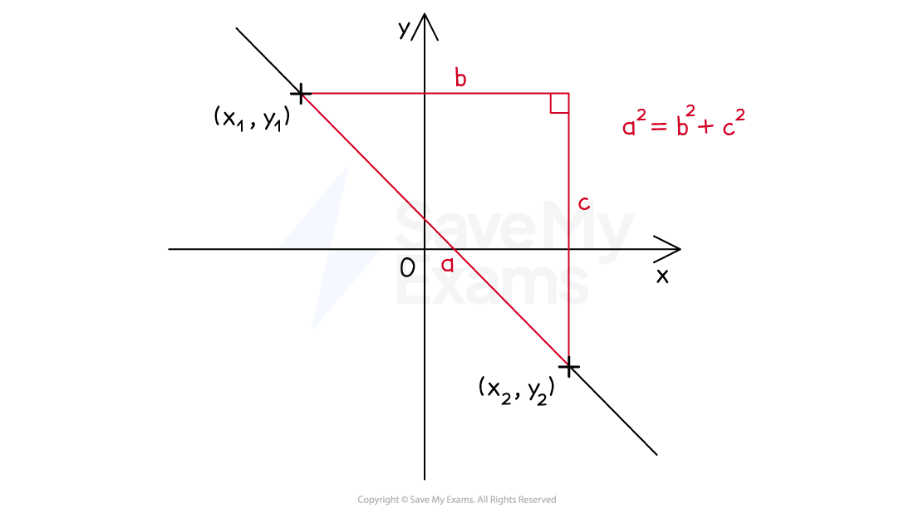

# Length of a Line

## Length of a Line

> **Spec point** — `spcpt_hMqjBRzQQfvsc9f8`

## Length of a line

### How do I calculate the length of a line?

- The **distance between two points** with coordinates `open parentheses x subscript 1 space comma space y subscript 1 close parentheses` and `open parentheses x subscript 2 space comma space y subscript 2 close parentheses` can be found using the formula

`d equals square root of open parentheses x subscript 1 minus x subscript 2 close parentheses squared plus open parentheses y subscript 1 minus y subscript 2 close parentheses squared end root`

- This formula uses** Pythagoras’ theorem**  $a^{2}+b^{2}=c^{2}$

  - It is applied to the difference in the $x$-coordinates and the difference in the $y$-coordinates

> **Exam Hint**
> Be extra careful when negative coordinates are involved. It can help to put negative numbers in brackets to make your working clearer, e.g. `open parentheses negative 6 close parentheses minus open parentheses negative 8 close parentheses equals 2`.

> **Worked Example**
> Point *A* has coordinates (3, -4) and point *B* has coordinates (-5, 2).
> 
> Calculate the distance of the line segment *AB*.
> 
> **Answer:**
> 
> > *Using the formula for the distance between two points, *`d equals square root of open parentheses x subscript 1 minus x subscript 2 close parentheses squared plus open parentheses y subscript 1 minus y subscript 2 close parentheses squared end root`* *
> 
> > *Substitute in the two given coordinates*
> 
> `d equals square root of open parentheses 3 minus open parentheses negative 5 close parentheses close parentheses squared plus open parentheses open parentheses negative 4 close parentheses minus 2 close parentheses squared end root`
> 
> > *Be careful with the negative numbers*
> `3 minus open parentheses negative 5 close parentheses equals 8`* and *`open parentheses negative 4 close parentheses minus 2 equals negative 6`
> 
> > *Simplify*
> 
> `d equals square root of open parentheses 8 close parentheses squared plus open parentheses negative 6 close parentheses squared end root space equals space square root of 64 plus 36 end root equals square root of 100 equals 10`
> 
> **Final answer:** **10 units**
