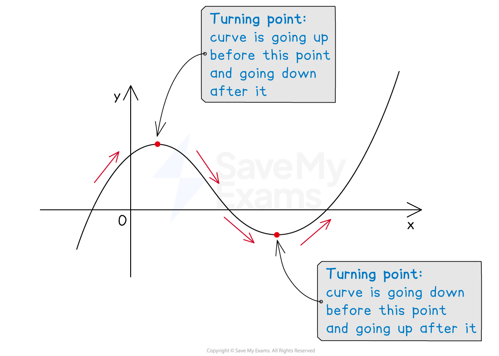
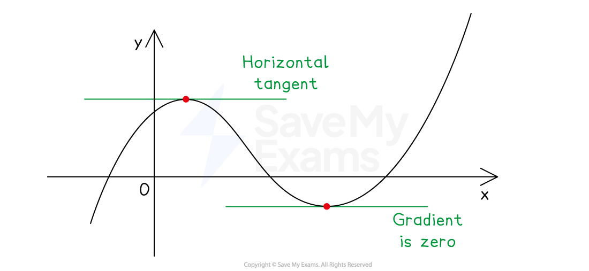

# Finding Stationary Points & Turning Points

## Finding Stationary Points & Turning Points

> **Spec point** — `spcpt_pKJ7Y3jd7PDzZQpP`

## Finding stationary points & turning points

### What is a stationary point?

- A **stationary point** is a point on the graph at which the **gradient is zero** (a tangent drawn at this point will be **horizontal**)

  - These* include *peaks (**maximum points**) and troughs (**minimum points**)
- Maximum points and minimum points are collectively know as **turning points**

  - At a turning point a curve **changes** from **moving upwards** to **moving downwards**, or vice versa

- At a **turning** **point** the **gradient** of the curve is **zero**

  - If a **tangent** is drawn at a turning point it will be a **horizontal** **line**
  - Horizontal lines have a gradient of zero
- Because the gradient at a turning point is zero

  - Substituting the* x*-coordinate of a turning point into the **gradient function **$\frac{dy}{dx}$ (the** derivative**) will give an **output of zero**

### How do I find the coordinates of a turning point?

- **STEP 1**
Find the **gradient function **(derivative) $\frac{dy}{dx}$ of the** original equation**

  - E.g. Find the coordinates of the turning point of the equation $y=4x^{2}-8x+9$
  - $\frac{dy}{dx}=8x-8$
- **STEP 2**
Set the** gradient function **(derivative) **equal to** **zero** and** solve for **$x$

  - This will find the ***x*****-coordinate** of the turning point
  - E.g. $0=8x-8$, so $x=1$
- **STEP 3**
**Substitute** the *x*-coordinate into the original equation of the **graph**

  - This will find the ***y*****-coordinate** of the turning point
  - E.g. `y equals 4 open parentheses 1 close parentheses squared minus 8 open parentheses 1 close parentheses plus 9 equals 5`
- **STEP 4** Write out the** coordinates** of the turning point

  - E.g. The turning point is at `open parentheses 1 comma space 5 close parentheses`

> **Exam Hint**
> - Remember to read the questions carefully
> 
>   - Sometimes only the *x*-coordinate of a turning point is required

> **Worked Example**
> Find the coordinates of the turning point on the curve with equation $y=2x^{2}+8x-9$.
> 
> **Answer:**
> 
> > *Use differentiation to find the gradient function (derivative) of the equation*
> 
> $\frac{dy}{dx}=4x+8$
> 
> > *Set the derivative equal to 0 and solve for **x*
> 
> `table row 0 equals cell 4 x plus 8 end cell row cell negative 8 end cell equals cell 4 x end cell row cell negative 2 end cell equals x end table`
> 
> > *Substitute the **x**-coordinate into the origination equation of the curve and solve for **y*
> 
> `y equals 2 open parentheses negative 2 close parentheses squared plus 8 open parentheses negative 2 close parentheses minus 9
> y equals 8 minus 16 minus 9
> y equals negative 17`
> 
> > *Form a set of coordinates*
> 
> **Final answer:** **The turning point has coordinates **$(-2,-17)$
