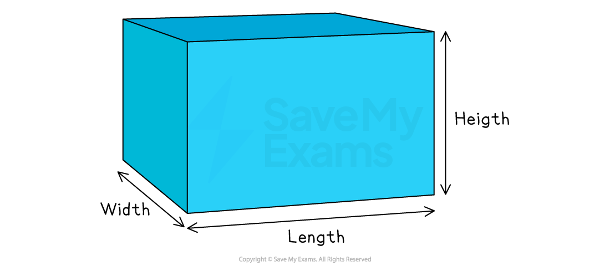

# Problem Solving with Differentiation

## Problem Solving with Differentiation

> **Spec point** — `spcpt_HJZCbjy4VhjyHVWM`

## Problem-solving with differentiation

### What is problem-solving using differentiation?

- You can use the same method of **differentiating curves** to find **turning points** to help with problems involving finding the **maximum** **or** **minimum value **of a quantity

  - These are called **optimisation** problems
- Questions may use **different variables**

  - For example, $A=t^{3}-12t$ and $\frac{dA}{dt}=0$

### How do I apply differentiation to different contexts?

- This is easiest explained using an example

- Find the **maximum volume**, $V$ m3, of the cuboid shown with width 2 m, length $x$ m and height `open parentheses 10 minus x close parentheses` m

  - Find a** formula** for its volume in terms of $x$
  - Volume = width $\times$ length $\times$ height
  
    - `V equals 2 x open parentheses 10 minus x close parentheses`
  - **Expand** this into individual terms in $x$
  
    - $V=20x-2x^{2}$
    - This is a negative quadratic in $x$ (it has an $\cap$ shape)
- The graph of $V$ against $x$ will have a **maximum point** when $\frac{dV}{dx}=0$

  - Find $\frac{dV}{dx}$ by differentiating each term
  
    - $\frac{dV}{dx}=20-4x$
  - Set this **equal to zero **and solve
  
    - `table row cell 20 minus 4 x end cell equals 0 end table` so $4x=20$ giving $x=5$
    - This is the value of $x$ at the maximum point (not the value of $V$)
  - **Substitute **this value of $x$ back into the equation for $V$
  
    - $V=20\times5-2\times5^{2}=50$
    - The **maximum volume** is 50 m3

> **Exam Hint**
> A common problem in the exam is to forget to substitute the value of $x$ back into the formula!

### How do I know if I have found a maximum value or a minimum value?

- Sometimes there are **two values** of $x$ for different **turning points **and you need one of them

  - either substitute them both back into the formula
  
    - See which gives the max value and which gives the min value
  - or use any acceptable techniques for **classifying turning points **
  
    - For example, using a sketch to see if its a max or min
  - Remember that
  
    - **Positive quadratics** have **minimum** points
    - **Negative quadratics** have **maximum** points

### How do I use differentiation if there are lots of  variables?

- Sometimes a formula has lots of letters

  - You need to **find an extra relationship** between these letters
  - then **substitute** it into the formula
- If, in the above example, you had width 2 m, length $x$ m and height $y$ m then

  - $V=2xy$
  
    - But you need a formula in $x$ only
  - You will be **given **an extra piece of information, such as the length and height sum to 10 m
  
    - Therefore $x+y=10$
    - Make $y$ the subject, $y=10-x$
    - Substitute it into $V$ to get `V equals 2 x open parentheses 10 minus x close parentheses`

> **Worked Example**
> A farmer has  60 metres of fencing and wants to fence off the biggest rectangular area possible next to an existing wall.
> 
> The area has dimensions $x$ metres by $y$ metres, as shown.
> 
> 
> 
> (a)  Explain why $2x+y=60$.
> 
> **Answer:**
> 
> > *The wall is not part of the fencing*
> 
> > *Find the total length of the three sides of the fence shown*
> 
> $x+y+x$
> 
> > *This must equal 60 metres*
> 
> **The length of the fence must equal 60 metres so **$2x+y=60$
> 
> (b)  Show that the area, $A$m2, is given by $A=60x-2x^{2}$.
> 
> **Answer:**
> 
> > *Find the area of the rectangle shown*
> 
> $A=xy$
> 
> > *You need a right-hand side in terms of *$x$* only*
> 
> > *Make *$y$* the subject of part (a)*
> 
> $y=60-2x$
> 
> > *Substitute this into the area formula*
> 
> `A equals x open parentheses 60 minus 2 x close parentheses`
> 
> > *This is now all in terms of *$x$
> 
> > *Expand*
> 
> $A=60x-2x^{2}$
> 
> (c)  Find the maximum possible area.
> 
> **Answer:**
> 
> > *To find a maximum point, set *$\frac{dA}{dx}=0$
> 
> > *First find *$\frac{dA}{dx}$* by differentiating each term*
> 
> $\frac{dA}{dx}=60-4x$
> 
> > *Set this equal to zero and solve*
> 
> `table row cell 60 minus 4 x end cell equals 0 row cell 4 x end cell equals 60 row x equals cell 60 over 4 end cell row x equals 15 end table`
> 
> > *This is the value of *$x$* at the maximum point (but not the maximum of *$A$*)*
> 
> > *Substitute this value of *$x$* back into *$A$
> 
> `table row A equals cell 60 cross times 15 minus 2 cross times 15 squared end cell row blank equals 450 end table`
> 
> **The maximum area is 450 m****2** 
> 
> (d)  Explain how you know that the answer in part (c) is a maximum area, not a minimum area.
> 
> **Answer:**
> 
> > *See how the area *$A$* depends on  *$x$
> 
> > *Think about what it would look like as a graph*
> 
> $A=60x-2x^{2}$* is a negative quadratic curve*
> 
> > *A negative quadratic curve has an *$\cap$* shape*
> 
> > *There is only one turning point on this graph and it is a maximum point*
> 
> **Final answer:** **The curve **$A=60x-2x^{2}$** is a negative quadratic curve**
> 
> **Final answer:** **This means it can only have a maximum point, not a minimum point**
