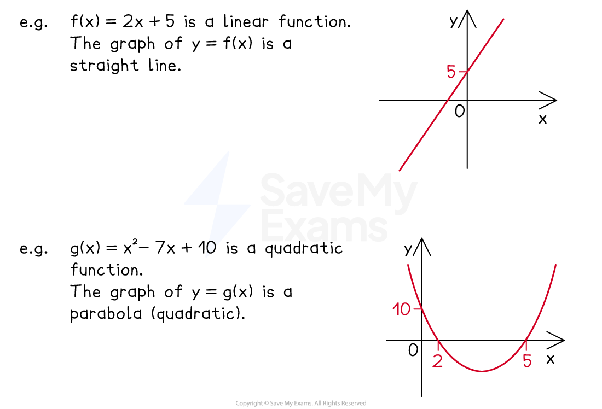
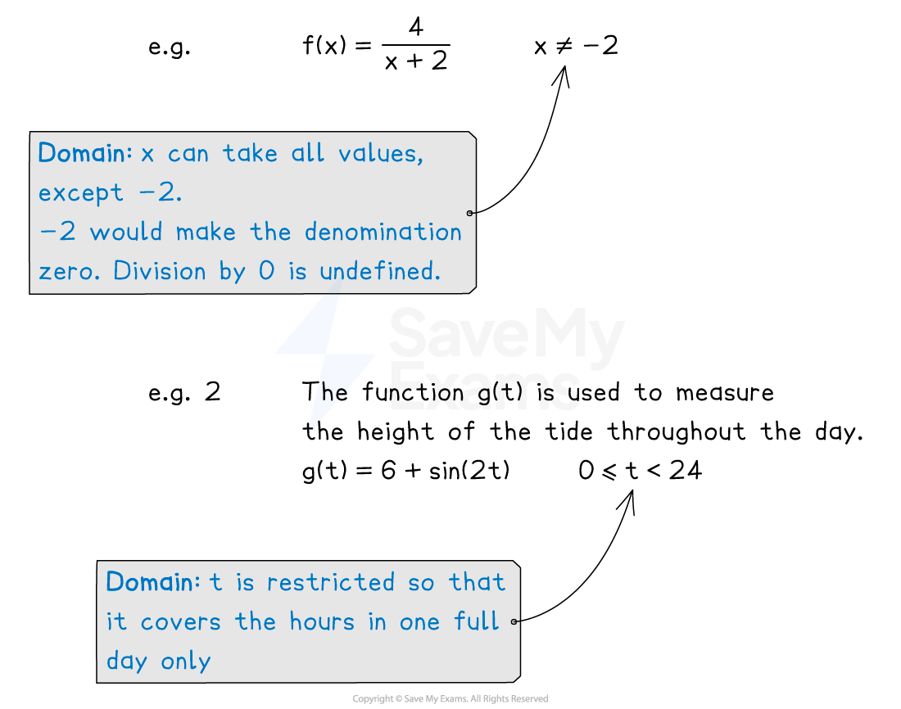
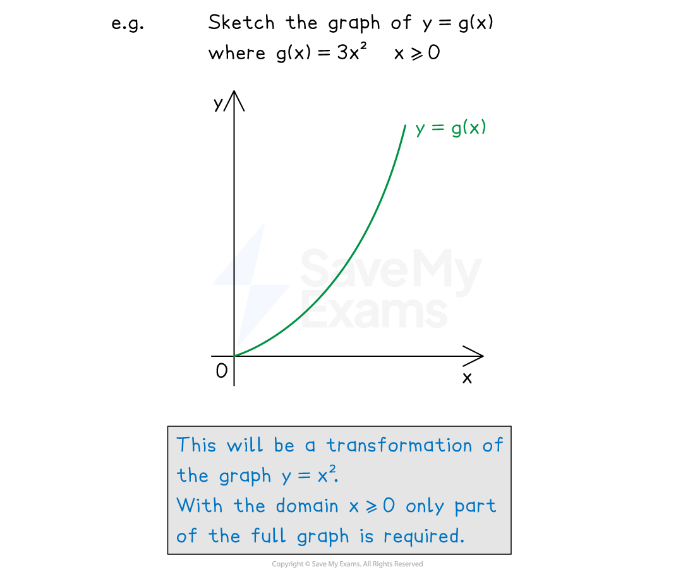
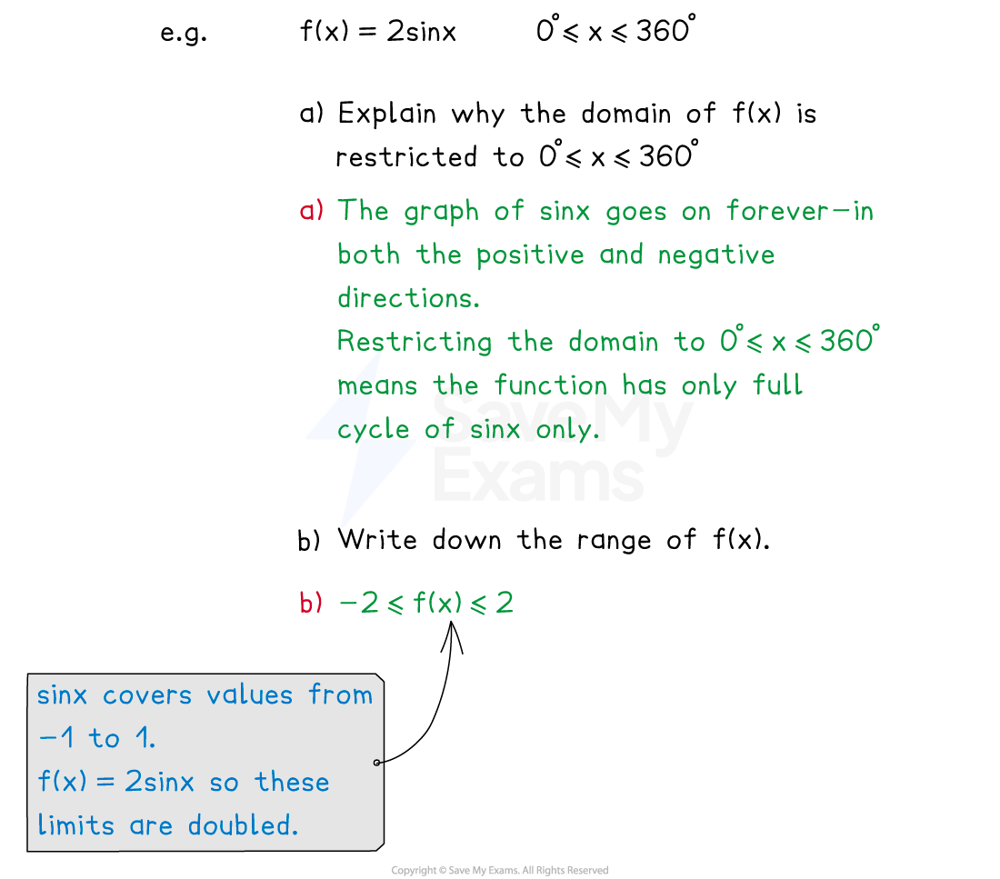

# Domain & Range

## Domain & Range

> **Spec point** — `spcpt_2w6yB8pYShK9mGRb`

## Domain & range

### How are functions related to graphs?

- Functions can be represented as graphs on *x* and* y* axes

  - The *x*-axis values are the **inputs**
  - The *y-*axis values are the **outputs**
- To see what graph to plot, replace `straight f open parentheses x close parentheses equals...` with $y=...$

### What is the domain?

- The **domain** of a function is the **set** **of all inputs** that the function is **allowed** to take
- **Domains** can be described in **words**

  - Domains must refer to ***x ***
  
    - not *y* or f(*x*)
  - You can use "**not equal to**" ≠ if needed
  - You can use **inequality signs **if needed

### What are examples of domains?

- Examples of domains are below:

  - `straight f open parentheses x close parentheses equals 1 over x` takes any *x* value except 0 (you cannot divide by 0)
  
    - The domain is "**all values of *****x***** except 0**", or simply "***x***** ≠ 0**"
  - `straight f open parentheses x close parentheses equals square root of x` takes any *x* value that is not negative (you cannot take the square root of a negative)
  
    - The domain is "***x***** ≥ 0**"
  - `straight f open parentheses x close parentheses equals x squared` takes any *x* value (negative *x* values are fine as inputs)
  
    - The domain is "**all values of *****x***"
  - `straight f open parentheses x close parentheses equals 3 x plus 2` takes any *x* value
  
    - The domain is "**all values of *****x***"

### What are restricted domains and values excluded from domains?

- Some domains are **restricted** by choice

  - `straight f open parentheses x close parentheses equals 3 x plus 2` with the domain 0 < *x* < 5
  
    - This question wants to concentrate on that domain only (even though bigger domains exist)
- Some domains must **exclude** certain values (or sets of values)

  - `straight f open parentheses x close parentheses equals fraction numerator 1 over denominator open parentheses x minus 1 close parentheses open parentheses x plus 7 close parentheses end fraction` must exclude *x* = 1 and *x* = -7 from any domain
  
    - These two inputs make the function** undefined** (dividing by zero)
  - `straight f open parentheses x close parentheses equals square root of x minus 3 end root` must exclude *x* < 3 from any domain
  
    - Any input in *x* < 3 leads to **square-rooting a negative**

### What is the range?

- The **range** of a function is the** set of all outputs** that the function gives out
- **Ranges** can be described in **words**

  - Ranges must refer to **f(*****x*****)***** ***
  
    - not *x *or *y*
  - You can use "**not equal to**" ≠ if needed
  - You can use **inequality signs **if needed
- Ranges **depend on domains**
- Examples of ranges are below:

  - `straight f open parentheses x close parentheses equals 3 x plus 2` with the domain *x* > 0
  
    - If *x* = 0 then f(0) = 3(0) + 2 = 2
    - The range is "f(*x*) > 2"
    - This is because if all inputs are greater than 0, all outputs will be greater than 2
    - This could be seen from a **sketch** or by substituting inputs of *x* > 0 into f(x)
  - `straight f open parentheses x close parentheses equals x squared` with domain "all values of *x*"
  
    - The range is f(x) ≥ 0
    - This is because all values of *x* get squared (so no negative outputs are created)
    - Any negative value that goes in comes out positive
    - (0 goes in and comes out as 02 = 0)

### How can I use graphs to find ranges?

- Ranges are easier if you know the** shapes** of different** types of graphs**

  - For example, the shapes of $y=\frac{1}{x}$, $y=x^{2}$, $y=x^{3}$, **trig graphs**, etc
  - They may also involve **graph transformations**

> **Exam Hint**
> - Sketching a function in an exam can help to "see" both the domain and range of that function

> **Worked Example**
> Two functions are given by
> 
> `straight f open parentheses x close parentheses equals 10 minus x space space space space space space space space space space space space space space straight g open parentheses x close parentheses equals fraction numerator 1 over denominator 2 x minus 1 end fraction`
> 
> (a) If the domain of the function $f$ is $2<x\leq4$, find the range.
> 
> **Answer:**
> 
> > *The domain is the set of inputs*
> 
> > *Substitute **x** = 2 into f(**x**) to find its output*
> 
> `table attributes columnalign right center left columnspacing 0px end attributes row cell straight f open parentheses 2 close parentheses end cell equals cell 10 minus 2 end cell row blank equals 8 end table`
> 
> > *Substitute **x** = 4 into f(**x**) to find its output*
> 
> `table attributes columnalign right center left columnspacing 0px end attributes row cell straight f open parentheses 4 close parentheses end cell equals cell 10 minus 4 end cell row blank equals 6 end table`
> 
> > *Think of f(**x**) = 10 - **x** as a graph*
> 
> *the graph of *$y=10-x$
> 
> > *This straight-line graph has a negative gradient*
> *Between **x** = 2 and **x** = 4 the graph decreases from a height of 8 to a height of 6 *
> 
> > *Relate this to outputs*
> 
> *all outputs are between 6 and 8*
> 
> > *Write down the range using f(x)*
> 
> *Remember that the inequality is "equal to" at x = 4, f(x) = 6*
> (*this is the opposite order of "equal to" in the domain)*
> 
> **Final answer:** **The range is **$6\leqf(x)<8$
> 
> (b) Write down the value of $x$ that must be excluded from the domain of function $g$.
> 
> **Answer:**
> 
> > *An input cannot cause the function to divide by zero*
> *Find out when "dividing by zero" would happen*
> 
> $2x-1=0$
> 
> > *Solve to find this value of **x** (the one that must be excluded)*
> 
> $2x=1\,x=\frac{1}{2}$
> 
> **Final answer:** $x=\frac{1}{2}$** ****must be excluded from the domain**
