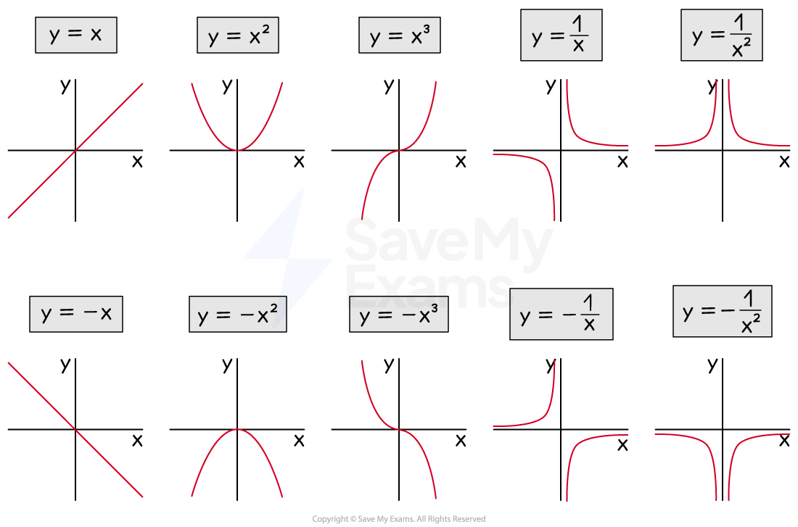
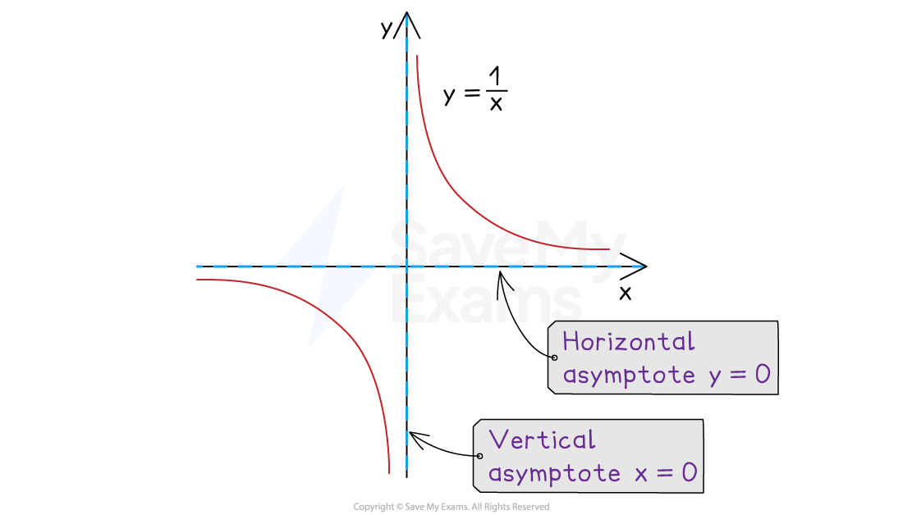
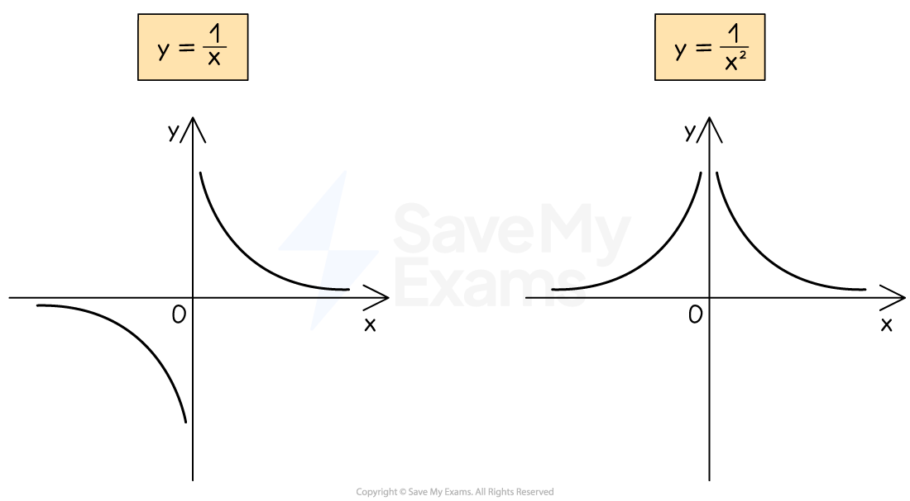
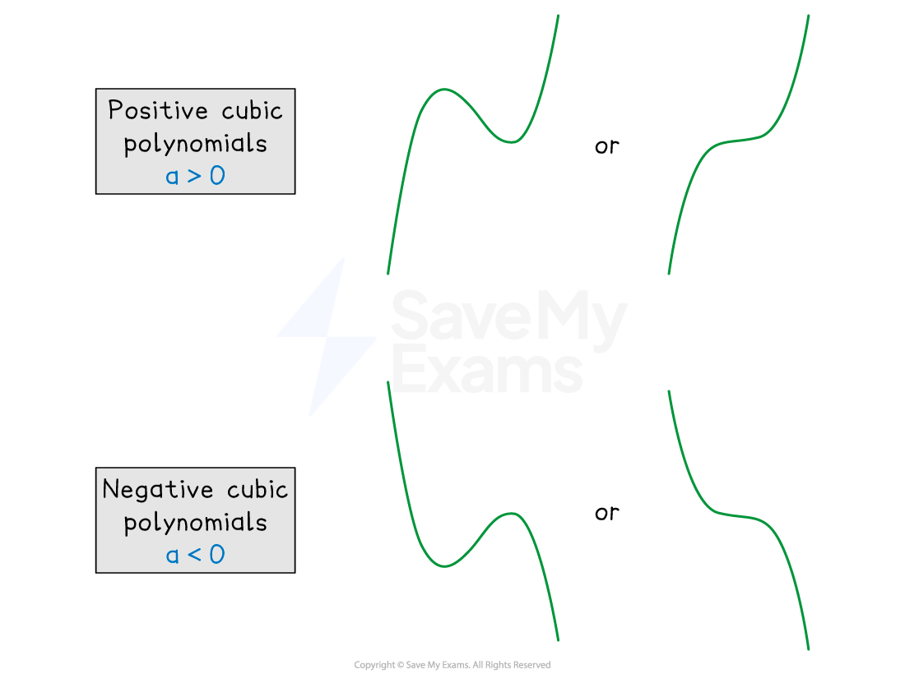
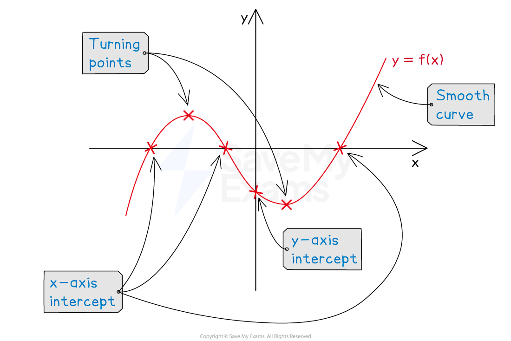

# Types of Graphs

## Types of Graphs

> **Spec point** — `spcpt_hrv7F8zpDwRXmcNg`

## Types of graphs

### What types of graphs do I need to know?

- You need to be able to **recognise, sketch, and interpret **the following types of graph:

  - **Linear** ($y=\pmx$)
  
    - $y=mx+c$ or $ax+by=c$
  - **Quadratic **($y=\pmx^{2}$)
  
    - $y=ax^{2}+bx+c$
  - **Cubic **($y=\pmx^{3}$)
  
    - $y=ax^{3}+bx^{2}+cx+d$
  - **Reciprocal** ($y=\pm\frac{1}{x}$)
  
    - $y=\frac{a}{x}$
    - $y=\frac{a}{x^{2}}$

- You must also be able to recognise the three basic **trigonometric graphs**, covered in a separate section

### Where are the asymptotes on reciprocal graphs?

- An **asymptote** is a line on a graph that a curve becomes closer to but never touches

  - These may be horizontal or vertical
- The **reciprocal **graph, $y=\frac{a}{x}$  (where $a$ is a constant)

  - **does not have a *****y*****-intercept**
  - **and does not have any roots**
- This graph has **two asymptotes**

  - A **horizontal** asymptote at the *x*-axis: $y=0$
  
    - This is the **limiting value** when the value of *x *gets very large (or very negative)
  - A **vertical** asymptote at the *y*-axis: $x=0$
  
    - This is the value that causes the **denominator to be zero**

- The reciprocal graph, $y=\frac{a}{x}+b$ (where $a$ and $b$ are both constants)

  - is the **same shape** as $y=\frac{a}{x}$
  - but is **shifted upwards** by $b$ units
  
    - $y=\frac{a}{x}-3$ would be $y=\frac{a}{x}$ shifted **down** by 3 units
  - This means the **horizontal asymptote** also **shifts up** by $b$ units
  
    - The** vertical asymptote** remains on the ***y*****-axis**
- The graph of $y=\frac{1}{x^{2}}$ is similar to $y=\frac{1}{x}$ but has two key differences

  - $y=\frac{1}{x^{2}}$ is **steeper** than $y=\frac{1}{x}$
  - $y=\frac{1}{x^{2}}$ is **always positive**, even when $x$ is negative

### What does the graph of a cubic look like?

- A **cubic** is a function of the form $ax^{3}+bx^{2}+cx+d$

  - $a,b,c$ and $d$ are constants
  - It is sometimes referred to as a polynomial of degree (order) 3
- In general the graph of a cubic will take one of the four forms

  - All are **smooth** curves

- The exact form of a particular cubic will depend on:

  - The number (and value) of **roots** ($x$-axis intercepts)
  - The $y$-axis intercept
  - The sign of the coefficient of the $x^{3}$ term ($a$)
  
    - If $a>0$ the graph is a **positive cubic** ('starts' in the bottom left, 'ends' in the top right)
    - If $a<0$ the graph is a **negative cubic** ('starts' in the top left, 'ends' in the bottom right)
  - The ***turning points***

- Cubics can have **two turning points**

  - a maximum point and a minimum point
- However, note that the graphs of $y=x^{3}$ and $y=-x^{3}$:

  - Do not have a maximum or minimum (turning points)
  - Only cross the $x$-axis once, at $x=0$

> **Worked Example**
> Match the graphs to the equations.
> 
> 
> 
> **(1) **$y=0.6x+2$**,    (2) **$y=3^{x}$**,    (3) **$y=-0.7x^{3}$**,    (4) **$y=\frac{4}{x}$**,   (5) **$y=-x^{2}+3x+2$
> 
> **Answer:**
> 
> > *Starting with the equations,*
> 
> > *(1)** is a linear equation (**y** = **mx **+ **c**) so matches the only straight line, graph **D*
> 
> > *(3) **is a cubic equation with a negative coefficient so matches graph **E*
> 
> > *(4)** is a reciprocal equation with a positive coefficient so matches graph **B*
> 
> > *(5) is a quadratic equation with a negative coefficient so matches graph C*
> 
> > *(2) **is the only equation not yet used, so by elimination it is graph **A*
> 
> **Final answer:** **Graph A → Equation 2**
> 
> **Final answer:** **Graph B → Equation 4**
> 
> **Final answer:** **Graph C → Equation 5**
> 
> **Final answer:** **Graph D → Equation 1**
> 
> **Final answer:** **Graph E → Equation 3**
