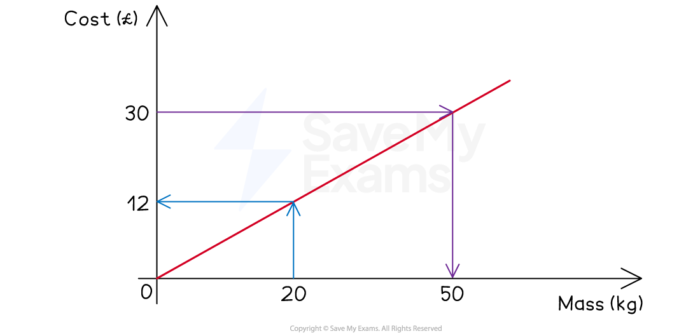
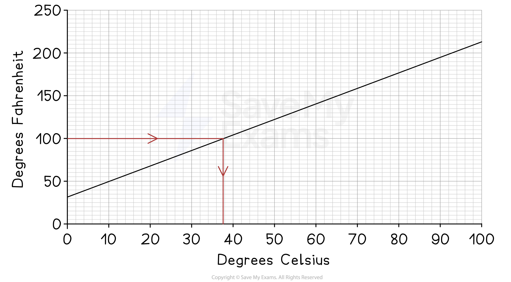

# Conversion Graphs

## Conversion Graphs

> **Spec point** — `spcpt_Nh8WWWGQxmJGVvvf`

## Conversion graphs

### What is a conversion graph?

- A **conversion graph** is a **straight-line** graph relating **two quantities**

  - You can** convert** (change) between them by **reading values** off the graph
- Common examples include

  - **Temperature**
  
    - degrees Celsius (°C) and degrees Fahrenheit (°F)
  - **Currency**
  
    - Dollars (\$) and pounds (£)
  - **Volume**
  
    - Litres and gallons
  - **Prices**
  
    - A taxi driver charging per kilometre driven
- The **gradient** of a conversion graph represents the **rate of change**

  - If the *y*-axis is the **cost** of a taxi journey (£) and the *x*-axis is the **distance travelled** (mile) then the **gradient** represents the **cost per mile**
  
    - A gradient of 5 means the cost increases by £5 for each mile travelled

### How do I use a conversion graph?

- Find the cost of 20kg using the conversion graph below

  - **Start** at 20kg on the ***x*****-axis**
  - Draw a** vertical line** to the graph
  - Then a **horizontal line** across to the *y*-axis
  - **Read off** the value
  
    - £12
- Find how many kilograms can be bought with £30

  - **Start** at £30 on the ***y*****-axis**
  - Draw a** horizontal line** to the graph
  - Then a **vertical line** down to the *x*-axis
  - **Read off** the value
  
    - 50kg
- You can use **proportion** to find values that on **not on the axes**

  - To find the cost of 120kg
  
    - 120kg = 6 × 20kg costs 6 × £12 = £72
    - 120kg = 50kg + 50kg + 20kg costs £30 + £30 + £12 = £72
  - You can only do this if the **graph starts at the origin**

### How do I use a conversion graph that does not start at the origin?

- Convert 100°F into Celsius using the conversion graph below

  - **Start** at 100°F on the ***y*****-axis**
  - Draw a** horizontal line** to the graph
  - Then a **vertical line** down to the *x*-axis
  - **Read off** the value
  
    - $\approx$37.5°C
    - Answers **between** 37°C and 38°C would be **accepted**
    - (The true answer is 37.8°C to 1 decimal place)
- The **graph starts** at 32 on the ***y*****-axis**

  - This means that 0°C is 32°F
  - This **starting value** sometimes represents a **fixed cost** when money is involved
  
    - It could represent the fixed charge for the cost of a taxi fare
- To convert values that are **not on the axis**

  - You would need to find an **equation for the straight-line**

> **Exam Hint**
> Always double-check the scales of the axes!

> **Worked Example**
> The graph below shows the price (in pounds, £) charged by a plumber for the time spent (in hours) on a particular job.
> 
> 
> 
> (a) Estimate the price charged for a job that takes 3 hours.
> 
> **Answer:**
> 
> *Draw a vertical line up from the **x**-axis at 3 hours*
> *Then a horizontal line across to the **y**-axis*
> *Read off the value*
> 
> 
> 
> **Approximately £225**
> 
> **Answers between £220 and £230 are accepted**
> 
> (b) A particular job costs £320. Estimate, to the nearest half hour, how long this job took.
> 
> **Answer:**
> 
> > *Draw a horizontal line across from the **y**-axis at £320*
> *Draw a vertical line down to the **x**-axis*
> *Read off the value to the nearest 0.5 hours*
> 
> 
> 
> **4.5 hours (to the nearest half hour)**
> 
> (c) The plumber charges a fixed callout fee for travelling to the customer and inspecting the job before starting any work.
> 
> Find the price of the callout fee.
> 
> **Answer:**
> 
> > *Before starting work means 0 hours of work has been done*
> *Find the price charged for 0 hours*
> *This is the **y**-intercept of the graph*
> 
> **Final answer:** **Approximately £45**
> 
> **Final answer:** **Answers between £40 and £50 are accepted**
