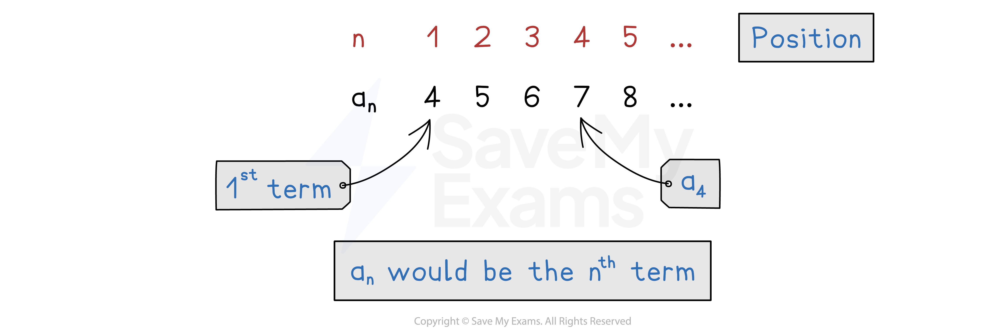

# Introduction to Sequences

## Introduction to Sequences

> **Spec point** — `spcpt_NNhjQfXtS7sNJyHD`

## Introduction to sequences

### What are sequences?

- A** sequence** is an ordered set of numbers that follow a** rule**

  - For example 3, 6, 9, 12...
  
    - The rule is to add 3 each time
- Each number in a sequence is called a **term**

- The **location** of a term within a sequence is called its **position**

  - The letter ***n *** is used for position
  
    - ***n*****  = 1** refers to the **1st term**
    - ***n*****  = 2** refers to the **2nd term**
    - If you do not know its position, you can say the ***n *****th term**
- Another way to show the position of a term is using **subscripts**

  - A general sequence is given by *a*1, *a*2, *a*3, ...
  
    - ***a*****1** represents the **1st term**
    - ***a*****2** represents the **2nd term**
    - ***a*****n** represents the ***n*****th term**

### How do I write out a sequence using a term-to-term rule?

- **Term-to-term** **rules** tell you how to get the **next term** from the term you are on

  - It is what you do **each time**
  - For example, starting on 4, add 10 each time
  
    - 4, 14, 24, 34, ...
- The common term-to-term rules are:

  - **adding or subtracting** a number
  
    - 3, 7, 11, 15, ... the rule is add 4 each time
  - **multiplying or dividing** by a number
  
    - 2, 6, 18, 54, ... the rule is multiply by 3 each time

### How do I write out a sequence using a position-to-term rule?

- A** position-to-term rule** is an **algebraic expression** in** *****n***  that lets you find **any term** in the sequence

  - This is also called the ***n *****th term formula**
- You need to know what **position** in the sequence you are looking for

  - To get the **1st term**, substitute in ***n*****  = 1**
  - To get the **2nd term**, substitute in ***n ***** = 2**
- You can jump straight to the 100th term by substituting in *n*  = 100

  - You do not need to find all 99 previous terms
- For example, the *n *th term is 8*n*  + 2

  - The 1st term is 8×1 + 2 = 10
  - The 2nd term is 8×2 + 2 = 18
  - The 100th term is 8×100 + 2 = 802
- For example, the *n *th term is *n*2  + 1

  - The 1st term is 1 2  + 1 = 2
  - The 2nd term is  22  + 1 = 5
  - The 100th term is 1002  + 1 = 10 001

### How do I know if a value belongs to a sequence?

- If you know the *n *th term formula, set the value equal to the formula

  - This creates an **equation** to** solve **for* n*
- For example, a sequence has the *n *th term formula 8*n * + 2

  - Is 98 in the sequence?
  `table row cell 8 n plus 2 end cell equals 98 row cell 8 n end cell equals 96 row n equals cell 96 over 8 end cell row n equals 12 end table`
  
    - It is in the sequence, it is the 12th term
  - Is 124 in the sequence?
  `table row cell 8 n plus 2 end cell equals 124 row cell 8 n end cell equals 122 row n equals cell 122 over 8 end cell row n equals cell 15.25 end cell end table`
  
    - *n*  is **not** a **whole number**, so it is** not** in the sequence

> **Exam Hint**
> In the exam, it helps to write the position number (the value of *n*) above each term in the sequence.

> **Worked Example**
> A sequence has the *n *th term formula 3*n*  + 2.
> 
> (a) Find the first three terms in the sequence.
> 
> **Answer:**
> 
> *Substitute **n**  = 1, **n ** = 2 and **n**  = 3 into the formula*
> 
> *3×1 + 2 = 5*
> 
> *3×2 + 2 = 8*
> 
> *3×3 + 2 = 11*
> 
> **Final answer:** **5, 8, 11**
> 
> (b) Find the 80th term.
> 
> **Answer:**
> 
> > *Substitute **n ** = 80 into the formula*
> 
> *3×80 + 2*
> 
> **The 80th term is 242***  *
> 
> (c) Determine whether the number 96 is in the sequence.
> 
> **Answer:**
> 
> > *Set the formula equal to 96*
> 
> $3n+2=96$
> 
> > *Solve to find **n*
> *If **n** is a whole number, it is a term in the sequence*
> 
> `table attributes columnalign right center left columnspacing 0px end attributes row cell 3 n end cell equals cell 96 minus 2 end cell row cell 3 n end cell equals 94 row n equals cell 94 over 3 end cell end table`
> 
> > *94 is not divisible by 3*
> *The nearest possible value is 95 ((95-2) ÷ 3 = 31, the 31st term)*
> 
> **Final answer:** **96 is not in the sequence**
