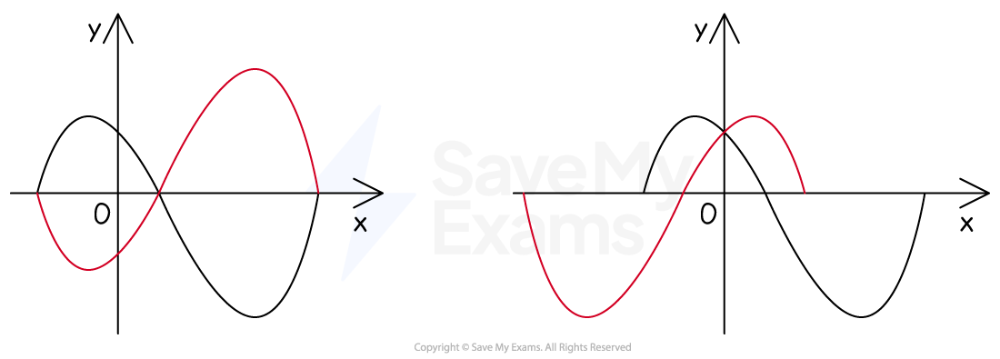
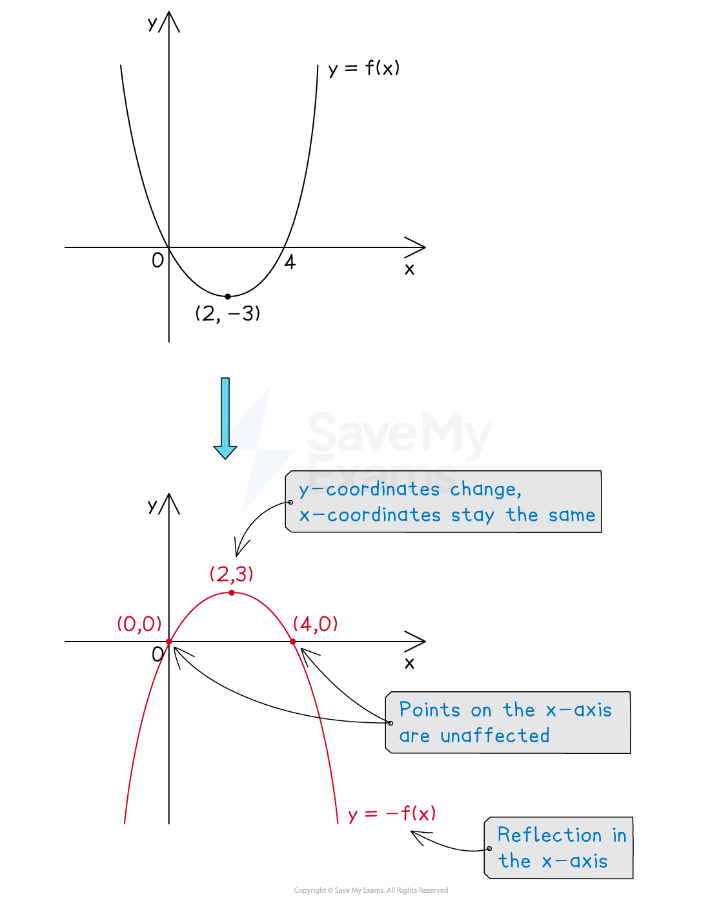
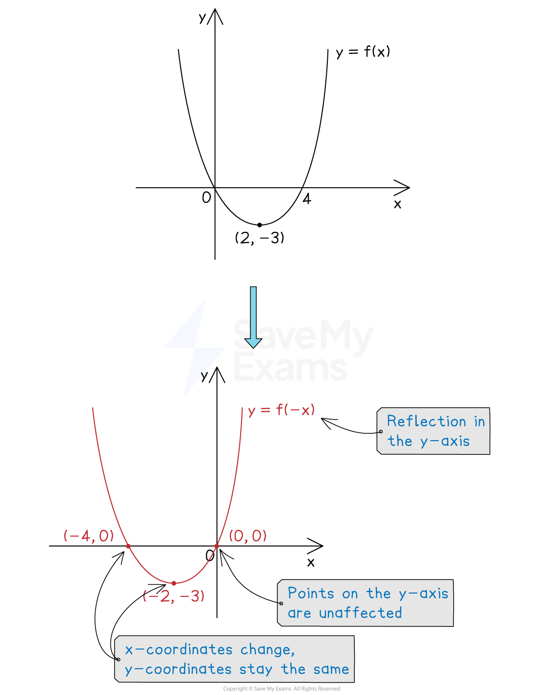
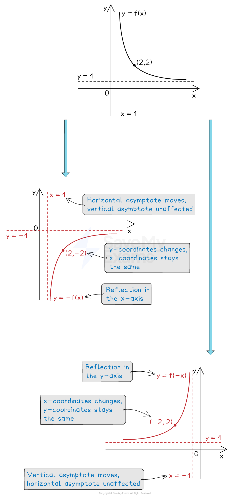

# Reflections of Graphs

## Reflections of Graphs

> **Spec point** — `spcpt_qNDqnmZtzYttZDnz`

## Reflections of graphs

### What are reflections of graphs?

- **Reflections **of graphs are a type of **transformation** where the **curve **is **reflected **about one of the** axes**

*Examples of reflections*

### How do I reflect graphs?

- Let `y equals straight f open parentheses x close parentheses` be the **equation** of the **original graph**

#### Vertical reflections: y=-f(x)

- `y equals negative straight f open parentheses x close parentheses` is a reflection in the** **$x$**-axis**

  - The $y$ coordinates change sign
  
    - The $x$ coordinates are unaffected

*Example of a vertical reflection*

#### Horizontal reflections: y=f(-x)

- `y equals straight f open parentheses negative x close parentheses` is a reflection in the** **$y$**-axis**

  - The $x$ coordinates change sign
  
    - The $y$ coordinates are unaffected

*Example of a horizontal reflection*

### What happens to asymptotes when a graph is reflected?

- Any ***asymptotes*** of `straight f open parentheses x close parentheses` are also reflected

> **Exam Hint**
> When reflecting graphs in the exam, reflect any key points on the graph first, then join them up with a smooth curve.

### How does a reflection affect the equation of the graph?

- When a graph is reflected, you can **change its equation algebraically **

  - There is no need to sketch the graph
- Reflecting in the $x$-axis puts a $-$** in front **of the whole **equation**

  - For example, $y=x^{2}+2x$ becomes `y equals negative open parentheses x squared plus 2 x close parentheses`
  
    - This simplifies to $y=-x^{2}-2x$
- Reflecting in the $y$-axis** replaces any **$x$** with **`open parentheses negative x close parentheses` in the equation

  - For example, $y=x^{2}+2x$ becomes `y equals open parentheses negative x close parentheses squared plus 2 open parentheses negative x close parentheses`
  
    - This simplifies to $y=x^{2}-2x$

### How do I apply a combined reflection?

- The graph of `y equals negative straight f open parentheses negative x close parentheses` is a **combined reflection** in both the $x$ and $y$ axes

  - It **does not matter which order **you apply these in
  
    - For example, reflect about the $y$-axis then about the $x$-axis

> **Worked Example**
> The diagram below shows the graph of `y equals straight f open parentheses x close parentheses`.
> 
> 
> 
> Sketch the graph of `y equals straight f open parentheses negative x close parentheses`.
> 
> **Answer:**
> 
> > *The transformation *`y equals straight f open parentheses negative x close parentheses`* is a reflection in the *$y$*-axis*
> *Reflect the points (-2, 6) and (1, -3) in the *$y$*-axis to get (2, 6) and (-1, -3)*
> *Sketch these points and join with a smooth curve through the origin*
> 
> 
