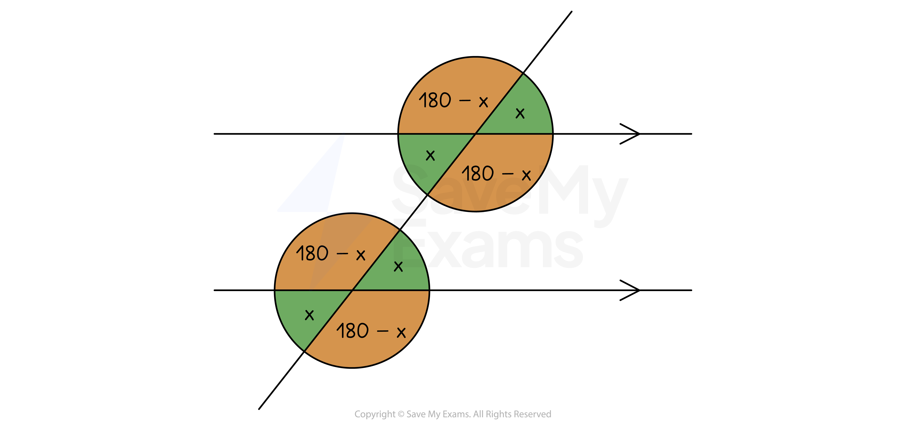

# Angles in Parallel Lines

## Angles in Parallel Lines

> **Spec point** — `spcpt_2SfTVFKHJRBby3QK`

## Angles in parallel lines

### What are parallel lines?

- Parallel lines are lines that are always **equidistant **(the same distance apart)

  - No matter how far the lines are extended in either direction, they will **never meet**
- **Angles** are formed when a **straight line** cuts through **two parallel lines**

### What are corresponding angles in parallel lines?

- Find **corresponding angles** by looking for an **F-shape**
- **Corresponding **angles** **are** equal**

*Corresponding angles*

### What are alternate angles in parallel lines?

- Find **alternate angles** by looking for a **Z-shape**
- **Alternate **angles** **are** equal**

*Alternate angles*

### What are allied angles in parallel lines?

- Find **allied angles** by looking for a **C-shape**
- **Allied **angles** add **up to** 180°**
- You may also see allied angles referred to as co-interior or supplementary angles

*Allied angles*

### How do I find missing angles in parallel lines?

- Look for shapes that look like **F**, **Z**, or **C**
- **Vertically opposite angles** can also be used in problems involving parallel lines

  - The below diagram shows how identifying angle x, can lead to knowing information about several other angles
  
    - The green angle opposite is also x, as it is vertically opposite
    - The orange angle must be 180-x as angles on a straight line sum to 180°
- You should also be able to spot **corresponding **angles, **alternate **angles, and **allied **angles in this diagram

> **Exam Hint**
> - Do not forget to give **reasons** for each step of your working in an angles question. These are often needed to get **full marks** You must use the **correct names** as listed above. **Do not** use F, Z and C angles otherwise you will **lose marks**!

> **Worked Example**
> Find the size of the angles *a* and *b* in the diagram below.
> 
> Give a reason for each step in your working.
> 
> 
> 
> **Answer:**
> 
> **Final answer:** **a**** = 64° (Vertically opposite angles are equal)**
> **b**** = 64° (Corresponding angles on parallel lines are equal)**
