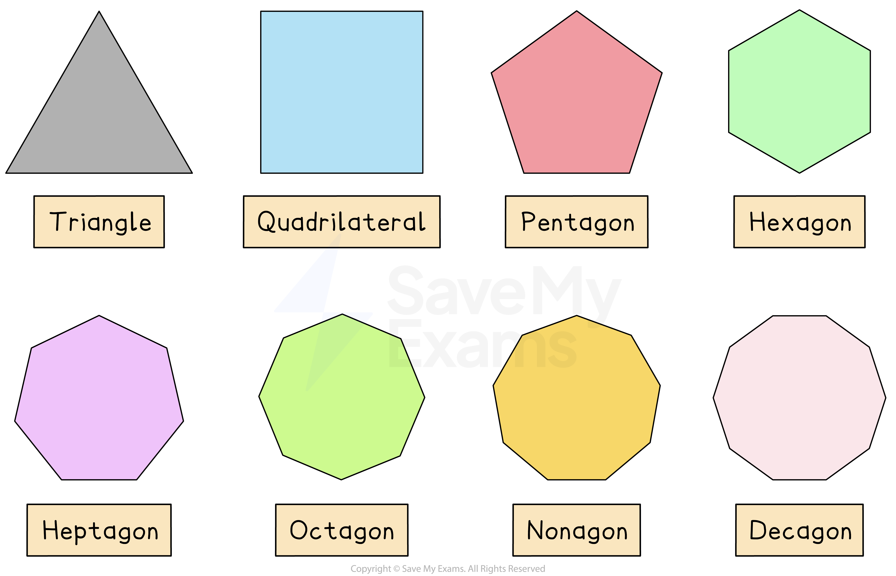
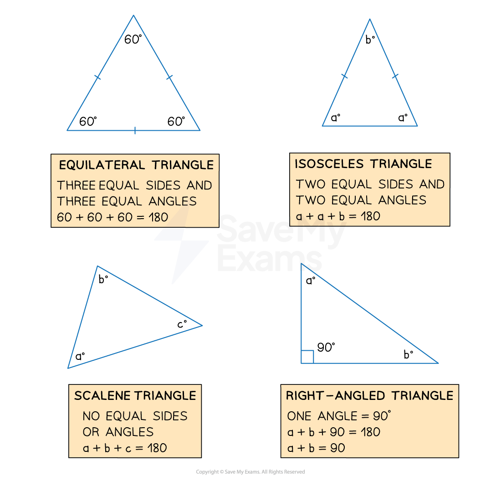
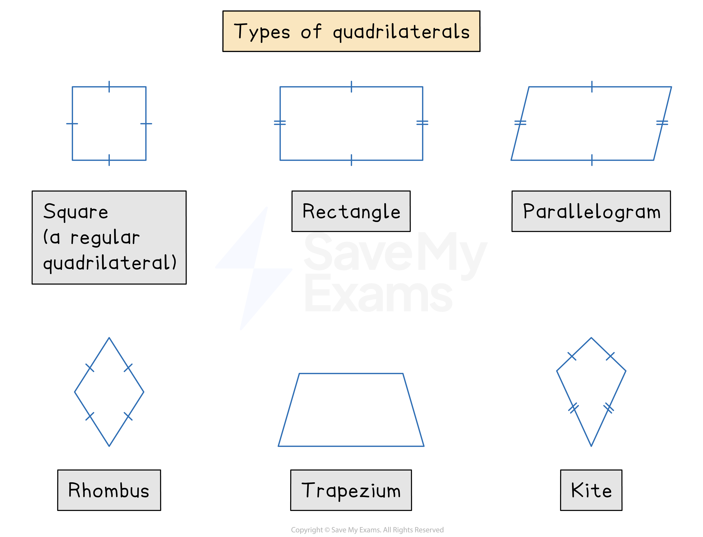
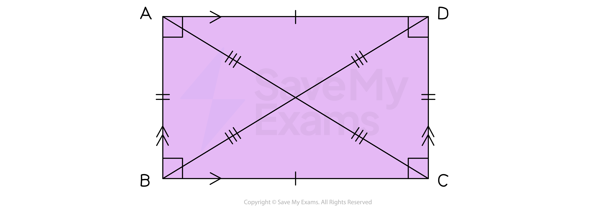
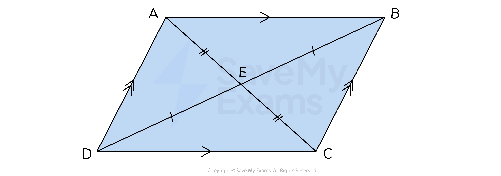
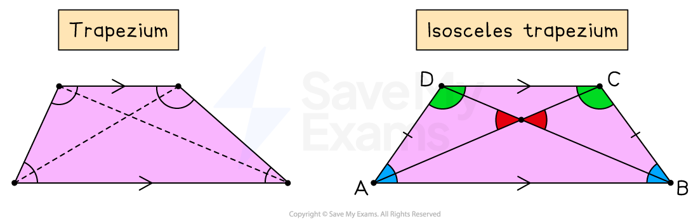
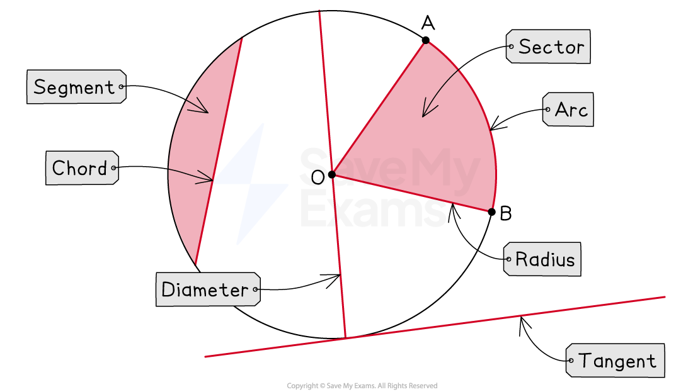

# 2D Shapes

## Properties of 2D Shapes

> **Spec point** — `spcpt_SVXT7VrWxFMXkD7D`

## Properties of 2D shapes

### What are the names of common 2D shapes?

- You should know the general names of all the 2D **polygons**

  - A **triangle** has 3 sides
  - A **quadrilateral** has 4 sides
  - A **pentagon** has 5 sides
  - A **hexagon** has 6 sides
  - A **heptagon** has 7 sides
  - An **octagon **has 8 sides
  - A **nonagon** has 9 sides
  - A **decagon **has 10 sides
  - A **polygon **is a flat (plane) shape with *n* straight sides
  
    - A **regular **polygon has all sides the same length and all angles the same size**  **

*Polygons*

### What are the names of the different types of triangles?

- You should know the names and properties of the different types of **triangles**

  - An **equilateral** triangle has **3 equal sides** and **3 equal angles**
  - An **isosceles **triangle has **2 equal sides** and **2 equal angles**
  - A **right-angled **triangle has **one 90° angle**
  - A **scalene **triangle has **3 sides all of different lengths**

### What are the names of the different types of quadrilaterals?

- You should know the names and properties of the different types of **quadrilaterals**

  - These are **squares**, **rectangles**, **parallelograms**, **rhombuses**, **trapeziums** and **kites**

### What are the properties of rectangles and squares?

- A **square **is a **rectangle **where all the **sides **have the **same length**
- The table below shows the **properties **of a rectangle and square

*Rectangle*

|   | Rectangle | Square |
|---|---|---|
| Sides | - Two pairs of equal, opposite sides - Two pairs of parallel sides | - All sides have the same length - Two pairs of parallel sides |
| Angles | - All angles are 90° | - All angles are 90° |
| Diagonals | - Both diagonals bisect each other - Diagonals have the same length | - Both diagonals bisect each other - Diagonals have the same length - Diagonals are perpendicular |
| Symmetries | - Two lines of symmetry - Order of rotational symmetry is two | - Four lines of symmetry - Order of rotational symmetry is four |

### What are the properties of parallelograms and rhombuses?

- A **rhombus **is a **parallelogram **where all the **sides **have the **same length**
- The table below shows the **properties **of a parallelogram and rhombus

*Parallelogram*

|   | Parallelogram | Rhombus |
|---|---|---|
| Sides | - Two pairs of equal, opposite sides - Two pairs of parallel sides | - All sides have the same length - Two pairs of parallel sides |
| Angles | - Two pairs of equal, opposite angles - Each pair of adjacent angles add up 180° | - Two pairs of equal, opposite angles - Each pair of adjacent angles add up 180° |
| Diagonals | - Both diagonals bisect each other | - Both diagonals bisect each other - Diagonals are perpendicular |
| Symmetries | - No lines of symmetry - Order of rotational symmetry is two | - Two lines of symmetry - Order of rotational symmetry is two |

### What are the properties of trapeziums?

- The table below shows the **properties **of a trapezium and an isosceles trapezium

|   | Trapezium | Isosceles trapezium |
|---|---|---|
| Sides | - One pair of parallel sides - The parallel sides have different lengths | - One pair of parallel sides - The parallel sides have different lengths - The non-parallel sides have the same length |
| Angles | - Two pairs of adjacent angles that add up to  180° | - Two pairs of adjacent angles that add up to  180° - Two pairs of adjacent angles that are equal |
| Diagonals | - Do not bisect each other | - Do not bisect each other - Diagonals have the same length |
| Symmetries | - No lines of symmetry - Order of rotational symmetry is one | - One line of symmetry - Order of rotational symmetry is one |

### What are the properties of kites?

- The table below shows the **properties **of a kite

*Kite*

|   | Kite |
|---|---|
| Sides | - Two pairs of equal, adjacent sides - No parallel sides |
| Angles | - One pair of equal, opposite angles |
| Diagonals | - One diagonal bisects the other - Diagonals are perpendicular |
| Symmetries | - One line of symmetry - Order of rotational symmetry is one |

### What terms related to circles do I need to know?

- **Circles **have several specific terms that you need to be familiar with:

  - A circle's perimeter is called a **circumference**
  - Its line of symmetry is called a **diameter**
  - The line from the centre of the circle to its circumference is called a **radius**
  
    - The **diameter** is equal to **2 × the radius**
  - A portion of the circumference is called an **arc**
  - A portion of the area, contained between two radii and an arc, is called a **sector**
  - A line between two points on the circumference is called a **chord**
  - The area formed between a chord and an arc is called a **segment**
  - A line which intersects the circumference at one point only, is called a **tangent**

*Parts of a circle*

- The ratio $\frac{\mathrm{circumference}}{\mathrm{diameter}}$ is equal to **𝝅 **(3.14159...)
- **Circles **have many angle properties and you will need to learn some of them

  - These properties are known as **circle theorems**

> **Exam Hint**
> Always double check if a measurement is the **diameter or the radius. **This is a really common error in exams.
> 
> Diameter = 2 × Radius.
