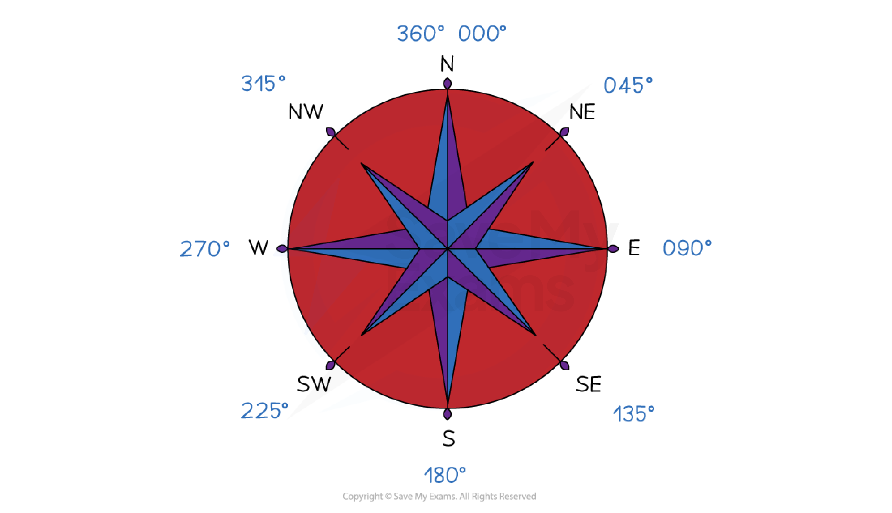

# Bearings

## Bearings

> **Spec point** — `spcpt_38XcCSfT6hW33fDn`

## Bearings

### What are bearings?

- **Bearings **are a way of describing an **angle**

  - They are commonly used in **navigation**
- There are **three rules** which must be followed when using a bearing:

  - They are measured **from North**
  
    - North is usually straight up on a scale drawing or map, and should be labelled on the diagram
  - They are measured** clockwise**
  - The angle should always be written with **3 digits**
  
    - 059° instead of just 59°
- Knowing the **compass directions **and their respective bearings** **can be helpful** **

*Bearings of compass points*

### How do I find a bearing between two points?

- Identify where you need to **start**

  - "The bearing **of A from B**" means **start at B** and find the bearing to A
  - "The bearing **of B from A**" means **start at A** and find the bearing to B
- Draw a **North line** at the **starting point**
- Draw a **line between the two points**
- **Measure** the angle between the **North line** and the l**ine joining the points**

  - Measure **clockwise** from North
- Write the angle using **3 figures **

### How do I draw a point on a bearing?

- You might be asked to plot a point that is a **given distance** from another point and on a **given bearing**
- **STEP 1**
Draw a **North line** at the point you wish to measure the bearing **from**

  - If you are given the bearing **from A to B **draw the North line at **A**
- **STEP 2**
Measure the **angle** of the bearing given **from the North line** in the **clockwise direction**
- **STEP 3**
Draw a line and add the **point B** at the **given distance**

### How do I find the bearing of B from A if I know the bearing of A from B?

- If the **bearing of A from B** is **less than 180°**

  - **Add 180°** to it to find the **bearing of B from A**
- If the **bearing of A from B** is **more than 180°**

  - **Subtract 180°** from it to find the **bearing of B from A**

### How do I answer trickier questions involving bearings?

- Bearings questions may involve the use of **Pythagoras** or **trigonometry** to find missing distances (lengths) and directions (angles)

  - You should always** draw a diagram** if there isn't one given

> **Exam Hint**
> Make sure you have all the **equipment **you need for your maths exams.
> 
> A rubber and pencil sharpener can be essential as these questions are all about accuracy. Make sure you can see and read the markings on your ruler and protractor.

> **Exam Hint**
> **Always** draw a big, clear diagram and annotate it, be especially careful to label the angles in the correct places!

> **Worked Example**
> A ship sets sail from the point P, as shown on the map below.
> 
> It sails on a bearing of 105° until it reaches the point Q, 70 km away. The ship then changes path and sails on a bearing of 065° for a further 35 km, where its journey finishes.
> 
> Show on the map below the point Q and the final position of the ship.
> 
> 
> 
> **Answer:**
> 
> > *Draw in a north line at the point P*
> 
> > *Measure an angle of 105° clockwise from the north line*
> 
> > *Making sure you are accurate, carefully make a small but visible mark on the map*
> 
> 
> 
> > *Draw a line from P through the mark you have made. Make this line long so that you can easily measure along it accurately*
> 
> 
> 
> > *Use the scale given on the map (1 cm = 10 km) to work out the number of cm that would represent 70 km*
> 
> *70 km = 70 ÷ 10 = 7 cm*
> 
> > *Accurately measure 7 cm from the point P along the line and make a clear mark on the line*
> *Label this point Q*
> 
> 
> 
> > *A bearing of 065 means 65° clockwise from the North*
> 
> > *First, draw a North line at the point Q, then carefully measure an angle of 65° clockwise from this line. Make a mark and then draw a line from Q through this mark*
> 
> > *Using the scale, find the distance in cm along the line you will need to measure. *
> 
> *  35 km = 35 ÷ 10 = 3.5 cm*
> 
> *Accurately measure 3.5 cm from the point Q along this new line and make a clear mark on the line *
> *This is the final position of the ship*.
> 
> 
