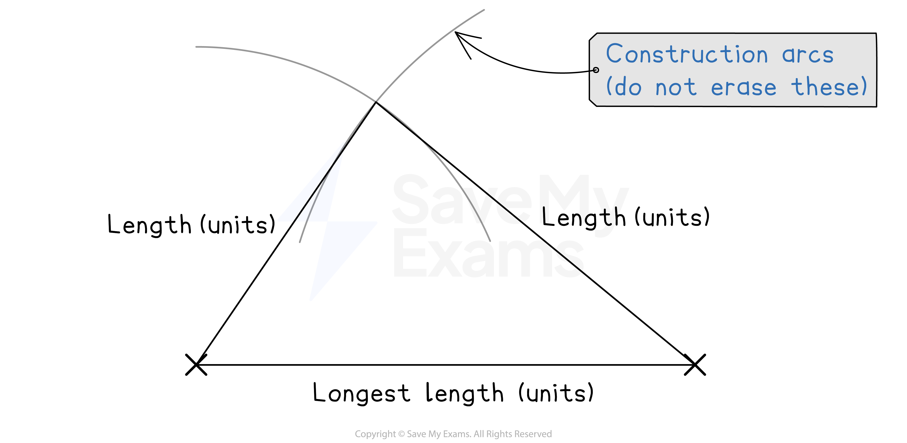
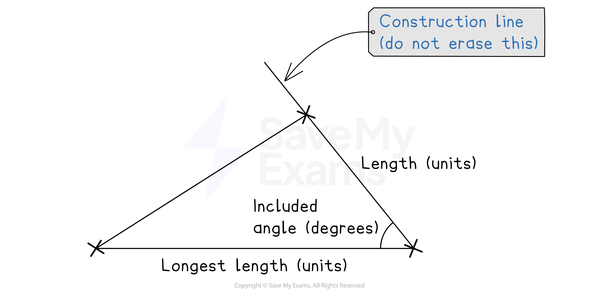
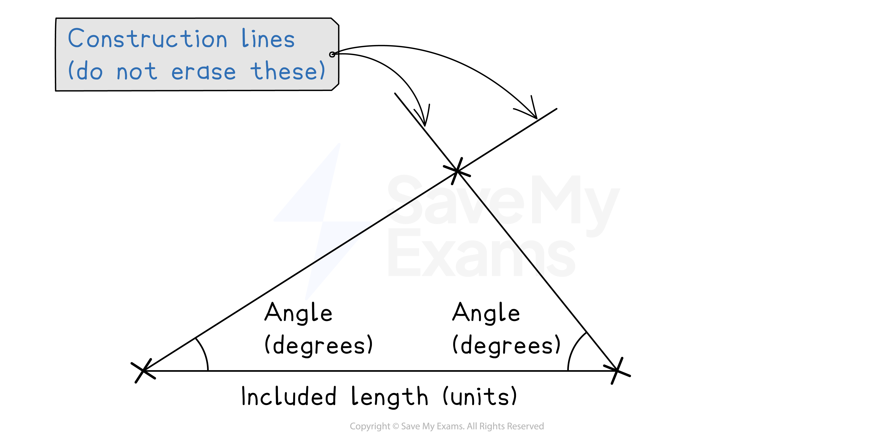

# Constructing Triangles

## Constructing Triangles

> **Spec point** — `spcpt_RXP6GyfJydf7Kggr`

## Constructing triangles

### What are triangle constructions?

- A **triangle construction **is an accurate drawing that usually uses:

  - a sharp **pencil**
  - a **ruler**
  - a **protractor**
  - and/or a pair of **compasses**
- You will be given information about the size of some of the **angles** and/or **sides** of a triangle
- Depending on the type of triangle, you will need to follow a specific method and you may need different equipment
- The types of triangle you may be asked to construct include:

  - **SSS **- you are given the lengths of **all three sides**
  - **SAS** - you are given the lengths of **two sides** and the **angle in between them**
  - **ASA** - you are given the size of **two angles** and the length of the **side in between them**

### How do I construct an SSS triangle?

- **STEP 1**
Use a **ruler** to draw the **longest **side as the **horizontal **base near the bottom of the space you have been given

  - This needs to be **accurate**
  - Write its length (with units) just underneath

- **STEP 2**
Open your **compasses **so that the **length** from the **compass point to the tip of your pencil** is **exactly the length** of one of the **remaining sides**

  - Being extra careful not to change the length, put the compass point on one end of the horizontal line you have drawn and **draw an arc** above the horizontal line
  - You can draw a full circle rather than an arc if you prefer
- **STEP 3**
Open your **compasses **so that the length from the **compass point to the tip of your pencil** is **exactly the length** of the **third side**

  - Being extra careful not to change the length, put the compass point on the other end of the horizontal line and **draw another arc**, making sure that it **crosses the first arc**
- **STEP 4** Use your **ruler** to draw **straight lines** from each end of the horizontal line to the point **where the arcs cross**
- **STEP 5**
Use your **ruler** to **check **that the two new lines are **exactly equal** to the lengths given in the question

  - When you are confident that they are accurate, label the lines with their lengths and units

- **Do not rub out your arcs** as the examiner will use these to check your work
- Sometimes the instructions will include a **triangle name** such as triangle ABC

  - Make sure you label each vertex with the correct letters

*Constructing an SSS triangle*

> **Worked Example**
> **Using a ruler and pair of compasses only,** construct a triangle with sides 6 cm, 7 cm and 10 cm.
> Leave in your construction arcs.
> 
> **Answer:**
> 
> *Draw the 10 cm line as the horizontal base*
> *Place the point of the compasses at each end and draw an arc with radius 6 cm from one end and another with radius 7 cm from the other end*
> *The third vertex of the triangle is the point at which they intersect*
> 
> > *Use your ruler to measure each side and check for accuracy*
> 
> 

### How do I construct an SAS triangle?

- **STEP 1**
Use a **ruler **to draw the longest given side as the horizontal base

  - This needs to be accurate, measure it carefully with your **ruler**
  - Write its length (with units) just underneath
- **STEP 2**
Measure the **angle** from the end of the line

  - Place the centre point of the **protractor **on one end of the side that you have just drawn, measure the given angle, and make a mark to indicate where it is
  - Use a ruler to draw a straight line from where you placed the protractor, through the mark, and extend it further

- **STEP 3**
Draw the second **straight line**

  - Measure along the line you have just drawn in STEP 2 from the end where it connects to the first horizontal line
  - Make a mark on the line when you have measured the length of the second given side

- **STEP 4** Use your **ruler **to draw a straight line from other end of the first horizontal line to the mark you have just made on the second line
- **STEP 5**
Use your **protractor **and **ruler **to **check **that the measured angle and sides are exactly equal to the sizes given in the question

  - When you are confident that they are accurate, label the sides and the angle

- It is important that you **do not rub out your construction lines** as the examiner will use these to check your work

*Constructing an SAS triangle*

> **Worked Example**
> Using a **ruler and a protractor **only, construct a triangle with sides 9 cm and 6 cm and an included angle of 62o.
> 
> **Answer:**
> 
> > *Draw the 9 cm line as the horizontal base*
> 
> 
> 
> > *Place the centre of the protractor at one end of the horizontal line and measure 62**o*
> 
> 
> 
> > *Measure 6 cm along the new line and indicate it with a mark*
> 
> 
> 
> > *Use your ruler to draw a straight line connecting the other end of the horizontal line to the mark*
> 
> > *Label the lengths of the sides and the angle that you are given in the question*
> 
> 

### How do I construct an ASA triangle?

- **STEP 1**
Use a **ruler **to draw the given side as the horizontal base

  - This needs to be accurate, measure it carefully with your ruler
  - Write its length (with units) just underneath
- **STEP 2**
Measure **one angle** from one of the ends of the line

  - Place the centre point of the **protractor **on one end of the side that you have just drawn, measure the given angle from the side and make a mark to indicate where it is
  - Draw a straight line from where you placed the protractor, through the mark and extend it further

- **STEP 3**
Measure the **second angle** from the other end of the line

  - Repeat STEP 2 for the second angle, but from the other end of the horizontal line
  - This line should cross the line you drew in STEP 2, if it doesn't, extend both lines further so that they do intersect
- **STEP 4**
Use your **protractor **to **check **that the two measured angles are exactly equal to the sizes given in the question

  - When you are confident that they are accurate, label the angles

- It is important that you **do not rub out your construction lines** as the examiner will use these to check your work

*Constructing an ASA triangle*

> **Exam Hint**
> To ensure you get full marks in constructions questions:
> 
> - Make sure you are confident using your compasses
> - Make sure that your compasses are not loose
> - Do not erase the construction arcs from your diagram

> **Worked Example**
> Using a **ruler and a protractor **only, construct a triangle with angles 36o and 59o and an included side of length 8 cm.
> 
> **Answer:**
> 
> > *Draw the 8 cm line as the horizontal base*
> 
> 
> 
> > *Place the centre of the protractor at one end of the horizontal line and measure 36**o*
> 
> 
> 
> > *Put the centre of the protractor over the other end of the horizontal line and measure 59**o*
> 
> 
> 
> > *Using your ruler, join each end of the horizontal line to the point where the other two lines intersect*
> *Label the size of the angles and the length of the side that you were given in the question*
> 
> 
