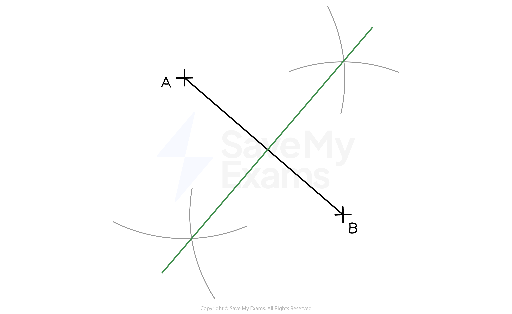
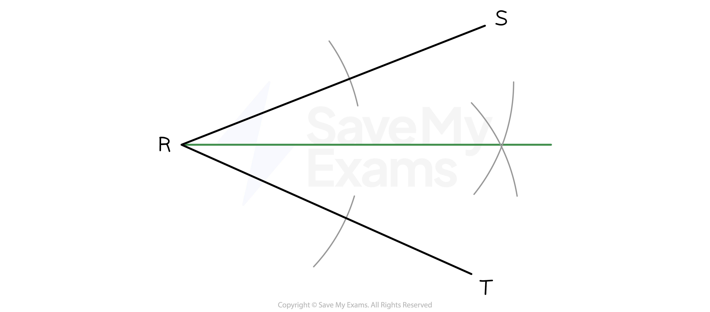

# Constructions

## Constructions

> **Spec point** — `spcpt_yDbZQ6WS99WPCvvR`

## Constructions

### What are constructions?

- A **construction** is a process where you create an accurate geometric object using a **pair of compasses** and a **straight edge **(and a pencil)
- There are several types of construction you must be able to carry out:

  - A **perpendicular bisector** of a line
  
    - This is a line that cuts another one exactly in half (**bisects**) but also crosses it at a right angle (**perpendicular**)
    - It shows a path that is **equidistant** (**equal distance**) between the two endpoints of the line
  - An **angle bisector**
  
    - This is a line that **cuts an angle exactly in half** (**bisects**)
    - It shows a path that is **equidistant** (**equal distance**) between the two lines that form the angle

### How do I construct the perpendicular bisector of a line?

- **STEP 1**
Set the **distance** between the point of the **compasses** and the pencil to be **more than half the length** of the line
- **STEP 2**
Place the point of the compasses **on one end** of the line and sketch an **arc **above and below the line
- **STEP 3**
Keeping your compasses **set to the same distance**, place the point of the compasses on **the other end of the line** and sketch an **arc **above and below the line

  - The **arcs should intersect** each other both above and below the line
- **STEP 4**
**Connect** the points where the arcs intersect with a **straight line**

### How do I construct an angle bisector?

- **STEP 1**
Set the **distance** between the point of your **compasses** and the pencil to be **about half **the distance of the smallest line that makes the angle

  - The precise distance is not important
- **STEP 2**
Place the **point **of the compasses where the **lines meet** and sketch an **arc** that **intersects both of the lines** that form the angle
- **STEP 3**
Keeping your compasses set to the same distance, place the point of the compasses on one of the **points of intersection** and sketch an arc
- **STEP 4**
Keeping your compasses set to the same distance, place the point of the compasses on the **other point of intersection** and sketch an **arc**

  - This **should intersect** the last arc you drew
- **STEP 5**
Join the **point of the angle** to the **point of intersection** with a **straight line**

> **Exam Hint**
> - Make sure you have all the equipment you need for the exam; pen, pencil, ruler, compasses, protractor, calculator
> - An eraser and a pencil sharpener can be helpful on these questions as they are all about **accuracy**
> 
>   - But do not erase your construction lines
> - Make sure your compasses aren’t loose and wobbly
> 
>   - They can usually be tightened with a screwdriver
> - Make sure you can see and read the markings on your ruler and protractor
