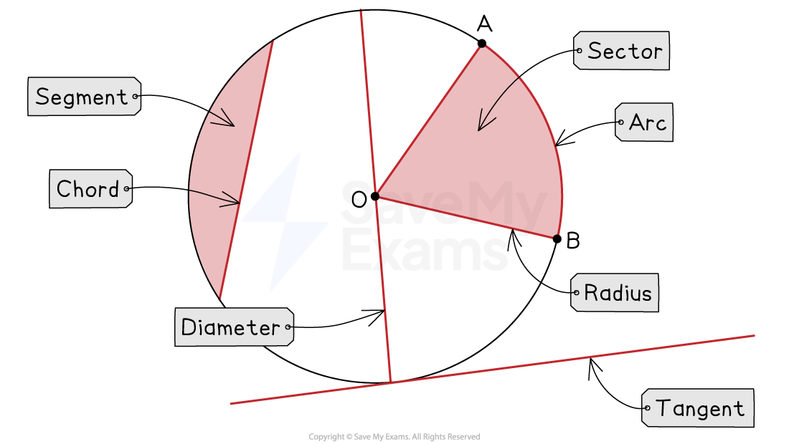
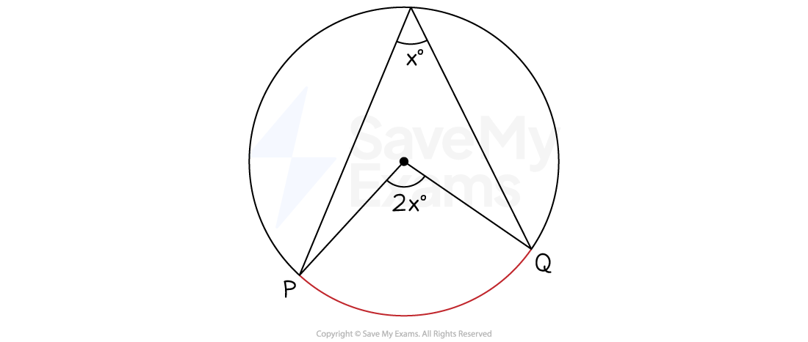

# Angles at Centre & Circumference

## Angles at Centre & Circumference

> **Spec point** — `spcpt_wPBshqzwKBKyYHBV`

## Angles at centre & circumference

### What are circle theorems?

- **Circle Theorems** deal with angles that occur when lines are drawn within (and connected to) a circle

- You may need to use other **facts and rules** such as:

  - basic properties of lines and angles
  - properties of triangles and quadrilaterals
  - angles in parallel lines or polygons

*Parts of a circle*

### Circle Theorem: The angle at the centre is twice the angle at the circumference

- In this theorem, the **chords (radii) to the centre** and the **chords to the circumference** are both drawn from (subtended by) the ends of the **same arc**

- To spot this circle theorem on a diagram

  - find any** two radii **in the circle and follow them to the** circumference**
  - see if there are** lines from those points** going to **any other point** on the **circumference**
  - it may look like the shape of an **arrowhead**
- When explaining this theorem in an exam you must use the keywords:

  - **The angle at the centre is twice the angle at the circumference**

- This theorem is still true when the** ‘triangle parts’ overlap** 
- It is also true when the lines form a** diamond shape**

  - You need to compare the **reflex angle at the centre** with the angle at the circumference
  - **Common mistakes** are to
  
    - compare the wrong angles
    - confuse it with a different circle theorem on cyclic quadrilaterals

> **Exam Hint**
> Questions often say to give “reasons” for your answer.
> 
> Quote an **angle fact** or **circle theorem **for **every **angle you find (not just one for the final answer).

> **Worked Example**
> Find the value of $x$* *in the diagram below.
> 
> 
> 
> *Not drawn accurately*
> 
> Give a reason for each step of your working.
> 
> **Answer:**
> 
> > *There are three radii in the diagram, **AO**, **BO** and **CO*
> *Mark these as equal length lines*
> 
> > *Notice how they create two isosceles triangles*
> *Base angles in isosceles triangles are equal*
> 
> *Angle*** OAB*** = angle ***OBA*** = 60º (isosceles triangle)*
> 
> 
> 
> > *Use the circle theorem:*
> 
> *The angle at the centre is twice the angle at the circumference*
> 
> > *Form an equation for *$x$
> 
> `2 open parentheses x space plus space 60 close parentheses space equals space 150`
> 
> > *Expand the brackets and solve the equation*
> 
> `table attributes columnalign right center left columnspacing 0px end attributes row cell 2 x space plus space 120 space end cell equals cell space 150 end cell row cell 2 x space end cell equals cell space 30 end cell row cell x space end cell equals cell space 15 end cell end table`
> 
> $x=15$
> 
> **Final answer:** **Base angles in isosceles triangles are equal**
> 
> **Final answer:** **The angle at the centre is twice the angle at the circumference**
