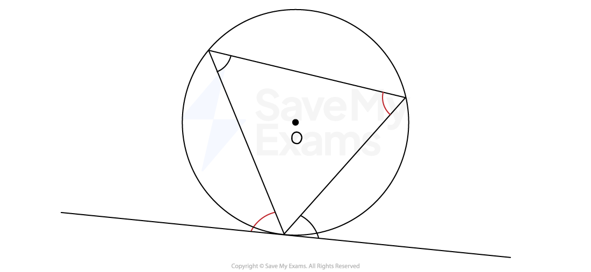

# The Alternate Segment Theorem

## Alternate Segment Theorem

> **Spec point** — `spcpt_TXCfYj93S7vCV9nq`

## Alternate segment theorem

### Circle theorem: The alternate segment theorem

- The **angle** between a** chord **and a **tangent** is **equal** to the **angle** in the** alternate segment**

  - The alternate segment is the region on the **opposite side** of a chord from a given angle formed between that chord and a tangent line

*Example of angles in alternate segments*

- To spot this circle theorem on a diagram

  - look for a **cyclic triangle**
  
    - where all three vertices of the triangle lie on the circumference
  - **one vertex** of the triangle meets a** tangent**
- To identify which angles are equal

  - mark the **angle** between the **tangent** and the **side** of the **cyclic triangle**
  - the angle **inside** the triangle at the corner **opposite the side** of the triangle that forms the first angle is the **equal angle**
- When explaining this theorem in an exam you can just say the phrase:

  - **The Alternate segment theorem**

> **Exam Hint**
> Look for **cyclic triangles** and **tangents** in busy diagrams.
> 
> Questions involving the alternate segment theorem frequently appear in exams!

> **Worked Example**
> $A$, $B$ and $C$ are points on a circle.
> 
> $DAC$ is a straight line.
> 
> $EBF$ is a tangent to the circle.
> 
> Find the value of $x$.
> 
> 
> 
> **Answer:**
> 
> > *One vertex of this triangle meets a tangent at point **B*
> *The angle between one of its sides (**BC**) and the tangent is given*
> *Find the angle inside the triangle, opposite to the same side (**BC**)*
> 
> *Angle ***CBF*** = Angle ***CAB*** by the alternate segment theorem*
> 
> 
> 
> > *Angle *$x$*and angle **CAB** form a straight lie*
> 
> `table row cell x plus 47 end cell equals 180 row x equals cell 180 minus 47 end cell end table`
> 
> $x=133$
