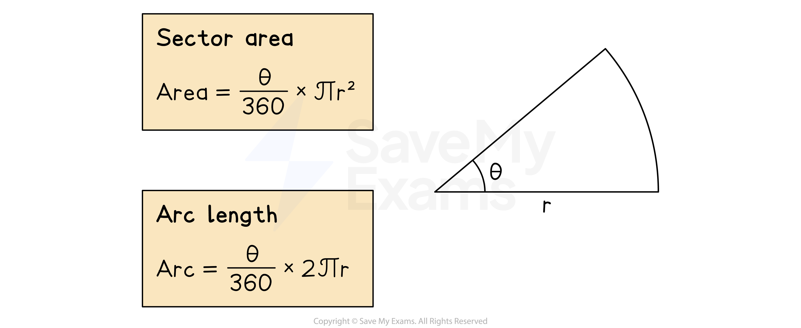

# Arc Lengths & Sector Areas

## Arc Lengths & Sector Areas

> **Spec point** — `spcpt_dvX7WnB2FSdky4jW`

## Arc lengths & sector areas

### What is an arc?

- An **arc** is a **part **of the **circumference** of a circle
- Two points on a circumference of a circle will create **two arcs **

  - The **smaller** arc is known as the **minor arc**
  - The **bigger** arc is known as the **major arc**

### What is a sector?

- A **sector** is the part of a circle enclosed by two **radii** (radiuses) and an arc

  - A sector looks like a slice of a circular pizza
  - The curved edge of a sector is the arc
- Two radii in a circle will create **two sectors**

  - The **smaller** sector is known as the **minor sector**
  - The **bigger** sector is known as the **major sector**

### What formulae do I need to know?

- You need to be able to calculate the **length of an arc** and the **area of a sector**
- The **angle** formed in a sector by the two radii is often labelled ***θ*** (the Greek letter “theta”)
- You can calculate the **area of a sector** or the **length of an arc** by adapting the formulae for the area or circumference of a circle

  - A full circle is equal to 360° so the fraction will be the angle, *θ°,**** ***out of 360°
  
    - $\mathrm{Area} \mathrm{of}a\mathrm{sector}=\frac{θ}{360}\timesπr^{2}$
    - $\mathrm{Arc} \mathrm{length}=\frac{θ}{360}\times2πr$

- Working with s**ector and arc formulae** is just like working with any other formula:

  - **Write down** what you know (or what you want to know)
  - Pick the correct **formula**
  - **Substitute** the values in and **solve**

### How do I find the length of an arc?

- **STEP 1**
**Divide** the **angle** by **360** to form a fraction

  - $\frac{θ}{360}$
- **STEP 2**
Calculate the **circumference** of the **full circle**

  - $2πr$
- **STEP 3**
**Multiply** the **fraction** by the **circumference**

  - $\frac{θ}{360}\times2πr$

### How do I find the area of a sector?

- **STEP 1**
**Divide** the **angle** by **360** to form a fraction

  - $\frac{θ}{360}$
- **STEP 2**
Calculate the **area** of the **full circle**

  - $πr^{2}$
- **STEP 3**
**Multiply** the **fraction** by the **area**

  - $\frac{θ}{360}\timesπr^{2}$

> **Exam Hint**
> Make sure you remember the formulas for the **circumference **and **area **of a circle, as they are not given in the exam.
> 
> **Arc length **and **sector area** are then just a **fraction **of these formulas.

> **Worked Example**
> A sector of a circle is shown.
> 
> 
> 
> The angle, *θ*, is 72° and the radius, *r*, is 5 cm.
> 
> (a) Find the area of the sector, giving your answer correct to 3 significant figures.
> 
> **Answer:**
> 
> *Substitute **θ  **= 72° and **r **= 5 into the formula for the area of a sector, *$A=\frac{θ}{360}πr^{2}$* *
> 
> $A=\frac{72}{360}π\times5^{2}$
> 
> > *Use a calculator to work out this value *
> 
> *15.70796..*.
> 
> > *Round your answer to 3 significant figures*
> 
> **Final answer:** **15.7 cm****2**
> 
> (b) Find the length of the arc of the sector*, *giving your answer as a multiple of $π$.
> 
> **Answer:**
> 
> *Substitute **θ  **= 72° and **r **= 5 into the formula for the length of an arc, *$l=\frac{θ}{360}2πr$* *
> 
> $l=\frac{72}{360}\times2\timesπ\times5$
> 
> *Simplify the number part without *$π$
> 
> $\frac{72}{360}\times2\times5=\frac{1}{5}\times10=2$
> 
> > *Write down the final answer with *$π$
> 
> **Final answer:** **2π cm**
