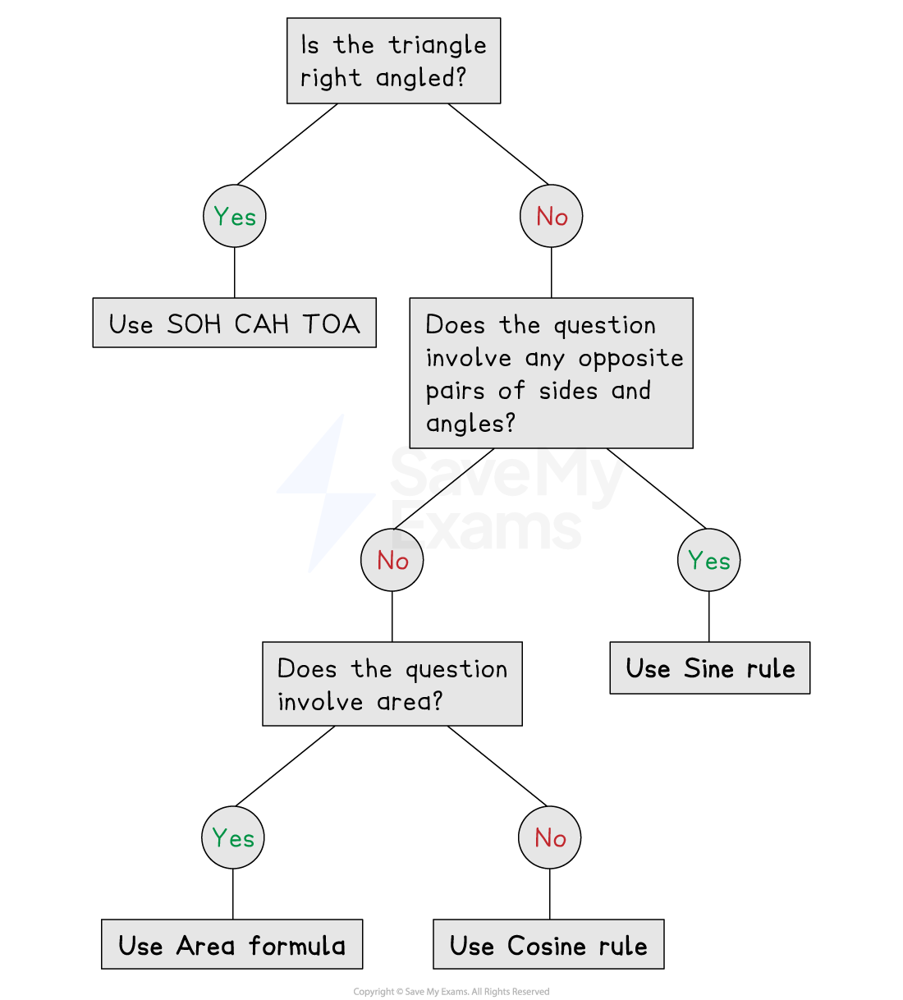

# Deciding the Trig Rule

## Applications of Trigonometry

> **Spec point** — `spcpt_vMcrBY5bkBpMVHMF`

## Applications of trigonometry

### How do I decide which trig rule to use?

- **Different rules** are required depending on the question

  - You need to be able to decide which is appropriate to use
  - Think about what** information **you **have** and what you want to **find**
- This table summarises the possibilities:

| If you know | And you want to know | Use |
|---|---|---|
| Two sides and an angle opposite one of the sides | The angle opposite the other side | Sine rule |
| Two angles and a side opposite one of the angles | The side opposite the other angle | Sine rule |
| Two sides and the angle **between** them | The third side | Cosine rule |
| All three sides | Any angle | Cosine rule |
| Two sides and the angle **between** them | The area of the triangle | Area of a triangle rule |

*Flowchart to decide the rule*

### Can I use multiple trig rules in the same question?

- Harder questions will require you to use** more than one trig rule**

  - For example, you may need the sine rule **followed by** the cosine rule
- The **area formula** only works for an angle between two sides

  - If you are** not** given this setup, you may need to use the sine or cosine rule first

- If it looks like no rule would work, remember that all **angles in a triangle sum to 180**

  - This often helps to find a missing angle

> **Exam Hint**
> Look at the number of marks for a question - if it is a lot, you are likely to need more than one trig rule!

> **Worked Example**
> Find the area of the triangle below.
> 
> 
> 
> **Answer:**
> 
> > *The area of a triangle can be found using the formula *$A=\frac{1}{2}ab\mathrm{sin}C$
> 
> > *The three side lengths are known , but we need to find an angle in order to calculate the area*
> *Because we know all three sides, any of the angles could be found*
> 
> > *Find angle **ABC** using the cosine rule*
> 
> > *Cosine Rule:  *$a^{2}=b^{2}+c^{2}-2bc\mathrm{cos}A$*, *
> *where *$A$* is the angle opposite side *$a$*  *
> 
> `table row cell A C squared end cell equals cell A B squared plus B C squared minus 2 open parentheses A B close parentheses open parentheses B C close parentheses space cos space A B C end cell row cell 4.4 squared end cell equals cell 7.4 squared plus 4.8 squared minus 2 open parentheses 7.4 close parentheses open parentheses 4.8 close parentheses space cos space A B C end cell end table`
> 
> > *Rearrange to make*$\mathrm{cos}ABC$* the subject*
> 
> `table row cell 4.4 squared minus open parentheses space 7.4 squared plus 4.8 squared close parentheses end cell equals cell negative 2 open parentheses 7.4 close parentheses open parentheses 4.8 close parentheses space cos space A B C end cell row cell cos space A B C end cell equals cell fraction numerator 4.4 squared minus 7.4 squared minus 4.8 to the power of 2 space end exponent over denominator negative 2 open parentheses 7.4 close parentheses open parentheses 4.8 close parentheses end fraction end cell end table`
> 
> > *Use your calculator to find the value of *$\mathrm{cos}ABC$
> 
> `table row cell cos space A B C end cell equals cell 487 over 592 end cell end table`
> 
> > *Use the cos**-1** button on your calculator to find the value of *$ABC$
> 
> `table row cell A B C end cell equals cell cos to the power of negative 1 end exponent open parentheses 487 over 592 close parentheses end cell row blank equals cell 34.65054... end cell end table`
> 
> > *Now we can find the area of the triangle using the formula and angle  **ABC **as the known angle*
> 
> `table row Area equals cell 1 half cross times 4.8 cross times 7.4 cross times sin space 34.65054... end cell row blank equals cell 10.09779... end cell end table`
> 
> **Final answer:** $\mathrm{Area}=10.1\mathrm{cm}^{2}$** (3.s.f)**
