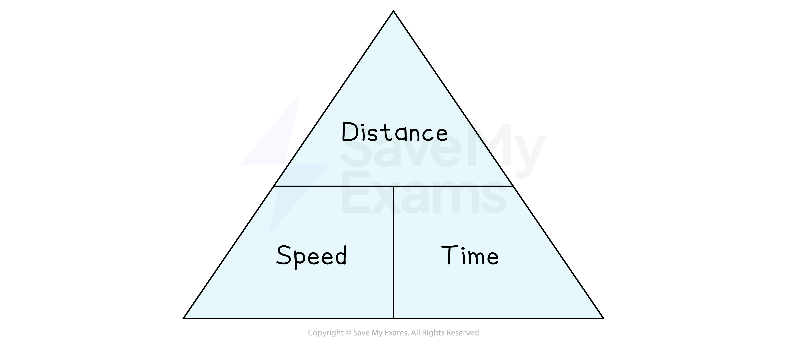

# Compound Measures

## Compound Measures

> **Spec point** — `spcpt_4ZdHtGPdDjYdR6rK`

## Compound measures

### What is a compound measure?

- **A compound measure** is something that is calculated by using **more than one** measurement
- Compound measures can be used to **measure rates**

  - This measures how much one quantity changes when the other is increased by 1
  - Examples include:
  
    - **Speed** – how much the distance changes for each unit of time
    - **Flow rate** – how much the volume changes for each unit of time
    - **Population density** – how many people there are for each unit of area
    - **Fuel consumption** - volume of fuel used for each unit of distance travelled

### How do I find the units for a compound measure?

- You can use the **formula** for a compound measure to **derive its units**

  - Use the **units** for the **quantities** in the formula to derive the units of the compound measure
  - Write a **division** as **a/b** or **ab****-1**** **and pronounce it as “a per b”
- Examples include:

  - $\mathrm{Speed}=\frac{\mathrm{Distance}}{\mathrm{Time}}$
  
    - If the distance is measured in **km** and the time is measured in **minutes** then the speed is measured in **km/min** or **km min****-1**
  - $\mathrm{Flow} \mathrm{rate}=\frac{\mathrm{Volume}}{\mathrm{Time}}$
  
    - If the volume is measured in **m****3** and the time is measured in **minutes** then the flow rate is measured in **m****3****/min** or **m****3****min****-1**

### How do I find the formula for a compound measure?

- You can use the **units** for a compound measure to help remember its **formula**

  - You just need to remember what each unit **measures**
  - If the unit is **a/b** then the formula will be the quantity that **a** measures **divided** by the quantity that **b** measures
- Examples include:
- **Density** can be measured in **kg/cm****3**

  - kg is a measure of **mass** and cm3 is a measure of **volume**
  - Therefore $\mathrm{Density}=\frac{\mathrm{Mass}}{\mathrm{Volume}}$
- **Population density** can be measured in "**people per km****2**"

  - The formula must be $\frac{\mathrm{number} \mathrm{of} \mathrm{people} \mathrm{in} \mathrm{an} \mathrm{area}}{\mathrm{area} \mathrm{in} \mathrm{km}^{2}}$
  - E.g. The population of France is approximately 67 million
  - The area of France is approximately 550 000 km2
  
    - Population density of France = $\frac{67000000}{550000}=121.8\mathrm{people} \mathrm{per} \mathrm{km}^{2}$

### What is a formula triangle?

- A **formula triangle** shows the **relationship** between the** different measures** in a **compound formula**

  - E.g. for Speed, Distance and Time

- If you are calculating a variable on the** top of the triangle**, multiply the two variables on the bottom

  - For example,  $\mathrm{Distance}=\mathrm{Speed}\times\mathrm{Time}$
- If you are calculating a variable on the **bottom of the triangle**, divide the top by the other variable on the bottom

  - For example,  $\mathrm{Speed}=\mathrm{Distance}\div\mathrm{Time}$  and  $\mathrm{Time}=\mathrm{Distance}\div\mathrm{Speed}$

> **Exam Hint**
> Check in the exam to see if the answer needs to be in different units.
> 
> For example, the question may use metres and seconds but want the answer in km/h.

> **Exam Hint**
> You need to remember the relationship between **speed**, **distance **and **time**.

> **Worked Example**
> A high-speed racing car has an average fuel consumption of 3 km per litre during a race.
> 
> 1 lap of the racing circuit is 5.9 km in length.
> 
> (a) Calculate the volume of fuel used, in litres, to complete 15 laps of the circuit.
> 
> **Answer:**
> 
> > *The units for the fuel consumption are km per litre, which suggests the formula is *$\mathrm{fuel} \mathrm{consumption}=\frac{\mathrm{distance}}{\mathrm{volume}}$
> 
> > *Calculate the total distance covered for the 15 laps*
> 
> $15\times5.9\mathrm{km}=88.5\mathrm{km}$
> 
> > *Use the above formula to find the volume of fuel, *$V$* litres, used*
> 
> `table row cell fuel space consumption space end cell equals cell fraction numerator distance space over denominator volume end fraction end cell row cell 3 space km space per space litre space end cell equals cell fraction numerator 88.5 space km space over denominator V space litres end fraction end cell end table`
> 
> > *Rearrange the equation by multiplying both sides by *$V$*, and dividing both sides by 3*
> 
> `table attributes columnalign right center left columnspacing 0px end attributes row cell 3 V end cell equals cell 88.5 end cell row V equals cell fraction numerator 88.5 over denominator 3 end fraction equals 29.5 end cell end table`
> 
> **Final answer:** **29.5 litres of fuel**
> 
> ** **
> 
> The race car then requires a pit-stop to refuel to complete the final laps of the race.
> 
> The flow rate of the fuel pump is 720 litres per minute, and fuel is pumped into the car for 3.1 seconds.
> 
> (b) Calculate the volume of fuel, in litres, pumped into the car in this time.
> 
> **Answer:**
> 
> > *The flow rate is 720 litres per minute which suggests the formula is *$\mathrm{flow} \mathrm{rate}=\frac{\mathrm{volume}}{\mathrm{time}}$
> 
> > *Before we can use the formula, we need to change the units of time to both be the same*
> 
> > *Change 720 litres per minute, into litres per second (to match the time fuel is pumped for, which is in seconds)*
> 
> > *If 720 litres are pumped in 1 minute, 60 times less will be pumped in 1 second*
> 
> $720\div60=12\mathrm{litres} \mathrm{per} \mathrm{second}$
> 
> > *Substitute these values into the formula*
> 
> $12\mathrm{litres} \mathrm{per} \mathrm{second}=\frac{\mathrm{volume} \mathrm{in} \mathrm{litres}}{3.1\mathrm{seconds}}$
> 
> > *Multiply both sides by 3.1*
> 
> $\mathrm{volume} \mathrm{in} \mathrm{litres}=12\times3.1=37.2$
> 
> **Final answer:** **37.2 litres**
