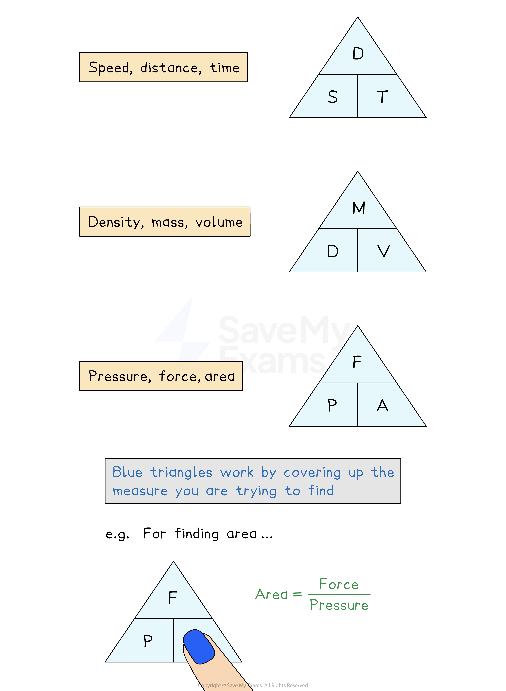

# Speed, Density & Pressure

## Speed, Density & Pressure

> **Spec point** — `spcpt_jJPhXSKYBg6x4d2Q`

## Speed, density & pressure

### What are speed, density and pressure?

- **Speed**, **density** and **pressure** are frequently used **compound measures**

  - **Speed** is equal to **distance **divided by **time**
  - **Density** is equal to **mass** divided by **volume**
  - **Pressure** is equal to **force** divided by **area**

### What should I know about speed, distance and time?

- **Speed **is commonly measured in **metres per second** (**m/s**) or **kilometres per hour** (**km/h**)

  - The units indicate **speed** is **distance per time**
  $\mathrm{Speed}=\frac{\mathrm{Distance}}{\mathrm{Time}}$
  
    - You need to learn this formula
- '**Speed**' (in this formula) means '**average** **speed**'
- In harder problems there are often **two journeys **or **two parts to one longer journey**

### What should I know about density, mass and volume?

- Density is usually measured in **grams per centimetre cubed** (**g/cm****3**) or **kilograms per metre cubed** (**kg/m****3**)

  - The units indicate that **density** is **mass per volume**
  $\mathrm{Density}=\frac{\mathrm{Mass}}{\mathrm{Volume}}$
  
    - You need to learn this formula

- You may need to use a **volume formula** to find the volume of an object first

### What should I know about pressure, force and area?

- Pressure is usually measured in Newtons per square metre (**N/m****2**)

  - The units of pressure are often called **Pascals** (**Pa**) rather than **N/m****2**
  - The units indicate that **pressure** is **force per area**
  $\mathrm{Pressure}=\frac{\mathrm{Force}}{\mathrm{Area}}$
  
    - You will be **given **this formula in the exam if it is needed
- Remember that **weight** is a **force**

  - It is different to **mass**

> **Exam Hint**
> Look out for a mixture of units:
> 
> - **Time** can be given as **minutes** but common phrases like '**half an** **hour'** (30 minutes) could also be used in the same question
> - Any mixed units should be those in common use and easy to convert, e.g., **g** to **kg** or **m** to **km **etc

> **Worked Example**
> A box exerts a force of 140 newtons on a table.
> The pressure on the table is 35 newtons/m2.
> 
> $p=\frac{F}{A}$        $p=\mathrm{pressure}\,F=\mathrm{force}\,A=\mathrm{area}$
> 
> Calculate the area of the box that is in contact with the table.
> 
> **Answer:**
> 
> **Method 1**
> 
> > *Substitute the numbers you know into the formula*
> 
> $35=\frac{140}{A}$* *
> 
> > *Solve the equation for **A*
> *First multiply both sides by **A** to get **A** out of the denominator*
> 
> $35A=140$
> 
> > *Then divide by 35 to find the value of **A*
> 
> `table row cell A space end cell equals cell space 140 over 35 space end cell end table`
> 
> > *The units will be m**2**, matching the units seen in newtons/m**2*
> 
> **4 m****2**
> 
> **Method 2**
> 
> > *Use the given formula to create a formula triangle for pressure, force and area*
> 
> $F\,pA$*  *
> 
> > *A **is on the bottom of the triangle, so this tells us to divide **F **by **P*
> 
> $A=\frac{F}{p}=\frac{140}{35}=4$*      *
> 
> **4 m****2**

> **Worked Example**
> The density of pure gold is 19.3 g/cm3.
> 
> What is the volume of a gold bar that has a mass of 0.454 kg?
> 
> **Answer:**
> 
> > *Begin by checking that all of the units are consistent*
> *Density is given in g/cm**3*
> *Convert the mass of the gold bar into grams to match the units for density*
> 
> *0.454 kg = (0.454 × 1000) g = 454 g*
> 
> > *The units of density are g/cm**3**, so divide the mass (g) by the volume (cm**3**)*
> 
> > *Or, write out the formula triangle*
> 
> 
> 
> > *Write out the formula that you will need*
> 
> $\mathrm{Volume}=\frac{\mathrm{mass}}{\mathrm{density}}$
> 
> > *Substitute the given values for the mass and the density*
> 
> $\mathrm{Volume}=\frac{454}{19.3}=23.5233...$
> 
> > *Make sure you give the correct units with your final answer*
> *The density is given in g/cm**3**, so the volume should be cm**3*
> 
> **Final answer:** **Volume = 23.5 cm****3**** (1 d.p.)**
