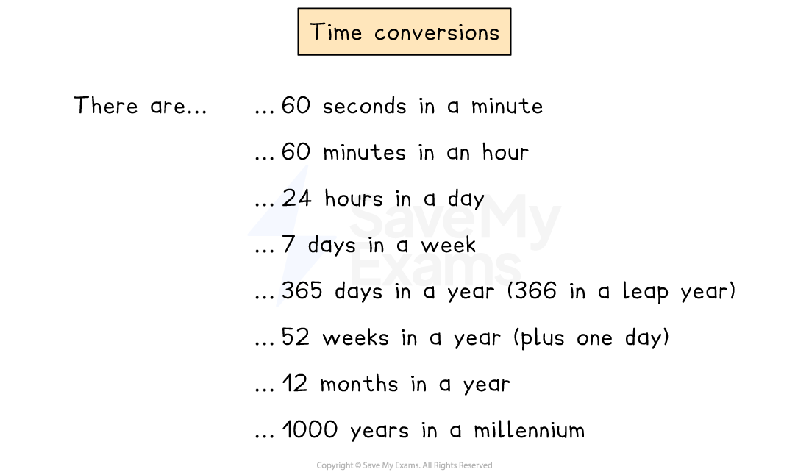
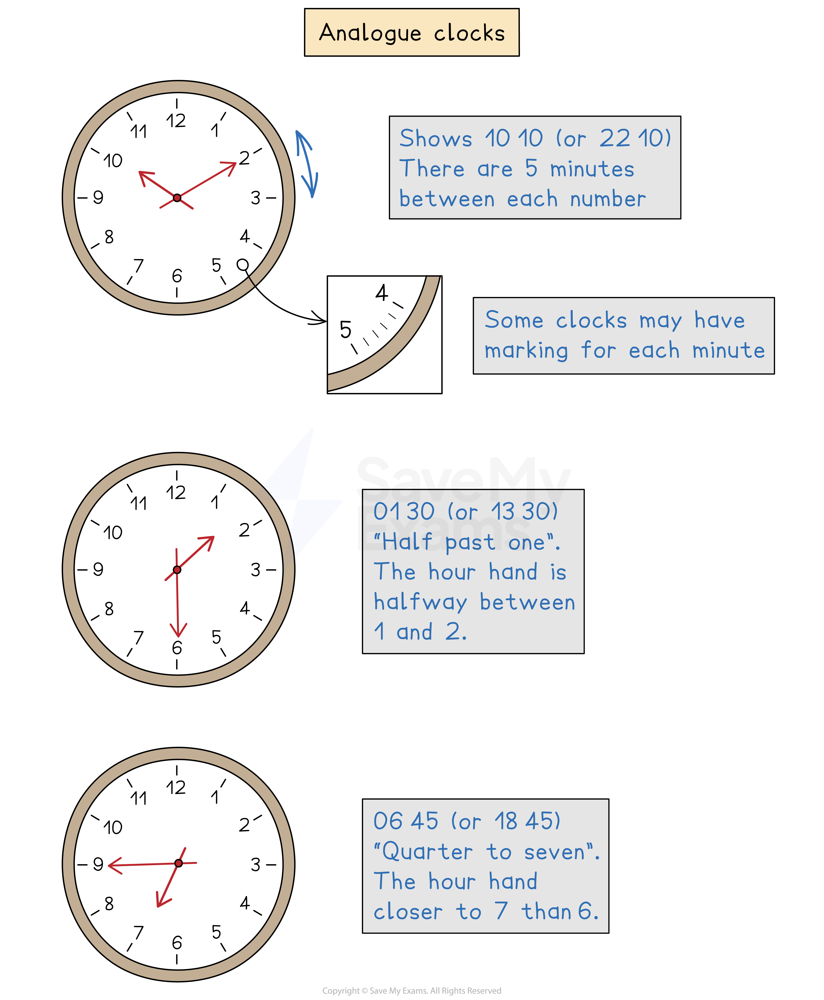
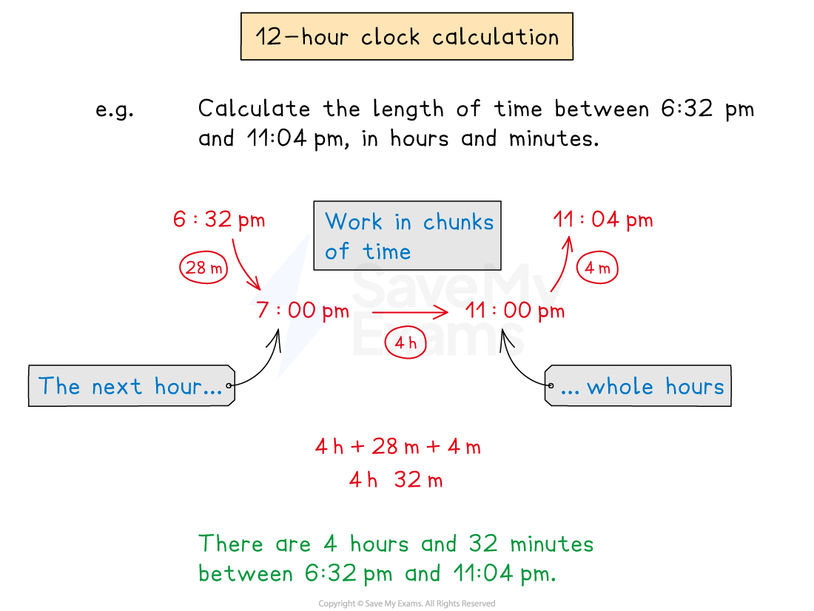
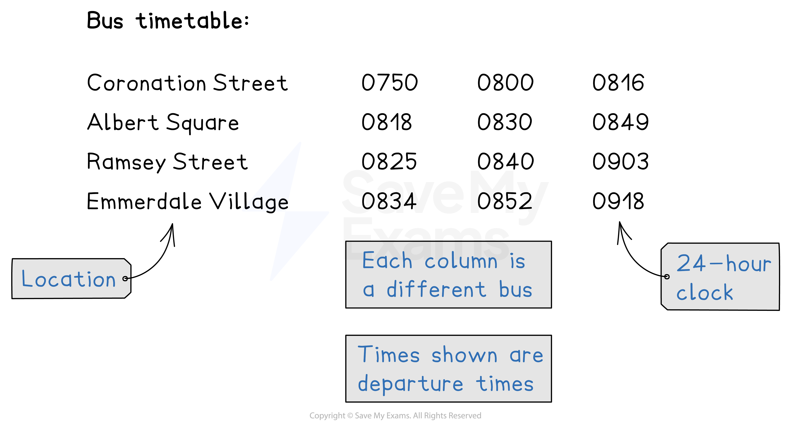

# Time

## Time

> **Spec point** — `spcpt_h2p7nv6zkR4xFJ3P`

## Time

### How do I convert between different units of time?

- **Time** has a **number of different conversions** and does not use the decimal number system (based on 10s, 100s, etc)

  - You need to know the follow time conversions

- You should also know the **number of days** in each **calendar month** 

### What is the difference between a 12-hour clock and a 24-hour clock?

- A **12-hour clock** goes around once for AM and once for PM in **one complete day**

  - AM is between midnight (12 am) and midday (12 pm)
  - PM is between midday (12 pm) and midnight (12 am)
- A **24-hour clock** goes around once for **one complete day**

  - The display uses four digits, two for the hour, two for the minutes
  - The day starts at midnight which is 00 00 (12 am) and goes up to 23 59 (11.59 pm)
- You need to be able to **read the time** from both a **12-hour clock** and a **24-hour clock**

| 12-hour clock time | 24-hour clock time |
|---|---|
| 12:02am | 00:02 |
| 9:37am | 09:37 |
| 12:10pm | 12:10 |
| 5:32pm | 17:32 |
| 12:00am (Midnight) | 00:00 |
| 12:00pm (Midday) | 12:00 |

### How do I read the time from an analogue clock?

- An **analogue** clock works in **12-hour **time

  - The **short hand** is the **hour hand**
  
    - Each number on the clock represents **one hour** for the hour hand
  - The **long hand** is the **minute hand**
  
    - Each number on the clock represents **five minutes** for the minute hand
    - Some clocks will have markings for individual minutes

### How do I read the time from a digital clock?

- A **digital** clock can use either **24 hour** time or **12-hour** time

  - A colon ':' is often displayed between the hours and minutes
  
    - E.g.,  1245 would be displayed as 12:45
  - AM or PM does **not** need to be specified with 24-hour time
  
    - it may or may not be shown on a 12-hour time digital clock
  - For** single-digit** hours, clocks often miss out the first zero
  
    - e.g.  09:23 would be displayed as 9:23

### How do I calculate with time using the 12-hour clock?

- Work in **chunks** of time

  - Calculate the **minutes until the** **next hour**, then **whole hours**, then **minutes until a final time**
- Ensure you know when the 12-hour clock **switches** from **AM to PM** and vice versa

> **Exam Hint**
> Be careful when using a calculator, as they can often cause problems in time-based questions!
> 
> Remember that 1 hour 30 mins of time would be 1.5 hours on a calculator.
> 
> You can use the **degrees, minutes and seconds function** `box enclose degree apostrophe double apostrophe end enclose` to enter time on your calculator
> 
> E.g. 3 minutes 45 seconds would be entered as $0^{\circ}3'45''$
> 
> You can convert between an answer on the calculator, given in either format of time, by pressing this button.

> **Worked Example**
> (a) A film starts at 15 35 and lasts for 1 hour 45 minutes.
> 
> Find the time at which the film ends.
> 
> **Answer:**
> 
> *Work in chunks of time*
> *Add the hour on*
> 
> *15 35 + 1 hour = 16 35*
> 
> > *Add on the number of minutes until the next hour*
> *There are 60 minutes in an hour*
> *Add on 25 minutes of the remaining 45 minutes to get to the next hour*
> 
> *16 35 + 25 minutes = 17 00*
> 
> > *There are 45 - 25 = 20 minutes left of the film to add*
> *Write your final answer using the type of clock used in the question (24-hour) unless otherwise stated*
> 
> **17 20**** **
> 
> (b) It is due to start raining at 02 35 and not stop until 08 14.
> 
> Find the time, in hours and minutes, it is expected to rain for.
> 
> **Answer:**
> 
> *Work in chunks of time*
> *Find the number of minutes until the next hour*
> 
> *02 35 + 25 minutes = 03 00*
> 
> > *Find the number of hours until the hour in the stopping time*
> 
> *03 00 + 5 hours = 08 00*
> 
> > *Find the remaining minutes until the rain stops*
> 
> *08 00 + 14 minutes = 08 14*
> 
> > *Add together the hours and minutes*
> 
> *25 minutes + 5 hours + 14 minutes*
> 
> **Final answer:** **5 hours 39 minutes**
> 
> (c) A train journey started at 11.23 am and finished at 2.27 pm.
> 
> How long, in hours and minutes, was the train journey?
> 
> **Answer:**
>  
> *Work in chunks of time*
> *Find the number of minutes until the next hour*
> *Be careful about the AM/PM boundary*
> 
> *11.23 am + 37 minutes = 12.00 pm*
> 
> > *Add on the number of hours until the hour in the arrival time*
> 
> *12.00 pm + 2 hours = 2.00 pm*
> 
> *Add on the remaining minutes until the arrival tim*e
> 
> *2.00 + 27 minutes = 2.27 pm*
> 
> > *Add up the hours and minutes to find the total length of the train journey*
> 
> *37 minutes + 2 hours + 27 minutes*
> 
> *37 minutes + 27 minutes add up to 1 hour and 4 minutes*** **
> 
> **Final answer:** ** 3 hours 4 minutes**

### How do I use bus and train timetables?

- Bus and train **timetables **tend to use the **24-hour **clock system

  - Each **column** represents a **different bus or train**
  - **Times** are listed as **four digits** without the colon ':'
  - The time in each cell usually indicates the **departure time **(when the bus/train leaves that stop/station)
  - The **last location** on the list usually shows the** arrival time**

> **Worked Example**
> The table below shows part of a bus timetable.
> 
> | Coronation Street | 0750 | 0800 | 0816 |
> |---|---|---|---|
> | Albert Square | 0818 | 0830 | 0849 |
> | Ramsey Street | 0825 | 0840 | 0903 |
> | Emmerdale Village | 0834 | 0852 | 0918 |
> 
> How long should the journey between Coronation Street and Ramsey street take on the 0800 bus?
> 
> **Answer:**
> 
> > *The 08 00 bus is the middle column*
> 
> > *Find the time between the departure times at Coronation Street and Ramsey street for the middle column*
> 
> *08 40 - 08 00*
> 
> **Final answer:** **40 minutes**

### How do I convert time between time zones?

- Different countries are in different **time zones**, depending on where they are on the planet
- For example when it is 11:36 in London in the UK, it may be 06:36 in New York in the USA

  - So New York is 5 hours **behind** London
  - London is 5 hours **ahead** of New York
- You must consider:

  - What is the **time difference** between the two locations (**in hours**)?
  - Which time zone is **ahead**, and which one is **behind**?
- For example, Buenos Aires (Argentina) is 6 hours behind Helsinki (Finland)

  - When it is 7 am in Helsinki
  
    - 7 am - 6 hours = 1 am in Buenos Aires
  - When it is 5 pm in Buenos Aires
  
    - 5 pm + 6 hours = 11 pm in Helsinki

> **Worked Example**
> The time in Madrid is 7 hours ahead of the time in Chicago.
> 
> Mark takes a flight from Madrid to Chicago which lasts 9 hours and 45 minutes.
> 
> The flight leaves at 7:30 am Madrid time.
> 
> What will the local time be in Chicago when he arrives?
> 
> **Answer:**
> 
> > *Work in Madrid time, and then change at the end*
> 
> > *Add 9 hours 45 minutes on to 7:30 am to find the time Mark arrives in Chicago (in Madrid time)*
> 
> *07:30 + 9 h 45m = 16:30 + 45m = 17:15*
> 
> > *17:15 is the time in Madrid, so find the time in Chicago*
> 
> > *Madrid is 7 hours ahead of Chicago*
> 
> > *Subtract 7 hours*
> 
> *17:15 - 7 hours = 10:15*
> 
> **Final answer:** **10:15 am**
