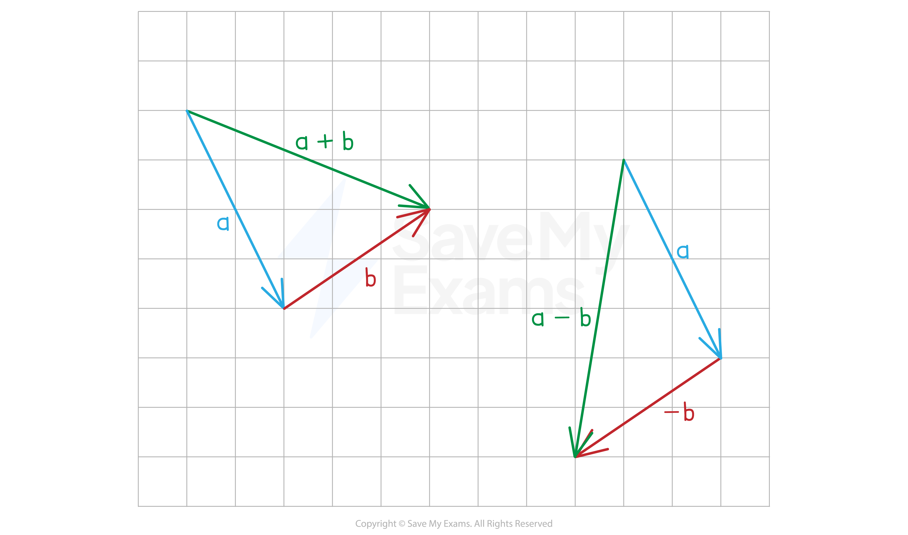

# Representing Vectors as Diagrams

## Vector Diagrams

> **Spec point** — `spcpt_wt9snSTkmXqhMvXn`

## Vector diagrams

### How can I represent a vector visually?

- A **vector** has **both a size (magnitude) and a direction**

  - You need to draw a **line** to show the **size of the vector**
  - You also need to draw an **arrow** to show the **direction of the vector**

- Vectors are written in** bold** when typed to **show** that they are a vector and not a scalar

  - When writing a vector in an exam you should **underline** the letter to show it is a vector
  - $a$ when **typed** and `bottom enclose a` when **handwritten**
  
    - You will **not lose marks** if you forget to underline vectors

- If a vector **starts at *****A*** and **ends at***** B*** we can write it as $\overset{\rightarrow}{AB}$

  - Here the arrow will **point toward *****B***
  - Vector $\overset{\rightarrow}{BA}$ will have the **same length** but **point toward *****A***

### What happens when a vector is multiplied by a scalar?

- When you **multiply** a vector by a** positive scalar**:

  - The **direction** stays the **same**
  - The **length** of the vector is **multiplied by the scalar**

- When you **multiply** a vector by a **negative scalar**:

  - The **direction** is **reversed**
  - The** length** of the vector is **multiplied** by the **number after the negative sign**

### What happens vectors are added or subtracted?

- To **draw** the vector $a+b$

  - Draw the vector $a$
  - Draw the vector $b$ starting at the endpoint of $a$
  - Draw a line that **starts at the start** of $a$ and **ends at the end** of $b$
- To **draw** the vector $a-b$

  - Draw the vector $a$
  - Draw the vector $-b$  starting at the endpoint of $a$
  - Draw a line that **starts at the start** of $a$  and **ends at the end** of $-b$

